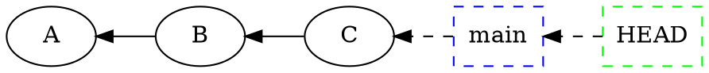
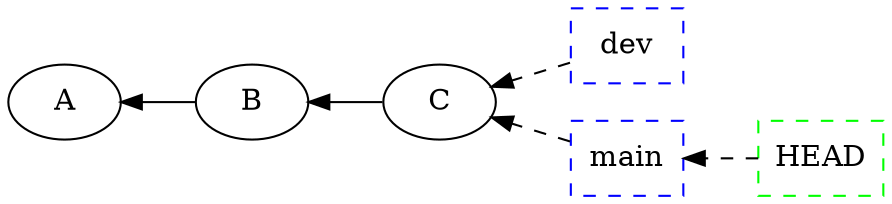
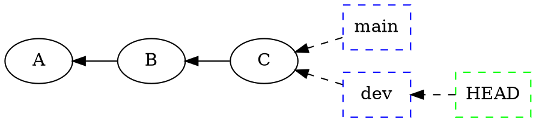
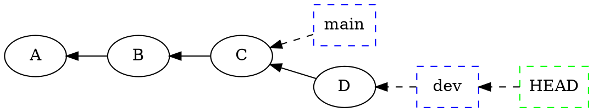
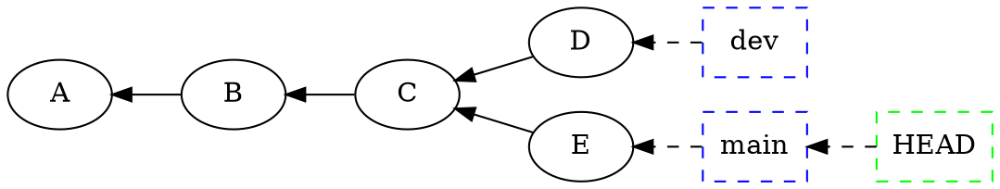
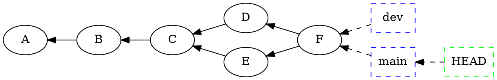

## Concepto de rama

Cuando empezamos a trabajar en un repositorio recien creado, cada _commit_ que
realizamos se va añadiendo de forma secuencial, definiendo la historia del
proyecto a traves del tiempo. Cada _snapshot_ o instantanea en el tiempo apunta
a su predecesor, y esto conforma una linea temporal sencilla:

```dot
    digraph G {
        graph [rankdir = RL];
        HEAD [shape = box color=green style=dashed]
        main [shape = box color=blue style=dashed]
        B -> A;
        main -> B [style=dashed];
        HEAD -> main [style=dashed];
        }
    }
```

En este gráfico, representamos con letras los commits. 

En este momento solo tenemos una rama, normalmente llamada `main` o `master`.
Una rama, técnicamente hablando, es solo una referencia o puntero a un _commit_
determinado. Cuando hacemos un commit en la rama `main`, se genera un nuevo
_snapshot_ del sistema de ficheros, se añade al sistema, apuntando al
anterior, y la rama pasa a apuntar directamente al nuevo _commit_.  



## Crear una rama nueva

Ahora bien, una de las características y puntos fuertes de Git es precisamente
poder crear ramas de forma muy rápida y sencilla. Esto es así por lo dicho
anteriormente, porque una rama solo es un puntero a un _commit_, es decir, a un
momento en la historia del proyecto.

Podemos crear una rama con el subcomando `branch`:

```
# git brach dev
```

Pero cuidado, esto solo crea la rama nueva. Nosotros seguimos en la rama
`main`, porque `HEAD` sigue apuntando a `main`. Además, como no hemos hecho
ningún cambio todavía en la historia del proyecto, es decir , no hemos hecho
ningún _commit_, tanto `dev` como `main` son iguales (Apuntan al mismo
_snapshot_).



Para cambiar de rama, se puede usar el subcomando `checkout` o, en las versiones
más nuevas de Git, el subcomando `switch`. Vamos a usar esta última opción, aunque es
posible usar las dos:

```
git switch dev
```

!!! note "Realizar los dos pasos con un solo comando"

    Como lo más normal al crear una rama sea para empezar a trabajar con ella,
    podemos usar el _flag_ `-c` (o su versión larga `--create`) con el
    subcomando `switch` para indicar que haga los dos pasos a la vez, que cree
    la nueva rama y que nos cambie a ella:

    ```
    git switch -c nueva-rama
    ```

Ahora `HEAD` apunta a la rama `dev`, así que ya hemos realmente cambiado de
rama. De nuevo, la historia del proyecto no ha cambiado y tanto `dev` y
`main` apuntan a la misma posición. La situación ahora es así:



Si ahora hacemos un _commit_, el nuevo _snapshot_ que se crea se lleva el
puntero `dev` con el, creando una bifurcación en la historia del proyecto, la
rama `dev` ahora es distinta de la rama `main`, que se ha quedado, por decirlo
así, atrás en el tiempo. La situación ahora sería:




Claro que la rama `main` no tiene por qué quedarse congelada, nosotros mismos u
otro colaborador puede realizar cambios en la rama `main`, con lo cual las dos
ramas empiezan a divergir (Si te gusta la ciencia ficción, esta trama la habrás
visto en muchas historias de universos paralelos).

Vamos a realizar cambios en `main` para ver claramente la divergencia:

```
$ git swith main                         # Volvemos a la rama main
$ touch uno.txt                          # Creamos un fichero
$ vim add uno.txt                        # Añadimos al stage
$ vim commit -m "Nuevo fichero uno.txt"  # y confirmamos
```

Esto añade un nuevo _snapshot_ a la historia del proyecto (pero en la rama
`main`), llamémosle `E` (Observa que `HEAD` vuelve a apuntar a `main`, es
por el subcomando `git switch` en la primera línea del ejemplo anterior):



Las dos (o más ramas) podrían seguir sufriendo cambios, pero lo normal que
en algún momento
queremos unificar las dos ramas en una sola. Este escenario es muy común, tener
una rama para desarrollo (Llamada habitualmente `dev`, `develop`, `desarrollo`,
etc.) y una rama `main` o `master`, que es la que se usa en producción.
Realizamos los cambios y las pruebas en la rama `dev`, y solo cuando
estemos seguros de que los cambios deseados están correctamente implantados
y probados, los incluimos o mezclamos con la rama principal.

Este proceso se llama _merge_.

## Reunificar ramas con Merge

```
git switch main  # Nos ponemos en una de las ramas ...
git merge dev    # ... y la mezclamos con la otra
```

La situación queda ahora:



Ahora podríamos borrar tranquilamente la rama `dev`, por que todos los cambios
realizados en esa rama están incorporados en la rama `main`. O podemos dejar la
rama creada para poder reutilizarla otra vez.
