El patrón Bridge (Puente)
-------------------------

.. index:: Bridge (Puente)

Propósito
^^^^^^^^^

Desacopla una abstracción de su implementación, de modo que ambas puedan
variar de forma independiente.

También conocido como
^^^^^^^^^^^^^^^^^^^^^

*Handle/Body* (Manejador/Cuerpo)

Motivación
^^^^^^^^^^

Cuando una abstracción o interfaz puede tener varias implementaciones
posibles, la forma más habitual de implementarlas es la herencia.

Usamos una clase abstracta para definir la interfaz de la abstracción, y
luego subclases concretas que la implementan de distintas formas.

Pero este enfoque no siempre es lo bastante flexible. La herencia liga
la implementación a la abstracción de forma permanente, lo que dificulta
modificar, extender y reutilizar abstracciones e implementaciones de
forma independiente.

Pensemos por ejemplo en una librería que quiera generar gráficos
vectoriales, pero que queremos que funcione para varias plataformas, por
ejemplo que pueda generar la imagen usando :ref:`Pygame` o pillow.

Podríamos definir una interfaz común, con todas las operaciones que
queremos realizar: Por ejemplo, pintar un punto, pintar una linea,
pintar un cuadro…

Este podría ser el esquema UML de la clase abstracta::

    +-------------------------------------+
    | init()                              |
    +-------------------------------------+
    | +point(x, y)                        |
    | +line(x0, y0, x1, y1)               |
    | +square(top, left, width, height)   |
    +-------------------------------------+

Ahore podríamos implementar la clase ``VectorzPillow`` y
``VectorzPygame``, que derivan de esta clase, e implementar todos
metodos: ``point``, ``line``, ``square``, etc.

Pero este enfoque tiene dos inconvenientes:

1. No es cómodo extender la abstracción ``VectorZBase`` para cubrir
   todas las posibles operaciones. En este caso, añadir una operación
   ``poligono``, por ejemplo, implica tener que implementar la operación
   en las dos clases derivadas. Si además, añadimos ahora una tercera
   implemntación, cada nueva funcionalidad en la interfaz debe
   implementarse en las tres plataformas.

2. Hace el código dependiente de la plataforma. Cada vez que un
   cliente usa nuestro sistema, se crea una clase concreta que tiene una
   determinada implementación. Por ejemplo, crear un objeto
   ``VectorzPillow`` vincula la abstracción ``Vectorz`` a la
   implementación para Pillow, lo que vuelve al código del cliente
   dependiente de dicha implementación.

A su vez, hace más difícil portar el código cliente a otras plataformas.
Los clientes deberían ser capaces de crear una ventana sin referirse a
una implementación concreta. Por ejemplo, seria deseable que al inicio
de la ejecución se determinara que librerías están instaladas y en base
a eso, usar la que este disponible (O dar un mensaje de error sin
ninguna esta instalada).

El código cliente, en cualquier caso, debería poder usar ``VectorZ`` sin
necesidad de hacer mención a una plataforma determinada

El patrón **Bridge** resuelve estos problemas situando la abstracción
Ventana y su implementación en clases (o jerarquías de clases, si fuera
el caso) separadas.

En vez de una clase base y varias clases derivadas de implementacion,
tenemos una clase que llamaremos **Abstraccion** y luego un conjunto,
totalmente separado de clases que denominares **Implementaciones**

En la clase Abstraccion se mantiene una referencia a un *objeto* de tipo
Implementación.

Parece que no hemos conseguido mucho, pero la clave es darnos cuenta de
que ahora la interfaz de la abstracción no tiene por qué seguir al pie
de la letra las interfaces de la implementación. De hecho, lo útil es
que sean diferentes.

El caso de uso típico de este patrón es hacer que las implementaciones
solo proporcionen operaciones primitivas, y las abstracciones pueden
ahora realizar operaciones de un nivel superior.

En el ejemplo mostrado, la clave es darse cuenta de que el método
``square`` se puede implementar fácilmente a partir del método ``line``,
así que podemos escribir la implmentación de ``square`` en la clase
abstracción, que llamara a los métodos ``line`` del objeto de tipo
implementación (en este caso, una implementación basada en Pillow
``PillowImp`` o una basada en ``Pygame``).

Esto desacopla la abstracción de las diferentes implementaciones que
tengamos o podamos tener en el futuro.

Hablamos de la relación entre la abstracción y la implementación como un
puente o *bridge* que une ambos aspectos, pero dejándoles libertad para
variar independientemente.

Aplicabilidad
^^^^^^^^^^^^^^^^^^^^^^^^^^^^^^^^^^^^^^^^^^^^^^^^^^^^^^^^^^^^^^^^^^^^^^^^

Puedes usar el patrón Bridge cuando:

- Quieres evitar un enlace permanente entre una abstracción y su
  implementación. Por ejemplo, cuando debe seleccionarse o cambiarse la
  implementación en tiempo de ejecución.

- Tanto las abstracciones como sus implementaciones deberían ser
  extensibles mediante subclases. En este caso, el patrón Bridge permite
  combinar las diferentes abstracciones y sus implementaciones, y
  extenderlas independientemente.

Consecuencias
^^^^^^^^^^^^^^^^^^^^^^^^^^^^^^^^^^^^^^^^^^^^^^^^^^^^^^^^^^^^^^^^^^^^^^^^

El patrón Bridge tiene las siguientes consecuencias:

1. Desacopla la interfaz y la implementación. No une permanentemente una
   implementación a una interfaz, sino que la implementación puede
   configurarse en tiempo de ejecución. Incluso es posible que un objeto
   cambie su implementación en tiempo de ejecución.

2. Este desacoplamiento potencia una división en capas que puede dar
   lugar a sistemas mejor estructurados. La parte de alto nivel de un
   sistema sólo tiene que conocer a Abstracción y a Implementador.

2. Mejora la extensibilidad. Podemos extender las jerarquías de
   Abstracción y de Implementador de forma independiente.

3. Oculta detalles de implementación a los clientes. Podemos aislar a
   los clientes de los detalles de implementación, como el
   compartimiento de objetos implementadores y el correspondiente
   mecanismo de conteo de referencias (si es que hay alguno).

Implementación
^^^^^^^^^^^^^^^^^^^^^^^^^^^^^^^^^^^^^^^^^^^^^^^^^^^^^^^^^^^^^^^^^^^^^^^^

Al aplicar el patrón Bridge hemos de tener en cuenta las siguientes
casos:

1. Un único implementador. En situaciones en las que sólo hay una
   implementación, no es necesario crear una clase abstracta
   Implementador. Éste es un caso degenerado del patrón Bridge, cuando
   hay una relación uno-a-uno entre Abstracción e Implementador. Sin
   embargo, esta separación sigue siendo útil cuando un cambio en la
   implementación de una clase no debe afectar a sus clientes
   existentes, es decir, que éstos no deberían tener que ser
   recompilados, sino sólo vueltos a enlazar.

2. Crear el objeto Implementador apropiado. ¿Cómo, cuándo y dónde se
   decide de qué clase Implementador se van a crear las instancias
   cuando hay más de una? Si Abstracción conoce a todas las clases
   ImplementadorConcreto, puede crear una instancia de una de ellas en
   su constructor; puede decidir de cuál basándose en los parámetros
   pasados a su constructor.

Otro enfoque consiste en elegir inicialmente una implementación
predeterminada y cambiarla después en función de su uso. Por ejemplo,

También es posible delegar totalmente la decisión en otro objeto. En el
ejemplo de la Ventana/VentanaImp se puede introducir un objeto fábrica
(véase el patrón *Factory* cuya única misión sea encapsular detalles de
implementación. La fábrica sabe qué tipo de objeto ``Implementation``
crear para la plataforma en uso.

Ejercicios
^^^^^^^^^^^^^^^^^^^^^^^^^^^^^^^^^^^^^^^^^^^^^^^^^^^^^^^^^^^^^^^^^^^^^^^^

**Ejercicio**: Aquí tenemos una simulación de las clases ``Vectorz`` y
dos versiones simuladas de implementación, ``PillowImp`` y
``PyGameImp``.

1) Ejecuta el código y comprueba que funcionan.

Primero la clase ``PillowImp``:

.. code-block:: python

    class PillowImp:
        
        def init(self):
            print("La implementacion de Pillow se inicializa")
            
        def point(self, x, y):
            print(f"Pillow imprime un pixel en {x}, {y}")
            
        def line(self, x0, y0, x1, y1):
            print(f"Pillow dibuja una linea entre {x0}, {y0} y {x1}, {y1}")

Luego la clase ``PyGameImp``:

.. code-block:: python

    class PyGameImp:
            
        def init(self):
            print("La implementacion de PyGame se inicializa")
            
        def point(self, x, y):
            print(f"PyGame imprime un pixel en {x}, {y}")
            
        def line(self, x0, y0, x1, y1):
            print(f"PyGame dibuja una linea entre {x0}, {y0} y {x1}, {y1}")

Ahora la clase ``VectorZ``:

.. code-block:: python

    import random
        
    class VectorZ:
        
        def __init__(self):
            Implementation = random.choice([PillowImp, PyGameImp])
            self.implementation = Implementation()
            self.implementation.init()
            
        def point(self, x, y):
            self.implementation.point(x, y)
            
        def line(self, x0, y0, x1, y1):
            self.implementation.line(x0, y0, x1, y1)
            
        def square(self, left, top, width, height):
            self.line(left, top, left+width, top)
            self.line(left+width, top, left+width, top+height)
            self.line(left+width, top+height, left, top+height)
            self.line(left, top+height, left, top)
            
        def punto_gordo(self, x, y):
            self.square(x-1, y-1, 2, 2)

Veamos como funciona:

.. code-block:: python

    v = VectorZ()
    v.punto_gordo(0, 0)

La salida debe ser algo como::

.. code::

    La implementacion de PyGame se inicializa
    PyGame dibuja una linea entre -1, -1 y 1, -1
    PyGame dibuja una linea entre 1, -1 y 1, 1
    PyGame dibuja una linea entre 1, 1 y -1, 1
    PyGame dibuja una linea entre -1, 1 y -1, -1

1) ¿Qué te parece el método de selección de la plataforma? Ni te
   molestes en contestar, es una pregunta retórica, es basura.

Elegir la plataforma al azar un una mala idea. ¿Se te ocurre alguna
manera mejor de hacerla?

2) ¿Cómo podríamos implementar un método ``polygon``, al que se le pase
   una lista de puntos en forma de tuplas de 2 elementos, y que dibuje
   el polígono equivalente? Recuerda que habría que unir también el
   último punto con el primero

Solución:

.. code-block:: python

    import random

    class VectorZ:
        
        def __init__(self):
            Implementation = random.choice([PillowImp, PyGameImp])
            self.implementation = Implementation()
            self.implementation.init()
            
        def point(self, x, y):
            self.implementation.point(x, y)
            
        def line(self, x0, y0, x1, y1):
            self.implementation.line(x0, y0, x1, y1)
            
        def square(self, left, top, width, height):
            self.line(left, top, left+width, top)
            self.line(left+width, top, left+width, top+height)
            self.line(left+width, top+height, left, top+height)
            self.line(left, top+height, left, top)
            
        def polygon(self, points):
            source = list(points)
            target = list(points)
            target.append(target.pop(0))
            for (x0, y0), (x1,y1) in zip(source, target):
                self.line(x0, y0, x1, y1)

    source = [(0, 0), (100, 50), (50, 100)]
    target = [(100, 50), (50, 100), (0, 0)]

    z = VectorZ()
    z.polygon([(0, 0), (100, 50), (50, 100)])

La salida podría ser::

    La implementacion de PyGame se inicializa
    PyGame dibuja una linea entre 0, 0 y 100, 50
    PyGame dibuja una linea entre 100, 50 y 50, 100
    PyGame dibuja una linea entre 50, 100 y 0, 0

3) Implementa el método ``punto_gordo``: Se le pasa unas coordenadas
``x`` e y ``y`` pinta una cuadrado alrededor de esa coordenada. Es
decir, si pasamos las coordenadas 5, 10, tendríamos que pintar un
cuadrado entre los :term:`píxeles<píxel>` 4,9 y 6, 11.

4) Si quisiéramos añadir otra plataforma (Por ejemplo que guarde estos
gráficos en un fichero SVG) ¿Qué habría que hacer?

   4.1) Si hay que crear una nueva clase, como la llamarías y que
   métodos tendría?

   4.2) ¿Podríamos usar ``punto_gordo`` con esta nueva plataforma? ¿Qué
   cambios habría que hacer para que funcionase?
