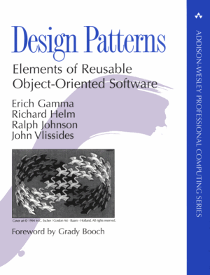

Qué son los patrones de diseño
========================================================================

Una definición sencilla podría ser:

   Un patrón de diseño es un **modelo de solución** para un
   **determinado problema** de diseño recurrente o habitual. El patrón
   describe el problema, le da un nombre, y sugiere una aproximación
   general a como resolverlo.

El concepto no está limitado al desarrollo de software; se puede aplicar
a cualquier campo donde se puedan encontrar problemas recurrentes. De
hecho los primeros patrones de diseño surgen en la arquitectura,
producto del arquitecto Christopher Alexander, en el libro *The Timeless
Way of Building* y desarrollados posteriormente, junto con otros
autores, en *A Pattern Language*.

En sus palabras, cada patrón **describe un problema que ocurre
infinidad de veces en nuestro entorno, así como la solución al mismo, de
tal modo que podemos utilizar esta solución un millón de veces más
adelante sin tener que volver a pensarla otra vez**.

   
   Design Patterns: Elements of Reusable Object-oriented Software

A principios de la década de 1990 los patrones de diseño entraron en el
mundo del desarrollo software con el libro **Design Patterns**, escrito
por el llamado *Grupo de los cuatro* (*Gang of Four* o *GoF*), compuesto
por Erich Gamma, Richard Helm, Ralph Johnson y John Vlissides.

En este libro seminal se recogen 23 patrones de diseño comunes.

Los patrones no son ni principios abstractos, ni soluciones especificas
a un problema particular; son algo intermedio. Un patrón define una
*posible* solución correcta para un problema de diseño, dentro de un
contexto dado, describiendo las cualidades invariantes de todas las
soluciones.

Características de los patrones
-------------------------------

Para describir bien un patrón, un simple esquema gráfico, aunque es sin
duda útil e importante, no es suficiente. Necesitamos más información
para poder reutilizar el patrón.

Tenemos que reflejar también las decisiones tomadas, las alternativas y
sus posibles costos o inconvenientes. Los ejemplos también son de mucha
ayuda.

En el libro Paterns Design, la Banda de los Cuatro describía y utilizaba
la siguiente plantilla para todos sus patrones:

====================== ================= =====================
Nombre y clasificación Intención         También conocido como
Motivación             Aplicación        Estructura
Participantes          Colaboraciones    Consecuencias
Implementación         Código de ejemplo Usos conocidos
Patrones relacionados                    
====================== ================= =====================

Nombre y clasificación
~~~~~~~~~~~~~~~~~~~~~~~~~~~~~~~~~~~~~~~~~~~~~~~~~~~~~~~~~~~~~~~~~~~~~~~~

El **nombre del patrón es muy importante**. La idea es que contenga la
esencia del patrón en una o dos palabras, para que se convierta en parte
del vocabulario de diseño. La clasificación se explica en la siguiente
sección.

Intención
~~~~~~~~~~~~~~~~~~~~~~~~~~~~~~~~~~~~~~~~~~~~~~~~~~~~~~~~~~~~~~~~~~~~~~~~

Unos párrafos que respondan a las siguientes preguntas: ¿Qué hace este
patrón? ¿Cuáles serían las razones para usarlo? ¿Qué problema intenta
resolver?

También conocido como
~~~~~~~~~~~~~~~~~~~~~~~~~~~~~~~~~~~~~~~~~~~~~~~~~~~~~~~~~~~~~~~~~~~~~~~~

Algunos patrones se conocen con varios nombres; si fuera el caso se
incluirían en esta sección.

Motivación
~~~~~~~~~~~~~~~~~~~~~~~~~~~~~~~~~~~~~~~~~~~~~~~~~~~~~~~~~~~~~~~~~~~~~~~~

Un escenario que muestra un problema de diseño y la manera en que el
patrón lo resuelve. Esto ayuda a entender las descripciones más
abstractas del patrón.

Aplicación
~~~~~~~~~~~~~~~~~~~~~~~~~~~~~~~~~~~~~~~~~~~~~~~~~~~~~~~~~~~~~~~~~~~~~~~~

¿En qué situaciones se puede aplicar este patrón? ¿Hay algún ejemplo de
un diseño imperfecto que este patrón podría mejorar? ¿Como podemos
identificar estas situaciones?

Estructura
~~~~~~~~~~~~~~~~~~~~~~~~~~~~~~~~~~~~~~~~~~~~~~~~~~~~~~~~~~~~~~~~~~~~~~~~

Una representación gráfica de las clases e interacciones del patrón.
Existen muchas notaciones gráficas para esto, pero las más usadas
actualmente son OMT object-modeling technique (OMT) y UML (que deriva en
gran parte de OMT)

Participantes
~~~~~~~~~~~~~~~~~~~~~~~~~~~~~~~~~~~~~~~~~~~~~~~~~~~~~~~~~~~~~~~~~~~~~~~~

Las clases y objetos que participan en el diseño, así como sus
responsabilidades.

Collaboraciones
~~~~~~~~~~~~~~~~~~~~~~~~~~~~~~~~~~~~~~~~~~~~~~~~~~~~~~~~~~~~~~~~~~~~~~~~

Describe la manera en que los participantes colaboran para llevar a cabo
sus responsabilidades.

Consecuencias
~~~~~~~~~~~~~~~~~~~~~~~~~~~~~~~~~~~~~~~~~~~~~~~~~~~~~~~~~~~~~~~~~~~~~~~~

¿Cómo consigue sus objetivos el patrón? ¿Cuáles son los compromisos y
consecuencias de usarlo? ¿Qué aspectos del sistema se pueden modificar
independientemente?

Implementación
~~~~~~~~~~~~~~~~~~~~~~~~~~~~~~~~~~~~~~~~~~~~~~~~~~~~~~~~~~~~~~~~~~~~~~~~

¿Qué técnicas, *idioms* y precauciones hay que considerar cuando
implementamos el patrón en un determinado lenguaje de programación.
¿Permite (o dificulta) el lenguaje algun aspecto del patrón?

Código de ejemplo
~~~~~~~~~~~~~~~~~~~~~~~~~~~~~~~~~~~~~~~~~~~~~~~~~~~~~~~~~~~~~~~~~~~~~~~~

Fragmentos de código que ilustren como se puede implementar el patrón.
En el libro original se usaban ejemplos en C++ y en Smalltalk.
Obviamente, nosotros usaremos Python.

Usos conocidos
~~~~~~~~~~~~~~~~~~~~~~~~~~~~~~~~~~~~~~~~~~~~~~~~~~~~~~~~~~~~~~~~~~~~~~~~

Ejemplo de uso de estos patrones en sistemas reales.

Patrones relacionados
~~~~~~~~~~~~~~~~~~~~~~~~~~~~~~~~~~~~~~~~~~~~~~~~~~~~~~~~~~~~~~~~~~~~~~~~

¿Qué otros patrones de diseño están relacionados con este? ¿Cuáles son
las diferencias más importantes? ¿Se puede usar este patrón junto con
otros? Si es así, ¿Con cuáles?

Tipos de patrones de diseño
------------------------------------------------------------------------

-  De creación
-  Estructurales
-  De comportamiento

De creación
~~~~~~~~~~~~~~~~~~~~~~~~~~~~~~~~~~~~~~~~~~~~~~~~~~~~~~~~~~~~~~~~~~~~~~~~

Se utilizan cuando queremos crear objetos, pero el proceso de creación
depende de decisiones y circunstancias que puede que no se conozcan a
priori. Estos patrones normalmente resuelven el problema retrasando el
proceso de creación de los objetos hasta el tiempo de ejecución.

Algunos Patrones de creación son: *``Singleton``*, *``Builder``*,
*``Factory Method``*, *``Object Pool``* y *``Prototype``*.

Estructurales
~~~~~~~~~~~~~~~~~~~~~~~~~~~~~~~~~~~~~~~~~~~~~~~~~~~~~~~~~~~~~~~~~~~~~~~~

Sirven para organizar y conectar nuestras estructuras de datos,
funciones y objetos. Normalmente su busca que estas conexiones permitan
interactuar pero reduciendo e incluso eliminar el acoplamiento, de forma
que podamos cambiar las partes de un programa con un impacto mínimo.

Algunos patrones de este estilo son: *``Decorator``*, *``Adapter``*,
*``Bridge``*, *``Facade``*, *``Flyweight``* y *``Proxy``*.

De comportamiento
~~~~~~~~~~~~~~~~~~~~~~~~~~~~~~~~~~~~~~~~~~~~~~~~~~~~~~~~~~~~~~~~~~~~~~~~

Fundamentalmente establecen unos comportamientos específicos, en los que
nuestros objetos juegan un papel predeterminado por el patrón para
resolver un determinado problema.

Algunos de ellos son: *``Strategy``*, *``Chain of Responsability``*,
*``Command``*, *``Interpreter``*, *``Iterator``*, *``Memoize``*,
*``Observer``*, *``Pub/Sub``* y *``Visitor``*.

Cómo resuelven los patrones los problemas de diseño
~~~~~~~~~~~~~~~~~~~~~~~~~~~~~~~~~~~~~~~~~~~~~~~~~~~

Los patrones de diseño resuelven muchos problemas del diseño OOP, y lo
hacen de muchas formas diferentes. A continuación se muestran algunos de
estos problemas y cómo los solucionan los patrones.

Encontrar los objetos adecuados
^^^^^^^^^^^^^^^^^^^^^^^^^^^^^^^

Lo más complicado del diseño orientado a objetos es descomponer un
sistema en objetos. La tarea es difícil porque entran en juego muchos
factores: encapsulación, granularidad, dependencia, flexibilidad,
rendimiento, evolución, reutilización, etcétera, etcétera. Todos ellos
influyen en la descomposición, muchas veces de formas opuestas.

Las metodologías orientadas a objetos permiten muchos enfoques
diferentes.

1) Podemos escribir la descripción de un problema, extraer los nombres y
   verbos, y crear las correspondientes clases y operaciones.

2) O podemos centrarnos en las colaboraciones y responsabilidades de
   nuestro sistema.

3) O modelar el mundo real y traducir al diseño los objetos encontrados
   durante el análisis.

Siempre habrá discrepancias sobre qué enfoque es mejor. Por ejemplo, el
modelado estricto del mundo real conduce a un sistema que refleja la
necesidad actual, pero no necesariamente las futuras.

Los patrones de diseño ayudan a identificar abstracciones menos obvias y
los objetos que las expresan. Por ejemplo, los objetos que representan
un proceso o algoritmo no tienen lugar en la naturaleza, y sin embargo
son una parte crucial de los diseños flexibles.

El patrón *Strategy* describe cómo implementar familias intercambiables
de algoritmos. El patrón *State* representa cada estado de una entidad
como un objeto. Estos objetos rara vez se encuentran durante el análisis
o incluso en las primeras etapas del diseño; son descubiertos más tarde,
mientras se trata de hacer al diseño más flexible y reutilizable.

Determinar la granularidad
^^^^^^^^^^^^^^^^^^^^^^^^^^

Los objetos pueden variar enormemente en tamaño y número. Pueden
representar cualquier cosa, desde el hardware hasta aplicaciones
completas. ¿Cómo decidir entonces qué debería ser un objeto?

Los patrones de diseño también se encargan de esta cuestión. El patrón
*Facade* describe cómo representar subsistemas completos como objetos, y
el patrón *Flyweight* cómo permitir un gran número de objetos de
granularidad muy fina.

Otros patrones de diseño describen formas concretas de descomponer un
objeto en otros más pequeños. Los patrones *Abstract Factory* y
*Builder* producen objetos cuya única responsabilidad es crear otros
objetos. El patrón *Visitor* y el *Command* dan lugar a objetos cuya
única responsabilidad es implementar una petición en otro objeto o grupo
de objetos.

Especificar las interfaces
^^^^^^^^^^^^^^^^^^^^^^^^^^

Cada operación declarada por un objeto especifica el nombre de la
operación, los objetos que toma como parámetros y el valor de retomo de
la operación. Esto es lo que se conoce como la **signatura** de la
operación. Al conjunto de todas las signaturas definidas por las
operaciones de un objeto se le denomina la **interfaz** del objeto.

Dicha interfaz caracteriza al conjunto completo de peticiones que se
pueden enviar al objeto. Cualquier petición que concuerde con una
signatura de la interfaz puede ser enviada al objeto.

Las interfaces son fundamentales en los sistemas orientados a objetos.
Los objetos sólo se conocen a través de su interfaz. No hay modo de
saber nada de un objeto o pedirle que haga nada si no es a través de su
interfaz. La interfaz de un objeto no dice nada acerca de su
implementación —distintos objetos son libres de implementar las
peticiones de forma diferente—. Eso significa que dos objetos con
implementaciones completamente diferentes pueden tener interfaces
idénticas.

Cuando se envía una petición a un objeto, la operación concreta que se
ejecuta depende tanto de la petición como del objeto que la recibe.
Objetos diferentes que soportan peticiones idénticas pueden tener
distintas implementaciones de las operaciones que satisfacen esas
peticiones. La asociación en tiempo de ejecución entre una petición a un
objeto y una de sus operaciones es lo que se conoce como **enlace
dinámico**.

El enlace dinámico significa que enviar una petición no nos liga a una
implementación particular hasta el tiempo de ejecución. Por tanto,
podemos escribir programas que esperen un objeto con una determinada
interfaz, sabiendo que cualquier objeto que tenga la interfaz correcta
aceptará la petición.

Más aún, el enlace dinámico nos permite sustituir objetos **en tiempo de
ejecución** por otros que tengan la misma interfaz. Esta capacidad de
sustitución es lo que se conoce como **polimorfismo**, y es un concepto
clave en los sistemas orientados a objetos. Permite que un cliente haga
pocas suposiciones sobre otros objetos aparte de que permitan una
interfaz determinada. El polimorfismo simplifica las definiciones de los
clientes, desacopla unos objetos de otros y permite que varíen las
relaciones entre ellos en tiempo de ejecución.

Los patrones de diseño ayudan a definir interfaces identificando sus
elementos clave y los tipos de datos que se envían a la interfaz. Un
patrón de diseño también puede decir lo que **no debemos poner** en la
interfaz.

El patrón *Memento* es un buen ejemplo de esto. Dicho patrón describe
cómo encapsular y guardar el estado interno de un objeto para que éste
pueda volver a ese estado posteriormente.

El patrón estipula que los objetos deben definir dos interfaces: una
restringida, que permita a los clientes albergar y copiar el estado a
recordar, y otra protegida que sólo pueda usar el objeto original para
almacenar y recuperar dicho estado.

Los patrones de diseño también especifican relaciones entre interfaces.
En concreto, muchas veces requieren que algunas clases tengan interfaces
parecidas, o imponen restricciones a las interfaces de algunas clases.
Por ejemplo, tanto el patrón *Decorator* como *Proxy* requieren que
ciertas interfaces sean idénticas en determinados objetos. En el patrón
*Visitor*, la interfaz Visitante debe reflejar todas las clases de
objetos que pueden ser visitados.

