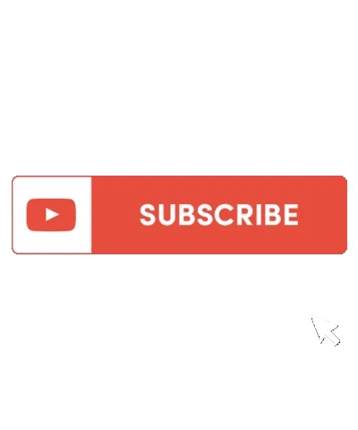

El patrón subscripción (Subscribe)
========================================================================

El patrón **Suscripción**, en inglés **Subscribe pattern** es un patrón
de comportamiento, que permite establecer una relacion 1-N entre varios
objetos, de forma que, cuando el estado de un objeto **publicador**
(*publisher*) cambia, todos los objetos a los que este cambio afecta,
los **suscriptores** (*subscribers*), son notificados.

Para evitar que los suscriptores y los publicadores estén acoplados, el
publicador **no se comunica directamemte con ningún suscriptor**, ni
necesita saber cuantos hay. De hecho, podría no haber ninguno.

Tampoco los subscriptores necesitan saber nada de los publicadores, solo
expresan un interés un un **área** o **tópico** (*topic*) del que quieren
estar informados.

El único conocimiento compartido entre ellos es el formato del mensaje
utilizado para la notificación.

Si el nombre hace pensar en un sistema de subscripción a una revisto o
apuntarse a un canal de YouTube para que te notifique cuando se publiquen
vídeos nuevos, es porque es exactamente la misma idea.

   subscribe!

También conocido como
~~~~~~~~~~~~~~~~~~~~~~~~~~~~~~~~~~~~~~~~~~~~~~~~~~~~~~~~~~~~~~~~~~~~~~~~

**Pub/Sub**, **Dependents**, **Publish-Subscribe**.

