## Introducción a Pillow

La librería **Pillow** es un *fork* de la libreria **PIL** (*Python Image
Library*). Con _pillow_ añadimos a Python la capacidad de procesar imágenes.  


##  Instalacion de Pillow

Se instala con pip.

```shell
pip install pillow
```

Pero ojo, que se importa con el nombre `PIL`, para mantener retrocompatibilidad con la
librería orginal.

```python
import PIL
```

## Características más importantes

- **Acepta múltiples formatos**: Pillow soporta muchos formatos de archivos
  usados para almacenaminto de imágenes, entre otros BMP (*Windows Bitmaps*),
  EPS (*Encapsulated Postscript*), GIF (*Graphics Interchange Format*), ICO
  (*Windows Icons*), JPEG (*Joint Photographic Experts Group*), PNG (*Portable
  Network Graphic*), TGA (*Truevision Graphics Adapter*), TIFF (*Tagged Image
  File Format*)...

- **Un sistema muy eficiente** para representar las imágenes en memoria. La
  librería está diseñada para permitir un acceso rápido y eficiente a los
  pixels de las imágenes, lo que permite usarlo como una base de desarrollo
  para procesar imágenes.

- **Varios algoritmos** habituales del procesamiento de imágenes ya vienen
  incluidos en la librería.

Algunos usos posibles de esta librería:

- Archivado y proceso de imágenes por lotes. La librería permite crear
  *thumbnails*, convertir entre formatos, rotar, cambiar el tamaño, imprimir
  imágenes, etc.

- Presentar imágenes. La versión actual incluye una interfaz Tk, asi como
  controles que pueden ser usados en otros sistemas de ventanas como PythonWin.

- Proceso de imágenes: La librería incluye operaciones básicas de modificación
  de imagenes, que funciona a nivel de pixels, y operaciones de más alto nivel,
  como filtros, nucleos de convolución y conversiones del espacio de colores.

- Análisis y síntesis de imágenes

## Primeros pasos: Usando la clase Image

La clase más importante dentro de la librería es la clase `Image`, definida en
el módulo con el mismo nombre. Podemos crear instancias de esta clase de
diversas formas, bien leyendo las imagenes de un fichero, procesando otras
imágenes, o creando una imagen desde cero.

Pare cargar una imagen desde disco, usamos la función `open()` dentro del
módulo `Image`:


```python
from PIL import Image

im = Image.open("incredibles.png")
```

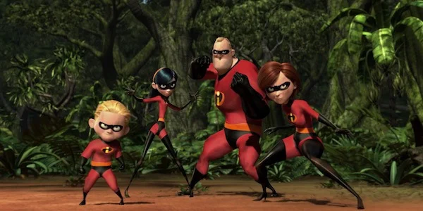


Si tiene éxito, la función devuelve un objeto de tipo `Image`. Podemos examinar
atributos de la instancia para obtener información adicional de la imagen:


```python
from PIL import Image

im = Image.open("incredibles.png")
print(im.format, im.size, im.mode)
```

La salida debería ser:

```
PNG (600, 300) RGB
```

- El atributo `format` identifica el formato usado para almacenar la imagen (Si
  la imagen no se ha creado a partir de un fichero, `format` vale `None`). 

- El atributo `size` es una dupla que contiene el ancho y alto de la imagen, en
  _pixels_.

- El atributo `mode` nos permite saber el número y nombre de las bandas de la
  imagen, así como el tipo de pixel y la profundidad. 

Algunos valores habituales de `mode` son: **`L`** (De luminancia) para imagenes
en escala de grises, **`RGB`** para imagenes en color real, con 24 bits de
profundidad, y **`CMYK`**, que indica una imagen preparada para usarse en sistemas
de impresión.

Una vez que tenemos la instancia de la imagen, podemos usar los diferentes
métodos definidos en la clase para procesar y manipular las imágenes.

Por ejemplo, podemos mostrar la imagen llamando al método `show`.


```python
from PIL import Image

im = Image.open("incredibles.png")
im.show()
```

**Pregunta**: ¿Cuál es el tamaño de la imagen `leon.jpg`? ¿Y cuál es su modo?

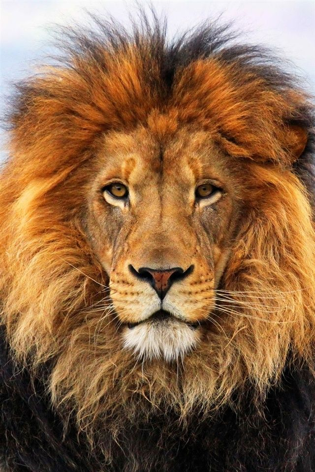

```python
from PIL import Image

im = Image.open("leon.jpg")
print('Tamaño de la imagen:', im.size)
print('Modo de la imagen:', im.mode)
```

La salida del programa es:

```
Tamaño de la imagen: (640, 960)
Modo de la imagen: RGB
```


## Teoría del Color

El ojo humano dispone de una serie de células especializadas en recibir la luz,
llamados conos. Hay tres tipos distintos de conos: los sensibles a la luz roja,
los sensibles a la luz azul y los sensibles a la luz verde.

En realidad, solo vemos esos tres colores, llamados **colores primarios**. En
resto de colores se obtiene como combinación de dos o más colores primarios.
Por ejemplo, el violeta sería un **color secundario**, resultado de detectar a
la vez tanto rojo como azul. Sumando el rojo y el verde obtenemos el amarillo.

Los colores primarios rojo, verde y azul funcionan como tales en un sistema
aditivo, es decir, un sistema que _suma_ los colores, como la pantalla de
ordenador. En un sistema sustractivo, como el que utilizan los pintores al
mezclar los pigmentos en su paleta, los colores se _restan_. En un sistema
sustractivo, los colores primarios serían Magenta (que absorbe el verde),
Amarillo (que absorbe el azul) y Cyan (que absorbe el rojo).

Otros seres vivos tienen ojos con células diferentes, por lo que perciben el
mundo de una forma totalmente diferente a la nuestra. Los perros, por ejemplo,
ven menos colores que nosotros porque solo tienen dos tipos de conos.
Básicamente, su gama cromática se reduce al amarillo, azul y gris. Colores que
nosotros distinguimos perfectamente, como el verde o el naranja, son para ellos
tonos de amarillo, y confunden el violeta y el azul. Curiosamente, muchos
juguetes para perros usan rojos y naranjas, que no distinguen bien.  Quizá Para
compensar, tienen mas bastones, lo que les permite ver mejor en la oscuridad
que nosotros.

Los pájaros y algunos insectos voladores, por el contrario, tienen cuatro tipos
de conos, tres de ellos son equivalentes a los nuestros -rojo verde y azul-
pero además tiene un cuarto tipo de cono para una frecuencia en el
ultravioleta. Eso les permite conseguir una gama cromática que solo podemos
imaginar. Se han realizado estudios usando cámaras sensibles al ultravioleta, y
se han falseado los colores para simular la visión de los pájaros, encontrado
en muchas flores patrones invisibles para nosotros, pero perfectamente
identificables por pajaros e insectos, que son los que realmente le "importan"
a la planta.


Fuente: [A bees-eye view: How insects see flowers very differently to us](https://www.dailymail.co.uk/sciencetech/article-473897/A-bees-eye-view-How-insects-flowers-differently-us.html)

### Modelo RGB

Así tenemos entonces los tres colores primarios del modelo **RGB**: rojo,
verde y azul o lo que es lo mismo con sus nombres en inglés; _Red_,
_Green_, _Blue_. Este sistema se basa en sumar la luz, de forma que la
composición de los tres colores daría el blanco.

### Modelo CMYK

En el modelo **CMYK** los tres colores primarios son Cián (*Cyan*), Amarillo
(*Yellow*) y Magenta (*Magenta*) y la mezcla de estos tres colores a partes
iguales da como resultado el color negro, debido a que cada adición sustrae
luz. Este modelo es el utilizado en la industria gráfica y las artes visuales.

Pero conseguir el color negro, el más barato, a base de mezclar las tintas de
colores, mucho mas caras, es de genero tonto. Así que lo que se hace en este
mdelo es añadir el negro como color aparte, que se representa con la `K` final,
aunque estrictamente hablando no es necesario.
 

### Modelo HSV

Por completar, veremos el modelo **HSV** (del inglés _Hue_, _Saturation_,
_Value_ – Matiz, Saturación, Valor), también llamado HSB (_Hue_, _Saturation_,
_Brightness_ – Matiz, Saturación, Brillo), define un modelo de color en
términos de sus componentes.


Em modelo HSV está diseñado desde el punto de vista de la utilidad. Es muy útil
usar la ruleta de color HSV para elegir un color. En ella el matiz se
representa por una región circular; una región triangular separada, puede ser
usada para representar la saturación y el valor del color. Normalmente, el eje
horizontal del triángulo denota la saturación, mientras que el eje vertical
corresponde al valor del color. De este modo, un color puede ser elegido al
tomar primero el matiz de una región circular, y después seleccionar la
saturación y el valor del color deseados de la región triangular.

En lo que a nosotros respecta, como estamos usando pantallas de ordenador y,
por tanto, estamos generando la luz mediante un sistema aditivo, el modelo RGB
es el que nos interesa usar.

En resumen, todos los colores se obtienen como combinación de tres posibles
valores. Por lo tanto, para representar una imagen en color, solo tenemos que
almacenar los componentes rojo, verde y azul de cada punto que compone la
imagen. Al igual que con las coordenadas, que podemos guardar en forma de tupla
de dos elementos, los colores se pueden expresar en forma de trios o tuplas de
tres elementos, cada uno indicando, por orden, el componente rojo, verde y azul
del color.

Normalmente se usan un *byte*, o sea, 8 bits, para indicar cada componente del
color, lo que nos da 256 tonalidades de rojo, 256 tonalidades de verde y 256
tonalidades de azul, y todas sus combinaciones, que son 256x256x255 o, lo que
es lo mismo:

$$ 2^{8} \times 2^{8} \times 2^{8} = 2^{24} = 16777216 $$

16.777.216 colores diferentes son muchos colores. En la práctica, esto es muchisimo más preciso de lo que el ojo humano puede percibir, por lo que a veces se llama a este esquema *True Color*.

También podemos definir colores usando una _cuadrupla_, una tupla de cuatro
valores. Los tres primeros valores corresponden a los componentes RGB del
color, en el cuarto se especifica la opacidad (lo contrario de transparencia)
del color, también llamada __*alfa*__, __*valor alfa*__ o __*canal alfa*__.

Esto nos permite crear colores traslúcidos, que pueden dejar pasar parte de la
luz que emiten los objetos que están detrás de ellos. Un valor alfa de 255 se
entiendo como totalmente opaco, una alfa de 0 es totalmente transparente; en la
práctica, invisible.

### Leer imágenes desde un fichero

La librería soporta, como vimos antes, muchos formatos diferentes. Para leer y
obtener una imagen desde cualquiera de estos tipos de fichero, solo tenemos que
usar la función `open` en el módulo `Image`, como hicimos antes.

No tienes que preocuparte por qué tipo de fichero es, porque la librería lo
determina automáticamente basandose en el propio contenido del fichero.

### Guardar una imagen a fichero

Para guardar un fichero, usamos el método `save` de la propia imagen. Al salvar
la imagen, es importante el nombre del fichero, porque la librería determinará
el tipo del fichero a partir de la extensión del mismo, asi que si se usa el
nombre `imagen.jpg` se usará un formato diferente que si usamos `imagen.png`.

**Ejecicio**: Convertir la imagen `leon.jpg` a un fichero de tipo PNG.

**Pista**: El mecanismo seria leer la  imagen a memoria, y luego salvarla pero
usando el nombre `leon.png`. La libreria usará la extensión para decidir
que formato de almacenamiento debe usar.

```python
from PIL import Image

img = Image.open("leon.jpg")
img.save("leon.png")
```

**Pregunta**: Como podríamos hacer para cambiar 4000 ficheros de tipo GIF que
tenemos en una carpeta a PNG? No hace falta escribir el programa, solo
describir lo que haríamos

## Crear *thumbnails* o (Para aficionados a la fotografia, copias de contacto)

Podemos usar el método `thumbnail` de la imagen para hacer una versión escalada
y más pequeña. El método acepta como parámetro una dupla o tupla de dos
elementos, que especifican el tamaño máximo de ancho y alto, respectivamente.

El escalado se hace manteniendo la proporción original de la imagen, así que
probablemente el _thumbnail_ solo tendrá el tamaño indicado en la tupla para el
ancho o para el alto. El otro valor se calculará automáticamente. Eso si,
tenemos la garantía de que el ancho y alto del _thumbnail_ siempre será menores o
iguales que los máximos indicados.


```python
from PIL import Image

leon = Image.open("leon.jpg")
size = (200, 200)
leon.thumbnail(size)
leon.show()
```

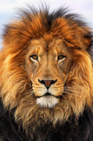


Una cosa a destacar es que el método `thumbnail` no nos devuelve una nueva
imagen, sino que modifica la imagen original, lo que se suele conocer como
modificación *in place*. La mayoría de las funciones y métodos **no** funcionan
así, sino que devuelven una nueva imagen creada a partir de la original.

Otra cosa que conviene saber es que la librería decodifica y carga la imagen
**solo cuando no tiene más remedio** (Esto se conoce como comportamiento
*lazy*).

Esto significa que, cuando abrimos la imagen con open, lee la cabecera del
fichero para determinar el formato y obtener información como el modo, el
tamaño y demás propiedades, pero el resto de los datos no se leen a no ser que
alguna operación de procesamiento lo requiera (como el método `thumbnail` que
usamos antes).

Por tanto abrir una imagen es siempre una operación muy rápida, y totalmente
independiente del tamaño el fichero o del tipo de compresión usado para
almacenar la imagen.

**Ejercicio**: Escribir un pequeño _script_ que liste las imágenes en el
directorio actual (puedes usar `os.listdir`)  que muestre sus dimensiones (El
ancho y alto, que puedes obtener como una tupla en la propiedad `.size` de la
imagen, y el modo de la imagen (que puedes obtener del método `.mode`).


```python
import PIL
import os

IMAGE_EXTENSIONS = [".png", ".jpg", ".gif", ".webp"]
for fn in os.listdir():
    name, ext = os.path.splitext(fn)
    if ext in IMAGE_EXTENSIONS:
        im = PIL.Image.open(fn)
        print(fn, im.size, im.mode)
```
 Cuya salido podría ser:

```
leon.png (640, 960) RGB
DandelionDM_800x665.jpg (800, 665) RGB
HSV.png (347, 347) RGBA
blue-lion.png (550, 340) RGB
incredibles.png (600, 300) RGB
rectangle.png (450, 643) RGBA
PrimroseDM_1000x390.jpg (1000, 390) RGB
SilverweedDM_800x460.jpg (800, 460) RGB
leon.tn.png (133, 200) RGB
fondo.jpg (1280, 719) RGB
mixed.png (341, 512) RGB
croma.png (640, 360) RGBA
elastigirl.png (461, 314) RGB
leon.jpg (640, 960) RGB
```

Puedes filtrar el tipo de ficheros que puedes listar, usando `os.path.splitext(filename)`
y comprobando que la extensión esté en una lista predeterminada, como esta:

```python
IMAGE_EXTENSIONS = [".png", ".jpg", ".gif", ".webp"]
```

O puedes utilizar las excepciones. Para usar las excepciones, necesitas saber que si se
intenta abrir un fichero de algo que no es un fichero de imagen (un fichero `.py`, por
ejemplo) se elevará la excepción `IOError`. Podemos simplemente capturarla, ignorar
este fichero y pasar al siguiente.


```python
--8<--
./docs/external/pillow/lista-imagenes.py
--8<--
```

## Cortar, pegar y mezclar imágenes

La clase `Image` contiene métodos que te permiten manipular partes de una
imagen. Podemos, por ejemplo, extraer un sub-rectangulo de una imagen, usando
el método `crop`. El parámetro de entrada es una cuádrupla (tupla de cuatro
elementos), que contiene, en este orden:

- valor minimo de `x`, o `left`
- valor minimo de `y`, o `upper`
- valor máximo de `x`, o `right`
- valor máximo de `y`, o `bottom`


```python
from PIL import Image

leon = Image.open("leon.jpg")
box = (150, 320, 280, 440)
region = leon.crop(box)
region
```


Como vemos, el tamaño de la imagen respeta las dimensiones usadas para el
recorte.

```python
leon.size, region.size
```

salida:

```shell
((640, 960), (130, 120))
```


Observa que en este caso no se transforma la imagen original, como en `thumbnail`, sino que
se crea una imagen totalmente nueva. En el siguiente diagrma se muestra el significado de cada
uno de los valores de la 4-tupla.


El sistema de coordenadas de Pillow pone el origen (0, 0) en la esquina superior izquierda.
Como las coordenadas empiezan en cero, es bueno pensar que las posiciones apuntan
a los valores entre los pixel, y no a los pixels en si. Por tanto, la imagen
recortada tiene un tamaño de 150xs150 pixels exactamente.


```python
from PIL import Image

with Image.open("leon.jpg") as leon:
    box = (150, 300, 300, 450)
    region = leon.crop(box)
    
region
```

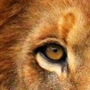


## Procesar la imagen y pegarla de nuevo

Vamos a realizar algun cambio en esta nueva imagen. En este caso vamos
a usar el método `transpose` para rotar la imagen 180 grados. Después, 
pegaremos esta imagen rotada en la imagen original, usando el metodo `.paste`
de la misma.


```python
from PIL import Image

leon = Image.open("leon.jpg")
box = (150, 300, 300, 450)
region = leon.crop(box)
region = region.transpose(Image.ROTATE_180)
leon.paste(region, box)
leon.show()
```

Al pegar la imagen, indicamos la imagen a pegar y el rectangulo donde pegarla, y
el tamaño de las dos debe ser el mismo, si no se elevará un error. Además, no se puede
pegar una imagen de forma que ocupe más que el tamaño de la imagen original.

no tenemos que preocuparnos, sin embargo, si los modos de la imagen pegada y destino
no coinciden, la librería realizará las conversiones necesarias automáticamente.

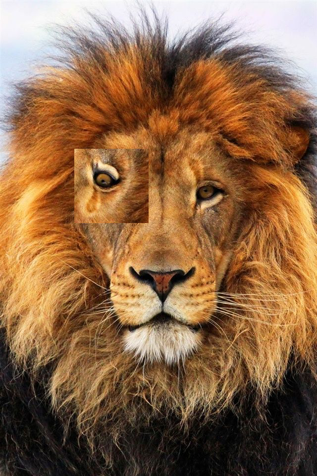

## Descomponer una imagen en color en RGB

El método `split` nos permite dividir una imagen en los canales básicos rojo,
verde y azul (R, G, B), devolviéndoos tres imágenes, cada una de las cuales
contienen los valores para cada banda o color. Podemos reunificar esas tres
imágenes de nuevo con la función `merge`.


```python
from PIL import Image

leon = Image.open("incredibles.png")
red, green, blue = leon.split()
green.show()
```

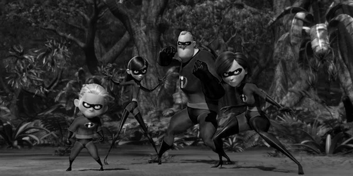


El método `merge` espera dos parámetros, el primero es el modo (es este caso,
`RGB`) y luego las bandas con las que debe mezclar la imagen, en este caso en
forma de tupla de tres elementos). Si mezclamos las bandas en el orden
correcto, obtenemos la misma imagen.

**Ejercicio**: Mezcla las tres bandas obtenidas antes (`red`, `green`, `blue`)
ejecutando el siguiente ejemplo, y comprueba que volvemos a tener la imagen
original. Después, cambia el orden de las bandas (`blue`, `green`, `red`, por
ejemplo) y observa el efecto:


```python
from PIL import Image
from PIL.ImageChops import invert, lighter, add

im = Image.open("incredibles.png")
im.thumbnail((512, 512))

red, green, blue = im.split()
rebuild = Image.merge("RGB", (red, green, blue))
rebuild
```


```python
from PIL import Image
from PIL.ImageChops import invert, lighter, add

im = Image.open("leon.png")


red, green, blue = im.split()
rebuild = Image.merge("RGB", (blue, red, green))
rebuild.thumbnail((550, 550))
rebuild.show()
```

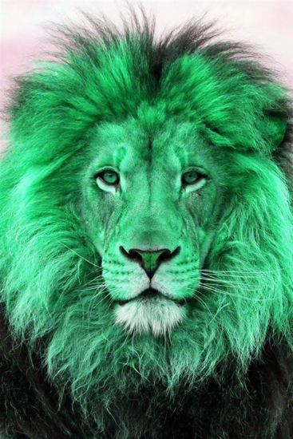

## Transformaciones geométricas

Podemos realizar algunas transformaciones geométricas sencillas incluidas en la
propia clase `Image`. Por ejemplo, `resize` nos permite cambiar el tamaño de la
imagen. Al contrario que `thumbnail`, no respetara las proporciones actuales,
si el nuevo tamaño no la hace, y no hace el cambio *in place*, sino que crea
una nueva imagen con el nuevo tamaño:
    
```python
from PIL import Image

leon = Image.open("leon.jpg")
deformed = leon.resize((560, 220))
deformed.show()
```

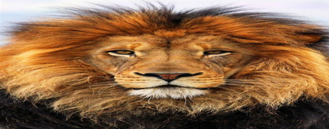


Para rotar las imágenes, podemos usar el método `rotate` o, como hicimos antes, `transpose`. Este
último puede ser usado también para reflejar la imagen a lo largo de su eje vertical u horizontal.

```python
out = im.transpose(Image.FLIP_LEFT_RIGHT)
out = im.transpose(Image.FLIP_TOP_BOTTOM)
out = im.transpose(Image.ROTATE_90)
out = im.transpose(Image.ROTATE_180)
out = im.transpose(Image.ROTATE_270)
```  

Usando el *flag* `expand` (por defecto a False), podemos indicar si queremos 
expandir la imagen para que la rotación se produzca con
o sin perdida.


```python
from PIL import Image

leon = Image.open("leon.jpg")
leon.thumbnail((240, 240))
rotated = leon.rotate(45, expand=True)
rotated.show()
```

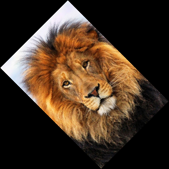


## Transformaciones de color

La librería nos permite convertir imágenes entre diferentes modos.


```python
from PIL import Image

leon = Image.open("leon.jpg")
leon.thumbnail((440, 440))
leon = leon.convert("L")
leon
```

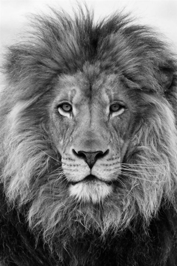


## Mejora de las imágenes

Hay varioas métodos y módulos que nos permites mejorar las imágenes.

### Filters

En el módulo `ImageFilter` vienen una serie de filtros predefinidos, que
se pueden usar directamente como parámetros del método filter.
Tambien tienen estos filtros ya configurados y listos para usar:

- `BLUR`
- `CONTOUR`
- `DETAIL`
- `EDGE_ENHANCE`
- `EDGE_ENHANCE_MORE`
- `EMBOSS`
- `FIND_EDGES`
- `SHARPEN`
- `SMOOTH`
- `SMOOTH_MORE`


```python
from PIL import Image
from PIL import ImageFilter

leon = Image.open("leon.jpg")
leon = leon.crop((0, 340, 550, 680))
l2 = leon.filter(ImageFilter.SMOOTH)
l2
```

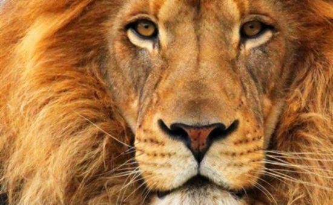


**Ejercicio** Prueba distintos filtros con el código anterior.

### Operaciones puntuales

El metodo `point` se usa para transformar los valores de pixels de una 
imagen de manera individulal. Acepta como argumento una funcion que se
aplicara a todos los pixels de la imagen.

Por ejemplo, si miltiplicamos todos los valores de pixels por 1.4, lo que
estamos haciendo es que todos los valores sean mas luminosos en un 40%:
```python
from PIL import Image

leon = Image.open("leon.jpg")
leon = leon.crop((0, 340, 550, 440))
leon = leon.point(lambda x: x*1.2)
leon.show()
```

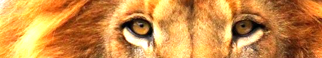

 Combinando estas operaciones con la sivision por bandas podemos crear efectos
 curiosos:

```python
from PIL import Image

leon = Image.open("leon.jpg")
leon = leon.crop((0, 340, 550, 680))
r, g, b = leon.split()
r = r.point(lambda x: 0 if x < 128 else 255)
g = g.point(lambda x: 0 if x < 128 else 255)
b = b.point(lambda x: 0 if x < 128 else 255)
rebuild = Image.merge("RGB", (r, g, b))
rebuild
```

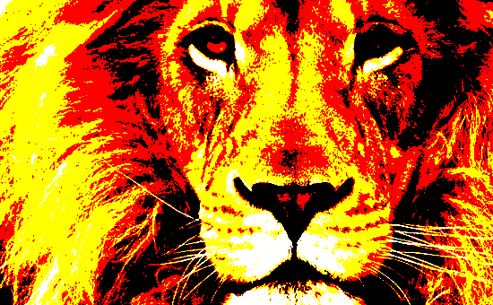


**Ejercicio** Usa la función `split` para obtener los tres canales RGB de la
imagen.  Con el método `point` sube un poco (multiplica por $1.2$) el canal de
rojo), y baja un poco los valores de los canales verde y azul (Por ejemplo,
multiplícalos por $0.85$). Combina de nueve los canales RGB en una nueva figura
y muéstrala como resultado de la celda

**Solución:**

```python
from PIL import Image

leon = Image.open("leon.jpg")
leon.thumbnail((350, 450))# 
r, g, b = leon.split()
r = r.point(lambda x: x*1.25)
g = g.point(lambda x: x*0.85)
b = b.point(lambda x: x*0.85)
rebuild = Image.merge("RGB", (r, g, b))
rebuild.show()
```

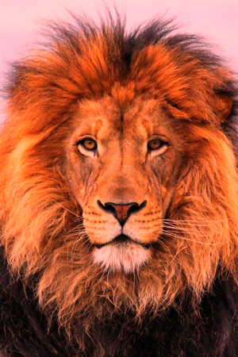

Podemos conseguir una imagen en colores planos usando una funcion que agrupe
les valores, por ejemplo, de 0 a 64 se convierten en 0, de 65 a 128 serían 65, 
de 129 a 193 serían 125, de 194 para arriba serian 255.

```python
from PIL import Image

leon = Image.open("leon.jpg")
leon = leon.crop((0, 340, 550, 680))
leon = leon.point(lambda x: (x // 64) * 64)
leon.show()
```


### El módulo `ImageEnhance`

Una forma aun mas avanzada de tratamiento de imágenes se puede encontrar en
el módulo `ImageEnhance`. Podemos crear  un objeto de tipo `Color`, `Contrast`,
`Brightness` o `Sharpness` a partir de la imagen y probarla con distintos
valores.


```python
from PIL import Image
from PIL import ImageEnhance

leon = Image.open("leon.jpg")
leon = leon.crop((0, 340, 550, 680))

enhancer = ImageEnhance.Color(leon)

enhancer.enhance(1.5)
```


**Ejercicio**: Cambia el valor de 2.2 a otros a ti criterio para que veas el efecto en la
    imagen final. Cambia tambien si quieres a otro tipo de *enhancer* y varia de nuevo
    el valor.

## El módulo `ImageDraw`: Dibujar sobre la imagen

Para dibujar sobre una imagen podemos usar el modulo `ImageDraw`.

Este módulo nos posibilita hacer dibujos desde cero, o anotar o retocar
imágenes preexistentes, o incluso generar gráficos bajo demanda para la web.

Para poder dibujar sobre la imagen, tenemos que crear un objeto, a veces llamado
*canvas* o lienzo, a partir de la imagen. Dibujamos usando este objeto, y no sobre la
imagen original, pero este objeto se encargara de reflejar estos cambios en ella.

Veamos un ejemplo:

```python
from PIL import Image, ImageDraw

leon = Image.open("leon.jpg")
leon.thumbnail((400, 400))
width, height = leon.size
draw = ImageDraw.Draw(leon)
draw.line((0, 0, width, height), fill="red", width=12)
draw.line((width, 0, 0, height), fill="red", width=12)
leon.show()
```

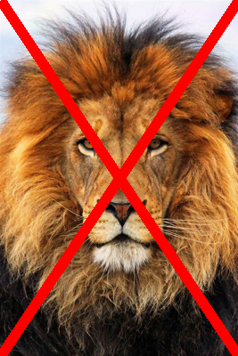

**Ejercicio:** ¡Pon al león entre barrotes! Pinta una parrilla de líneas
horizontales y verticales, de color blanco. Deja un hueco entre ellas
de 100 pixels y pinta cada línea o "barrote" de 12 pixels.

**Solución:**

```python
from PIL import Image, ImageDraw

im = Image.open("leon.png")
max_width, max_height = im.size
draw = ImageDraw.Draw(im)

for width in range(40, max_width, 100):
    draw.line((width, 0, width, max_height), fill="white", width=12)
for height in range(60, max_height, 100):
    draw.line((0, height, max_width, height), fill=(255, 255, 255), width=12)
im.show()
```

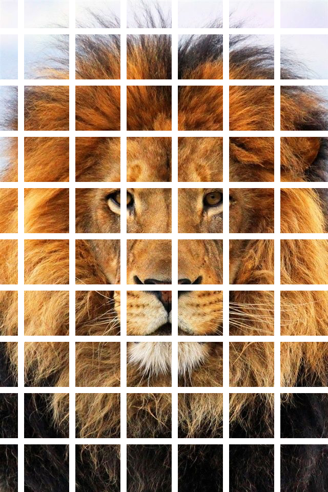


### Colores

Para especificar colores, se pueden usar números o tuplas. Para imágenes
en modo `1`, `L` e `I` solo valen los enteros. Si el `mode` es `F` se deben
usar números en coma flotante (*float*). Para `RGB` se puede usar un numero
o un tupla; si se usa un numero se tomara como el valor rojo. Si el modo
es `P` es que usa un paleta de colores, y se usa un entero cómo indice de la
paleta.

Desde la versión 1.1.4 también se pueden usar nombres usando el convenio de
nombres de colores usado en Html, como `silver` o `navy`. Puedes ver el est
ndar de nombres de colores para HTML aquí:

<https://en.wikipedia.org/wiki/Web_colors#HTML_color_names>

*Ejercicio*: Cambia los colores y ancho de las lineas en el ejercicio anterior.


Además de dibujar líneas, tenemos las siguientes funciones definidas en el objeto `draw`.

- `arc(xy, start, end, fill=None, width=0)`

Dibuja un arco (una porción de un circulo) entre los ángulos indicados `start` y `end`. el
parametro `xy` es un rectángulo que inscribe el arco.


```python
from PIL import Image, ImageDraw

im = Image.new("RGB", (200, 200), 'white')
draw = ImageDraw.Draw(im)

draw.arc((10, 10, 191, 191), 0, 45, fill="cyan", width=18)
draw.arc((10, 10, 191, 191), 45, 123, fill="coral", width=18)
draw.arc((10, 10, 191, 191), 123, 360, fill=(33, 66, 99), width=18)
im
```

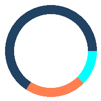


- `chord(xy, start, end, fill=None, outline=None, width=1)`

Como el arco, pero dibuja una linea recta que une los puntos finales.


```python
from PIL import Image, ImageDraw

im = Image.new("RGB", (200, 200), 'white')
draw = ImageDraw.Draw(im)

draw.chord((10, 10, 191, 191), 0, 45, fill="cyan", outline="black")
draw.chord((10, 10, 191, 191), 45, 123, fill="coral", outline="black")
draw.chord((10, 10, 191, 191), 123, 360, fill="pink", outline="black")
im
```

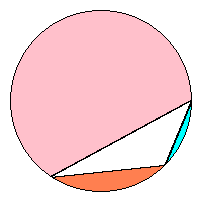


- `line(xy, fill=None, width=0, joint=None)`

Dibuja una línea entra las coordenadas indicadas por `xy`

El parámetro `joint` es el conector entre una secuencia de lineas, puede
ser `curve` o `None`.


```python
import random
from PIL import Image, ImageDraw

im = Image.new("RGB", (400, 200), 'silver')
draw = ImageDraw.Draw(im)
for _ in range(1000):
    x0 = random.randrange(401)
    y0 = random.randrange(201)
    p0 = (x0, y0)
    x1 = random.randrange(401)
    y1 = random.randrange(201)
    p1 = (x1, y1)
    draw.line(
        (p0, p1),
        fill=random.choice(['red', 'navy', 'yellow', 'green', 'black', 'white', 'blue']),
        width=random.choice([2, 4, 6, 8])
    )
im.show()
```

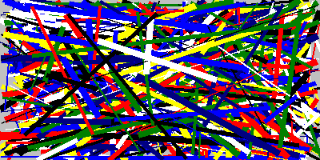


- `pieslice(xy, start, end, fill=None, outline=None, width=1)`

Como `arc` pero dibuja tanto las líneas interiores como exteriores. El parámetro
`xy` es una tupla de cuatro elementos indicando la posición del recuadro que
contendrá el arco. Los parámetros `start` y `end` se especifican en grados. Un
valor de $0$ se corresponde con la posición de las $3$ en el reloj (Horizontal
apuntando hacia la derecha), así que si queremos hacer nuestro gráfico de tarta
empezando en la posición de las 12 tenemos que empezar en $-90$.


```python
from PIL import Image, ImageDraw

im = Image.new("RGB", (200, 200), 'white')
draw = ImageDraw.Draw(im)

draw.pieslice((10, 10, 191, 191), 0, 45, fill="cyan")
draw.pieslice((10, 10, 191, 191), 45, 123, fill="coral", outline="white", width=1)
draw.pieslice((10, 10, 191, 191), 123, 360, fill="pink")
im.show()
```


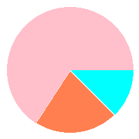


**Ejercicio:** Modificar el ejemplo anterior para que el primer gráfico, en
azul, empiece en la posición de las 12.

**Solucion:**


```python
from PIL import Image, ImageDraw

im = Image.new("RGB", (200, 200), 'white')
draw = ImageDraw.Draw(im)

draw.pieslice((10, 10, 191, 191), -90, -45, fill="cyan")
draw.pieslice((10, 10, 191, 191), -45, 23, fill="coral", outline="white", width=1)
draw.pieslice((10, 10, 191, 191), 23, 270, fill="pink")
im.show()
```


- `point(xy, fill=None)`

Dibuja un punto (un pixel individual) o puntos en las coordenadas `xy` (Que puede
ser una tupla para indicar un punto o una tupla o lista de tuplas para multiples puntos)


```python
import random
from PIL import Image, ImageDraw

im = Image.new("RGB", (200, 200), 'silver')
draw = ImageDraw.Draw(im)
for _ in range(10000):
    x = random.randrange(0, 201)
    y = random.randrange(0, 201)
    draw.point((x, y), random.choice(['red', 'navy', 'yellow', 'green', 'black', 'white', 'blue']))
im.show()
```

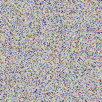


- `polygon(xy, fill=None, outline=None)`

Dibuja un polígono. Dibuja las líneas que unen cada dos puntos consecutivos, y
luego una línea final para unir el primero con el último.


```python
import random
from PIL import Image, ImageDraw

im = Image.new("RGB", (200, 200), 'silver')
draw = ImageDraw.Draw(im)
points = [
    (10, 10),
    (180, 10),
    (98, 44),
    (190, 190),
    (44, 114),
    (10, 180),
]
draw.polygon(points, fill='#336699', outline="red")
im.show()
```

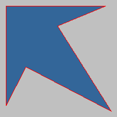


- `rectangle(xy, fill=None, outline=None, width=1)`

Dibuja un rectángulo.


```python
import random
from PIL import Image, ImageDraw

im = Image.new("RGB", (200, 200), 'silver')
draw = ImageDraw.Draw(im)
draw.rectangle([10, 10, 190, 40], fill='#336699')
im.show()
```

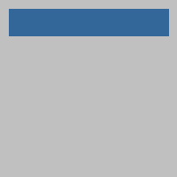

- `text(xy, text, fill=None, font=None, anchor=None, spacing=4, align="left", direction=None, ...)`

Dibuja texto. Los parámetros son:

- `xy` Esquina superior izquierda del texto
- `text` Texto
- `fill` Color de relleno
- `font` Fuente a usar
- `spacing` Si el texto contiene vrias líneas, el número de pixels entre líneas.
- `align` Alinecion de l texto: `left`, `center` o `right`
- `direction` Direccion del texto: `rtl` (*right to left*), `ltr` (*left to right*) o `ttb` (*top to bottom*). 


```python
from PIL import Image, ImageDraw, ImageFont

im = Image.open("incredibles.png")
im.thumbnail((450, 300))
draw = ImageDraw.Draw(im, "RGBA")
draw.rectangle([80, 170, 280, 210], fill='#33669988')
font = ImageFont.truetype("PaperFlowers.ttf", size=40)
draw.text((100, 170), "Have a nice Day!", font=font, fill="white")
im.show()
```


- `textsize(text, font=None, spacing=4, direction=None, ...)`

Devuelve el tamaño que ocupará el texto pasado como parámetro si se dibuja en la imagen.

```python
from PIL import Image, ImageDraw, ImageFont

im = Image.open("incredibles.png")
im.thumbnail((450, 300))
WIDTH, HEIGHT = im.size
draw = ImageDraw.Draw(im, "RGBA")
txt = f"{WIDTH}x{HEIGHT} pixels"
width, height = draw.textsize(txt)
print(width, height)
x = (WIDTH // 2) - (width//2)
y = (HEIGHT // 2) - (height // 2)
rect = (x, y, x+width, y+height)
draw.rectangle(rect, fill='#336699')
draw.text((x, y), txt, fill="white")
im.show()
```


- `ellipse(xy, fill=None, outline=None, width=1)`

Dibuja una elipse dentro del rectangulo `xy`

```python
from PIL import Image, ImageDraw, ImageFont

im = Image.open("incredibles.png")
lienzo = ImageDraw.Draw(im, "RGBA")
lienzo.ellipse((260, 50, 330, 120), fill="red", width=2)
im.show()
```

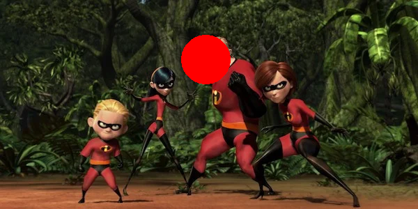


**Ejercicio**: Usa un objeto `Draw` para dibujar una nariz de payaso (Un
circulo rojo) en el hocico de león (O, si prefieres, dibuja con `ellipse` un
circulo completo en una imagen de tu elección)

**Solución:**

```python
from PIL import Image, ImageDraw

leon = Image.open("leon.jpg")

width, height = leon.size
x, y = width //2, height // 2
y += 80
rect = (x-55, y-55, x+55, y+55)
draw = ImageDraw.Draw(leon)
draw.ellipse(rect, fill=(255, 0, 0), width=3)
leon.thumbnail((250, 350))
leon.show()
```

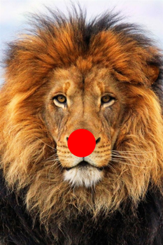


## Llamadas de bajo nivel

Podemos usar los métodos `getpixel` y `putpixel` para obtener o modificar 
el valor de un pixel determinado.

El método `getpixel` acepta un único parámetro, pero este es una tupla de dos
elementos, las coordenadas $x$ e $y$ del pixel cuyo valor queremos obtener. En una
imagen `RGB`, será una tupla de tres elementos con las componentes rojo, verde
y azul.

**Pregunta**: Cuales son los valores R, G, B del pixel en la posicion 100, 100,
en el fichero `leon.jpg`
   
**Respuesta**:

```python
from PIL import Image

leon = Image.open("leon.jpg")
print(leon.getpixel((100, 100)))
```

La salida es:

```
(216, 231, 250)
```

Para trabajar a bajo nivel, leyendo y modificando pixels, lo recomendado es usar
el __método__ `load` de la imagen, que nos da un mapa que nos permite acceder y modificar
los pixels accediendo por índice, como si fueran una matriz.


```python
from PIL import Image

leon = Image.open("leon.jpg")
mapa = leon.load()
print(mapa[100,100])
```

La salida es, de nuevo:

```
(216, 231, 250)
```

Pero este mapa nos deja modificar los valores, simplemente asignando un valor:
    
```python
mapa[x,y] = (red, green, blue)
```

**Ejercicio**: Cambiar a cero los valores R, G, B de los pixeles alrededor
de la posicion 100, 100, en el fichero `leon.jpg`.


```python
from PIL import Image

leon = Image.open("leon.jpg")
mapa = leon.load()

x = 100
y = 100

for xx in range(-10, 11):
    for yy in range(-10, 11):
        mapa[x+xx, y+yy] = (0, 0, 0)

mapa[x-1, y] = (255, 0, 0)
mapa[x, y-1] = (255, 0, 0)
mapa[x, y] = (255, 0, 0)
mapa[x, y+1] = (255, 0, 0)
mapa[x+1, y] = (255, 0, 0)

im = leon.crop((0,0, 500, 300))
im.show()
```


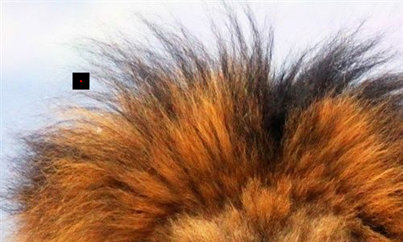


**Miniproyecto**: Usar la siguiente foto y pegar la imagen del presentador
    
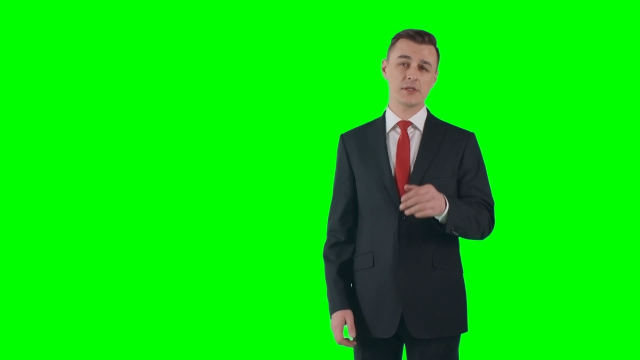

sobre este fondo


PAra poder hacer esto, necesitamos saber un par de cosas:
    
- **Cómo crear una imagen de cero**

Usamos la funcion `Image.new`. Hay que pasarle tres parámetros, el modo ("RGB" o "L"), el tamaño
de la imagen (en forma de tupla width, height) y el color de fondo.


```python
from PIL import Image

im = Image.new("RGB", (90, 90), (48, 64, 96))
im
```


**Pregunta**: Cambiar el modo a "L". ¿Qué color conseguimos? ¿Por qué?

También necesitamos saber que el método `paste` acepta un parámetro opcional,
una **máscara**. Una mascara es una imagen con una sola banda (Tonos de grises,
si queremos). Al pegar una imagen sobre otra con paste, si incluimos una imagen
como mascara, -que tiene que ser del mismo tamaño que la imagen pegada- se
sigue el siguiente proceso: si la mascara está en blanco, se "pega" el pixel,
pero si está en negro, se ignora.  Si está en algún tono de gris, se pega pero
usando el tono de gris como canal alfa u opacidad.

Es decir, que con un 50% de gris ($128$ en nuestra escala de $0..255$), el
pixel se pega pero con un 50 por ciento de su valor, y el otro 50 por ciento
se coge de la imagen de fondo

Así que vamos a dividir el problema en dos: Primero obtener la mascara:
        
- Crea una nueva imagen desde cero, la mascara, con modo `L`, del mismo tamaño
  que la imagen del presentador. Podemos obtener la imagen con el método
  `size`. Pon como color de fondo `white`.

Examinar cada uno de los píxeles de la imagen del presentador. Para cada pixel,
si el nivel de verde es superior al de rojo y azul sumandos, (El componente
verde es, por tanto, muy fuerte), por el pixel equivalente en la mascara a
negro (esto es, a cero).

Recuerda que la mascara solo tiene una banda o canal, no como las imágenes
RGB que tienen tres. Por lo tanto, se asigna un solo valor, no una tupla). Si
no cumple esta condición, déjalo como estaba (blanco, si pusiste "white" al
crearla).


```python
from PIL import Image, ImageFilter

croma = Image.open("croma.png")
(width, height) = croma.size
mask = Image.new("L", (width, height), 255)

source = croma.load()
map_mask = mask.load()
for y in range(height):
    for x in range(width):
        (red, green, blue, _) = source[x,y]
        if green > blue + red:
            map_mask[x,y] = 0
        else:
            map_mask[x,y] = 255 
mask.show()
```

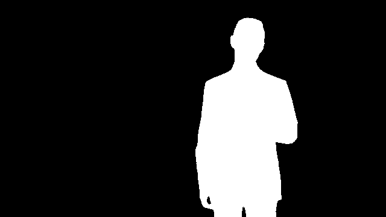


Con la mascara ya calculada, podemos cortar y pegar usándola para eliminar
todo el verde de la imagen original


```python
from PIL import Image


im = Image.open("croma.png")
fondo = Image.open("fondo.jpg")
fondo = fondo.resize(im.size)
fondo.paste(im, mask)
fondo.show()
```

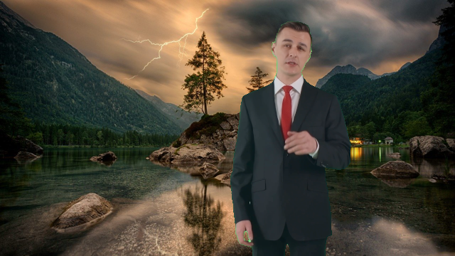


**Ejercicios:**

- Al crear la máscara, en vez de usar blanco puro para las partes que queremos
  transparentes, usa un tono de gris y repite el proceso. ¿Por qué pasa eso?

- Cuando creas la máscara, añade un filtro _blur_ a la misma, para que los
  bordes no sean tan duros. Repite el proceso. ¿Funciona mejor el croma?

- Si combinas los dos efectos, obtienes una imagen fantasmal, traslucida y con
  un brillo verde

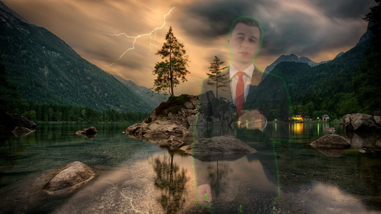
