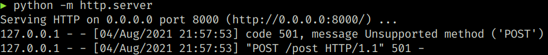

### Objetivos y contenidos

La librería **`requests`** es una librería para HTTP escrita en Python. Se diseñó
desde el principio siguiendo muy de cerca algunos de los principios de estilo PEP 20:

- Hermoso es mejor que feo.

- Explícito es mejor que implícito.

- Simple es mejor que complejo.

- Complejo es mejor que complicado.

- La legibilidad cuenta.

### Instalar requests

Se instala con ayuda del comando ``pip``:

```python
pip install requests
```

### Ejemplo de uso

Vamos a realizar nuestra primera peticion a una página web, tal y como hace
internamente cualquier navegador:

```python
import requests

r = requests.get('http://google.com/')
print(r.status_code)
print(r.encoding)
for name in r.headers:
    print(f" - {name}: {r.headers[name]}")
```

La salida podría ser:

```
200
ISO-8859-1
 - Date: Fri, 23 Oct 2020 14:48:05 GMT
 - Expires: -1
 - Cache-Control: private, max-age=0
 - Content-Type: text/html; charset=ISO-8859-1
 - P3P: CP="This is not a P3P policy! See g.co/p3phelp for more info."
 - Content-Encoding: gzip
 - Server: gws
 - Content-Length: 6076
 - X-XSS-Protection: 0
 - X-Frame-Options: SAMEORIGIN
 - Set-Cookie: NID=204=QTw5WRVVfnkIwzc9x12gWst_JU5Fn-WfpYOAMI1Fv0x1qgcBMXUPIQFJ0pAgOX_cvKeFbV50UHm-k3xI-vYPKJ7wgSKmFA_lTGrU0cEybxrdx_Ev-_0ytA_GV64-1A__G2TAM6oISyXepBFcsewmsczTP1SeSQ42cE9C73u0MYE; expires=Sat, 24-Apr-2021 14:48:05 GMT; path=/; domain=.google.com; HttpOnly

'<!doctype html><html itemscope="" itemtype="http://schema.org/WebPage" lang="es"><head><meta content="Google.es permite acceder a la información mundial en castellano, catalán, gallego, euskara e ingl'
```

En Python 2, un código equivalente a este resultaba mucho más largo e incomodo
de leer. Ahora, con el cambio llevado a las librerías en Python 3, la diferencia
ya no es tanta. Aun así, ``requests`` llega más lejos en términos de comodidad
y facilidad de uso.

Si tu programa hace uso extensivo de llamadas a servidores web, seguramente
``requests`` te aportara un código más sencillo y te conviene usarlo, si solo
haces una única llamada, igual solo te ahorrarías un par de lineas extra, lo
que no compensaría añadir otra dependencia.

### Realizar un petición GET

Realizar una petición en `requests`, como vimos, es muy sencillo. Vamos a obtener, por
ejemplo, el _timeline_ público de GitHub::


```python
import requests

r = requests.get('https://api.github.com/events')
```

Ahora tenemos un objeto `Response`, llamado `r`. Podemos obtener mucha de la
información que necesitamos a partir de este objeto.

### Las propiedades `status_code` y `ok`

En la propiedad `status_code` del objeto `r` que nos ha devuelto la llamada
(que es una instancia de la clase `Response`), podemos
acceder al código de respuesta del servidor usando la propiedad `status_code`.
Este número es el famoso Error **404** que obtenemos a veces en el navegador, si
intentamos acceder a una página que no existe, por ejemplo. El código para "todo ha ido
bien" es **200**.

Por tanto, podemos comprobar si una respuesta es correcta accediendo al valor
de `status_code` y ver si es un $200$.

**Ejercicio**: Haz un pequeño _script_ para comprobar una serie de páginas web.
Has una petición de tipo `GET` para cada dirección y comprueba que el
``status_code`` de la respuesta en 200. Imprime el código de error en caso
contrario.

Puedes usar estas direcciones, o modificarlas a tu gusto::


```python
urls = [
   'https://www.google.com/',
   'https://github.com/',
   'https://www.parcan.es/',
]
```

!!! note
    GET es el tipo de peticion o _verbo_ más frecuente, pero puedes acceder a todos
    los verbos HTTP, que veremos más adelante.

La propiedad `ok` es incluso más fácil de usar para saber si la petición se ha
completado con éxito, es un valor booleano con valor verdadero si todo ha ido
bien. En caso de cualquier problema, su valor será `False`.


```python
import requests

r = requests.get('https://es.wikipedia.org')
assert r.ok
```

**Ejercicio**: Modificar el programa que compruebe las páginas web, usando esta vez las
siguientes _URL_: `marca.es`, `google.es`, `es.wikipedia.es`, `www.python.org` y `www.nasa.gov`
y la propiedad `ok` de la respuesta.


```python
import requests

urls = [
    'http://marca.es',
    'http://google.es/',
    'http://es.wikipedia.org/',
    'http://www.python.org/',
    'http://github.com/',
]

for url in urls:
    print(url, requests.get(url).ok)
```

La salida podría ser:

```
http://marca.es True
http://google.es/ True
http://es.wikipedia.org/ True
http://www.python.org/ True
http://github.com/ True
```

### Usar `requests` para obtener `json`

Si la petición que hacemos nos devuelve contenido formateado en `json`,
disponemos de un método ya predefinido que nos devuelve los valores ya
interpretados como variables Python, es decir, no tenemos que utilizar el
módulo `json`. Veamos un ejemplo con una _API_ pública que ofrece
el cambio de divisas:

```python
import requests
import pprint

# Get the currency value for EUR to JPY:
url = "https://cdn.jsdelivr.net/gh/fawazahmed0/currency-api@1/latest/currencies/eur/jpy.json"
r = requests.get(url)
data = r.json()
print("La respuesta es de tipo:", r.headers['content-type'])
assert isinstance(data, dict)
pprint.pprint(data)
```

La salida podría ser:

```
La respuesta es de tipo: application/json; charset=utf-8
{'date': '2021-08-04', 'jpy': 129.268973}
```

**Ejercicio**: Haz un pequeño _script_ para imprimir por pantalla una lista de 
los tipos de cambio en el momento actual. Usa la API del Banco Central Europeo.

```python
import requests

url = "https://api.exchangerate.host/latest"
r = requests.get(url)
if r.ok:
    data = r.json()  # Los datos estan referidos al Euro
    rates = data['rates']
    for rate in rates:
        print(f'Un euro al cambio son {rates[rate]} {rate}')
```
La salida (abreviada) debería parecerse a esto:

```
Un euro al cambio son 4.357993 AED
Un euro al cambio son 94.844426 AFN
Un euro al cambio son 121.497602 ALL
Un euro al cambio son 582.121682 AMD
Un euro al cambio son 2.13372 ANG
Un euro al cambio son 757.495131 AOA
Un euro al cambio son 114.837637 ARS
Un euro al cambio son 1.603444 AUD
Un euro al cambio son 2.137286 AWG
Un euro al cambio son 2.018312 AZN
Un euro al cambio son 1.956035 BAM
...
```

**Ejercicio**: Filtra los resultados para que solo se muestre el cambio a
Libras esterlinas (`GBP`), Dolares USA (`USD`) y Coronas checkas (`CZK`) (Más
información sobre los códigos de las divisas en la [Wikipedia sobre ISO
4217](https://es.wikipedia.org/wiki/ISO_4217)).


```python
import requests

url = "https://api.exchangerate.host/latest"
r = requests.get(url)
if r.ok:
    data = r.json()  # Los datos estan referidos al Euro
    rates = data['rates']
    for rate in rates:
        if rate in ['GBP', 'USD', 'CZK']:
            print(f'Un euro al cambio son {rates[rate]} {rate}')
```

Salida:

```
Un euro al cambio son 25.442013 CZK
Un euro al cambio son 0.8516 GBP
Un euro al cambio son 1.186695 USD
```

### Otros tipos de peticiones

La orden o petición `GET` es la más frecuente, pero como ya comentamos antes,
puedes acceder a todos los verbos _HTTP_:

- `requests.post("http://httpbin.org/post")`

- `requests.put("http://httpbin.org/put")`

- `requests.delete("http://httpbin.org/delete")`

- `requests.head("http://httpbin.org/get")`

- `requests.options("http://httpbin.org/get")`

**Ejercicio**: Cambia el código anterior, el que comprobaba que los servidores
estuvieran activos comprobando la propiedad `ok` de las respuestas,  para que
use el método `head` en vez de `get`. ¿Va más rápida? ¿Por qué? ¿Devuelven
todas los servidores el código `200`?

Solución:

```python
import requests

urls = [
    'http://google.es',
    'http://es.wikipedia.es/',
    'https://www.python.org/',
    'https://github.com/',
]

for url in urls:
    resp = requests.get(url)
    print(url, resp.ok, resp.status_code)
```

Salida

```
http://google.es True 200
http://es.wikipedia.es/ True 200
https://www.python.org/ True 200
https://github.com/ True 200
```

### Pasar parámetros en las peticiones

Con frecuencia, debes enviar algún tipo de información en el _query string_ de la
_URL_. Si estuvieses creando la _URL_ a mano, esta información estaría en forma de
pares llave/valor, añadidas después del signo de interrogación en la _URL_, por ejemplo
`httpbin.org/get?key=val`. 

La librería `requests` te permite proveer estos argumentos en forma
de diccionario. Por ejemplo, si quisieras pasar las claves 
`key1` y `key2` con valores `value1` y `value2` a `httpbin.org/get`, usarías
algo como esto:


```python
params = {'key1': 'value1', 'key2': 'value2222'}
r = requests.get("http"+"://httpbin.org/get", params=params)
print(r.ok)
print(r.text)
```

Salida:

```
True
{
    "args": {
    "key1": "value1", 
    "key2": "value2222"
    }, 
    "headers": {
    "Accept": "*/*", 
    "Accept-Encoding": "gzip, deflate", 
    "Host": "httpbin.org", 
    "User-Agent": "python-requests/2.22.0", 
    "X-Amzn-Trace-Id": "Root=1-610afe4e-37055e3f53e05d213d4f2af2"
    }, 
    "origin": "87.125.81.191", 
    "url": "http://httpbin.org/get?key1=value1&key2=value2222"
}
```

Puedes ver que la dirección _URL_ ha sido codificada correctamente imprimiéndola:

```python
print(r.url)
```

Salida:

```
http://httpbin.org/get?key1=value1&key2=value2222
```

Nota: cualquier llave del diccionario cuyo valor es `None` no será agregada 
al _query string_.

### API's que requieren registro

La mayor parte de las _API_, aun siendo publicas, exigen un registro previo del
cliente, para poder evitar abusos al sistema, como por ejemplo, ataques de
denegación de servicio.

Normalmente, el registro se hace por correo electrónico, al final del cual
obtendremos algún tipo de _token_ o valor especial que sirve para identificarnos
como usuarios de la _API_.

Por ejemplo, la API de [Football
data](https://www.football-data.org/documentation/quickstart) nos da
informacion actializada de varias ligas de fútbol, entre ellas la _premier league_
y la _Champions League_. Esta API exige un registro previo, tras el cual podemos
hacer uso de la misma. En este caso, debemos añadir a la petición una cabecera
propia con la entrada `X-Auth-Token`:


```python

import requests

AUTH_TOKEN = 'Pon aqui tu TOKEN de acceso'
url = 'http://api.football-data.org/v2/competitions/'
headers = {
    'X-Auth-Token': AUTH_TOKEN,
}
r = requests.get(url, headers=headers)
assert r.ok
```

Si todo ha ido bien, podemos hacer alguna consulta
para obtener los datos de competiciones en curso:

```python
counter = 0
for competition in r.json['competitions']:
    print("{} ({})".format(
        competition['name'],
        competition['area']['name'],
    ))
    counter += 1
    if counter >= 10:
        print("...")
        break
```

Salo listamos las 10 primeras:

```
WC Qualification (Africa)
Primera B Nacional (Argentina)
Liga Profesional (Argentina)
Copa Liga Profesional (Argentina)
Supercopa Argentina (Argentina)
WC Qualification (Asia)
A League (Australia)
FFA Cup (Australia)
Erste Liga (Austria)
Bundesliga (Austria)
...
```

**Ejercicio**: Filtrar para que solo se vean las de España (`Spain`):


```python
import requests

AUTH_TOKEN = 'Pon aqui tu TOKEN de acceso'
url = 'http://api.football-data.org/v2/competitions/'
headers = {'X-Auth-Token': AUTH_TOKEN}
r = requests.get(url, headers=headers)
response = r.json()
for competition in response['competitions']:
    name = competition['name']
    area = competition['area']
    area_name = area['name']
    if ...:  # Tu codigo aqui
        print(f"{name} ({area_name})")
```

**Micro Proyecto**: Modificar para que muestre las ligas de España y Europa, usando una expresión regular


###  Codificación de la respuessta

Una ventaja de `requests` es que automáticamente decodificará el contenido que
viene del servidor. La mayoría de caracteres _unicode_ serán decodificados
correctamente.

Cuando ejecutas una petición, `requests` tratará de obtener la codificación de
la respuesta basándose en las cabeceras HTTP. La codificación del texto que
`requests` encontró (o supuso), será utilizada cuando se acceda a `r.text` o a
`r.json`. Puedes conocer la codificación que `requests` está utilizando, e
incluso cambiarla, usando la propiedad `r.encoding`:


```python
import requests

r = requests.get('https://google.com/')
r.encoding
```

Salida:

```
utf-8
```

### Peticiones POST más complicadas

En algunos casos puede que necesitemos **enviar información**, en forma de
formulario, como un formulario _HTML_. Para hacerlo, pasa un diccionario en el
parámetro `data`. Este diccionario será codificado automáticamente como
formulario al momento de realizar la petición:

Para el siguiente ejemplo, ejecuta un servidor _WEB_ local corriendo en una
terminal, con `python -m http.server`, y luego en otra terminal
ejecuta el siguiente código:

```python
import requests

payload = {'key1': 'value1', 'key2': 'value2'}
r = requests.post("http://localhost:8000/post", data=payload)
```



!!! warning
    No olvides terminar con el servidor web en la terminal, debería
    cerrarse con ++ctrl+c++.

### Cabeceras de respuesta

Podemos ver las cabeceras de respuesta del servidor utilizando un diccionario:

```python
pprint.pprint(r.headers)
```

Salida:

```
{
    'Server': 'SimpleHTTP/0.6 Python/3.8.10',
    'Date': 'Wed, 04 Aug 2021 20:57:53 GMT',
    'Connection': 'close',
    'Content-Type': 'text/html;charset=utf-8',
    'Content-Length': '497'
}
```

Este diccionario no es un diccionario normal, aunque lo parezca: está hecho
especialmente para las cabeceras _HTTP_. La razón es que, de acuerdo con el RFC
7230 , en los nombres de las cabeceras no se debe hacer distinción entre mayúsculas y
minúsculas.

Así que, al contrario que con un diccionario normal, podemos acceder a las cabeceras
indistintamente utilizando letras mayúsculas, minúsculas o cualquier
combinación de las misas:

```python
assert r.headers['Content-Type'] == 'application/json; charset=utf-8'
assert r.headers['content-type'] == r.headers['Content-Type']
assert r.headers['content-type'] == r.headers['CONTENT-TYPE']
```

### Cookies

Si una respuesta contiene _Cookies_, puedes acceder a ellas rápidamente:

```python
url = 'http://example.com/some/cookie/setting/url'
r = requests.get(url)
r.cookies['example_cookie_name']
```

Para enviar tus propias _cookies_ al servidor, puedes utilizar el parámetro
`cookies`:

```python
url = 'http://httpbin.org/cookies'
cookies = dict(cookies_are='working')
r = requests.get(url, cookies=cookies)
r.text
```

Debería devolver:

```python
{"cookies": {"cookies_are": "working"}}
```

### Historial y Redireccionamiento

La librería `requests` realizará redirecciones, si fuera necesario, para
peticiones de todos los verbos, excepto `HEAD`.

El sitio `GitHub`, por ejemplo, redirecciona todas las peticiones `HTTP` hacia
`HTTPS`. Podemos usar el método `history` de  la respuesta para rastrear las
redirecciones. 

La lista `Response.history` contiene una lista de objetos tipo `Request` que
fueron creados con el fin de completar la petición. La lista está ordenada
desde la petición más antigua, hasta las más reciente.

Si estás utilizando `GET` u `OPTIONS`, puedes deshabilitar el redireccionamiento
usando el parámetro `allow_redirects`:

```python
r = requests.get('http://github.com')
print(r.history)
```

Si estás utilizando `HEAD`, puedes habilitar el redireccionamento de la misma manera:

```python
r = requests.head('http://github.com', allow_redirects=True)
print(r.status_code, r.url, r.history)
```

**Ejercicio**: Arreglar el _script_ de comprobacion de direcciones _URL_ para
que realice la petición `HEAD`, pero con redireccionamiento

### Timeouts

Con el parámetro `timeout` puedes indicarle a `requests` que deje de esperar por una
respuesta pasados un número determinado de segundos. El parámetro `timeout`
indica el tiempo máximo que se espera por la respuesta. Si no se produce la
respuesta dentro de ese periodo se elevará una excepción.

### La clase `Session`

Los objetos de tipo `Session` permiten reusar y compartir determinados valores
y *cookies* entre peticiones que se realizan con esa sesión. También usa
internamente las conexiones reutilizables definidas en la librería `urllib3`.
Este objeto está pensado para ser usado cuando se realizan muchas conexiones al
mismo _host_, ya que en este caso, el hecho de reutilizar la conexión puede
suponer un incremento significativo del rendimiento.

Un objeto de tipo `Session` tiene todos los métodos definidos como funciones
en `requests`.

Veamos un ejemplo en el que vemos como las conexiones realizadas al mismo
_host_ comparten las _cookies_:


```python
import requests

s = requests.Session()
primera = s.get('https://httpbin.org/cookies/set/sessioncookie/123456789')
segunda = s.get('https://httpbin.org/cookies')
print(segunda.cookies)
```

### Soluciones

Versión final del programa de chequeo de web, usando `head` y con el
parametro `allow_redirects`:


```python
import requests

urls = [
    'https://www.google.com/',
    'http://github.com/',
    'https://www.parcan.es/',
]

for url in urls:
    r = requests.head(url, allow_redirects=True)
    if r.status_code != 200:
        print(f"Error {r.status_code} al acceder a {url}")
```
