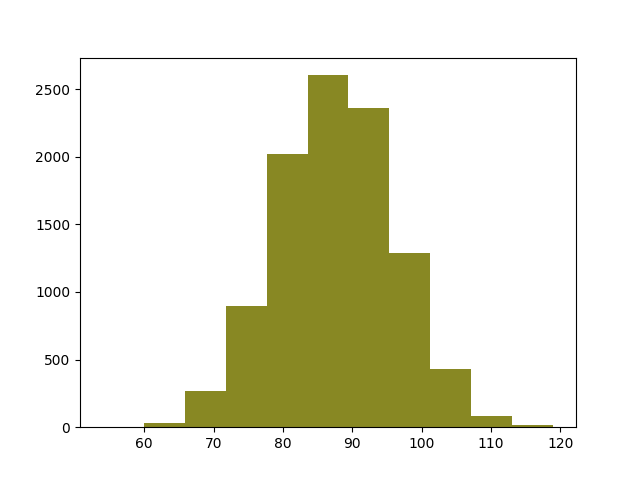

## Introducción a `random`

Este módulo implementa generadores de números pseudo-aleatorios para distintas
distribuciones. Para enteros, podemos hacer una selección uniforme dentro de un
rango; para secuencias, una selección uniforme de un elemento. Podemos
reordenar al azar -barajar- una secuencia y obtener una muestra al azar.

También podemos trabajar con distribuciones uniformes, normales (*Gauss*),
logarítmica normal, exponencial negativa, y distribuciones gamma y beta.

Como todas los módulos de la librería estándar, solo necesitamos importarla
previamente para poder usarla:

```python
import random
```

## La función `random`

La función `random.random()` devuelve un número al azar en coma flotante cuyo
valor puede ser mayor o igual que 0 y estrictamente menor que 1, es decir, el
valor 1.0 esta excluido. En otras palabras, genera un número al azar en el
intervalo semiabierto $[0.0, 1.0)$:

```python
import random

for _ in range(3):
    print(random.random())
```

Produce algo similar a:

```shell
0.9313781272806534
0.5745944655451104
0.5683576640727531
```

Casi todas las funciones de este módulo dependen de esta función básica
`random()`.

Normalmente no usaremos directamente esta función -aunque podemos- porque hay
otras funciones auxiliares, que eventualmente acabarán llamando a esta, pero
que a nosotros nos resultan más cómodas.

## La función `seed`

La función `random.seed([x])` inicializa el generador de números con un
determinado valor. Si se omite, se usa un valor obtenido a partir de la fecha y
hora actual. Pero si se especifica una semilla, la secuencia de números
generada a partir de ahí siempre será la misma, lo que nos permite producir
secuencias predecibles.

Esto nos permite obtener o bien valores menos deterministas (Es decir, algo más
al azar) al estar influidos por la fecha y hora actual, o valores
deterministas, esto es, si inicializamos con `seed` a un valor especifico, las
siguientes llamadas a cualquiera de las funciones nos devuelven las mismas
secuencias

En otras palabras, si inicializo, usando `seed` con un valor determinado,
digamos 173, las siguientes llamadas a `random`, por ejemplo, devolverán los
mismos valores.

Si ejecutamos el siguiente código:

```python
import random
random.seed(173)
for _ in range(3):
    print(random.random())
random.seed(173)
for _ in range(3):
    print(random.random())
```

Veremos que la salida del programa anterior debería dar un resultado
similar al siguiente. Observa que los valores se repiten a partir del
cuarto, porque volvemos a fijar el valor de semilla o *seed*:

```shell
0.8041030466905951
0.44217778729817014
0.02432865274376439
0.8041030466905951
0.44217778729817014
0.02432865274376439
```

Puede ser un poco difícil ver la utilidad o necesidad de esto. Después de todo,
si queremos valores aleatorios, querremos que sean lo más diferentes posibles,
¿no? Pero a veces, especialmente en simulaciones, queremos crear un entorno más
o menos al azar, pero **reproducible**, porque queremos probar distintos
parámetros del modelo, por ejemplo. En estos casos queremos que el entorno
producido sea exactamente el mismo en las dos simulaciones, para que el único
cambio en los dos escenarios sean en los parámetros del modelo, no en los datos
de entrada.

## La función `randint`

La función `random.randint(a, b)` genera un entero $n$ al azar tal que
$a <= n <= b$.

## La función `randrange`

La función `random.randrange(a, b, [step])` es similar a `randint`, pero
los parámetros son equivalentes a los de la función `range` y, en general,
a la forma en que se definen los rangos en Python, en los que el último
valor no está incluido. En otras palabras, genera un entero $n$ al azar
tal que $a <= n < b$.

Vendría a ser equivalente a `choice(range(start, stop, step))`, pero
mucho más eficiente porque no genera realmente todos los valores del
rango.

**Ejercicio**: Usar `randrange` para devolver un número comprendido
entre -20 y 20, ambos extremos incluido.

**Solucion**:

```python
import random

random.randrange(-20, 21)
```

### La función `choice`

La función `random.choice` se utiliza para obtener un elemento al azar
de los pertenecientes la secuencia que se le pasa como primer parámetro.
Si la secuencia está vacía, eleva una excepción `IndexError`.

Veamos un ejemplo:

```python
random.seed()
for _ in range(33):
    print(random.choice('ABCDEFGHIJKLMNOPQRSTUVWXYZ'), end=',')
```

La salida debería ser algo similar a esto:

```shell
K,D,R,I,X,I,P,N,A,S,J,J,C,U,K,R,Q,B,W,N,R,N,Q,C,S,Q,R,C,X,M,N,R,C,
```

**Ejercicio**: Piedra, papel, tijera, lagarto, *Spock*

El siguiente ejemplo de código es una función para el juego "Piedra, papel,
tijera". Modificar la función para jugar a la versión ampliada "Piedra, papel,
tijera, lagarto, Spock", que muestre uno de estos cinco elementos al azar cada
vez que se le llama:

```python
def juego():
    item = ['piedra','papel','tijera']
    return random.choice(item)

print(juego())
```

### La función `choices`

La firma completa de esta función es:

```python
choices(population, weights=None, *, cum_weights=None, k=1)
```

Devuelve una tupla de `k` elementos (por defecto, uno), seleccionados al azar
de los que le pasemos en la variable `population`. Esta selección se realiza
con reemplazo, así que podríamos obtener el mismo valor repetido.

Si se especifican los pesos con el parámetro `weights`, la selección se
realizará ponderada por esos valores. Es decir, que:

```python
choices('ABC', weights=[4, 2, 1], k=2)
```

Nos devolvería dos letras del conjunto `{"A", "B", "C"}`, pero la
letra `A` aparecerá con una frecuencia doble que la de `B`, y la `B` a
su vez aparecerá con una frecuencia doble que la de `C` (Y, por tanto,
la frecuencia de `A` sera cuatro veces la de `C`, o lo que es lo
mismo, aparecerá una `C` aproximadamente cada cuatro `A`.

Quizá se entienda mejor con este ejemplo. La operación realiza con el código
anterior es como si estuviéramos en un bolsa opaca 4 bolas marcadas con la
letra `A`, dos con la letra `B` y una con la letra `C`. Sacamos sin mirar una
bola, apuntamos la letra que tenga marcada, reponemos la bola a la bolsa (De
ahí lo de "con reemplazo") y volvemos a sacar una bola al azar, apuntando de
nuevo la letra marcada. Estas dos letras son el resultado. Es fácil ver con
este ejemplo que, aunque podemos sacar dos veces la bola `C`, este seria el
caso menos probable, ya que cualquier de las otras posibles combinaciones:
`AA`, `AB`, `AC`, `BA`, `BB`, `BC`, `CA` o `CB` tiene más posibilidades de
ocurrir.

Si ejecutamos el siguiente código podemos ver como los resultados, aun
siendo al azar, siguen los pesos indicados por el parámetro `weights`:

```python
from random import choices

for _ in range(10):
    l1, l2 = choices('ABC', weights=[4, 2, 1], k=2)
    print(l1, l2)
```

Ejemplo de salida:

```shell
B B
B B
A A
A C
A A
C A
A A
B B
A A
A C
```

**Ejercicio**: Cambia el parámetro `weights` y vuelve a ejecutar el
código para ver el efecto en el resultado. Usa `None` (El valor por
defecto) para indicar que no quieres usar pesos.

Si usamos el parámetro `cum_weights`, se entiende que son **pesos
acumulados**. En nuestro ejemplo anterior, los pesos 4, 2, 1 son
equivalentes a usar los pesos acumulados 4, 6, 7:

$$4 = 4$$

$$6 = 4 + 2$$

$$7 = 4 + 2 + 1$$

A efectos de rendimiento, **internamente siempre se usan los valores
acumulados**, es decir, que si usamos `weight`, la función acumulará los
valores por nosotros. Por tanto es mejor pasar pesos acumulados si los hemos
calculado previamente o si los podemos conseguir en esa forma, para evitar
hacer el trabajo dos veces.

Si no se indica ningún tipo de pesos, se usara la misma probabilidad
para todos los elementos.

### La función `sample`

La función `random.sample(population, k)` devuelve una lista de `k` elementos,
elegidos al azar dentro de los elementos contenidos en `population`
(normalmente una lista o un conjunto), pero **no se realiza reemplazo**, así
que no se repiten elementos (a no ser que el elemento en si estuviera repetido
en `population`).

Si se usa un tamaño de la muestra, `K`, mayor que el numero de elementos en la
población, se producirá un error.

**Ejercicio** Simulación de cartas.

Supongamos la siguiente clase, que proporciona un modelo de una carta de
la baraja francesa:

```python
--8<--
./docs/standard/09-random/cards.py
--8<--
```

Con esa clase, podemos crear un objeto de tipo naipe o `Card`. El siguiente
ejemplo crea una variable para representar el as de picas:

```python
from cards import Card

as_picas = Card(Card.SPADES, 1)
print(as_picas)
```

que produciría la siguiente salida:

```shell
As de Picas
```

Con el siguiente código creamos toda la baraja:

```python
from cards import Card

baraja = []
for palo in [Card.CLUB, Card.DIAMONDS, Card.SPADES, Card.HEARTS]:
    for valor in range(1, 14):
        baraja.append(Card(palo, valor))
assert len(baraja) == 52
```

El siguiente programa crea una baraja francesa completa, y debería mostrar una
carta elegida al azar, pero esta incompleto. Arréglalo para que funcione:

```python
--8x--
./docs/standard/09-random/ejercicio_01.py
--8x--
```

### La función `shuffle`

La función `random.shuffle(x[, random])` baraja la secuencia (internamente o *in place*, es
decir, no genera una secuencia nueva sino que modifica la existente).

**Nota:** El argumento opcional `random` es una función sin argumentos que
devuelve un número en coma flotante en el intervalo $[0.0, 1.0)$; por
defecto es la función `random()`.


**Ejercicio**: Escribe un programa que reparta cinco cartas al azar,
simulando la entrega de una mano a un jugador.

Tanto la función `sample` como `shuffle` pueden ayudarte con esa tarea.
Puedes usar como esqueleto el código siguiente:

```python
--8<--
./docs/standard/09-random/ejercicio_02.py
--8<--
```

Las siguientes funciones nos permiten generar valores utilizando distribuciones
estadísticas conocidas.


### La función `uniform`

La función `random.uniform(a, b)` devuelve un valor decimal $n$ al azar,
de forma que:

$$a <= n <= b$$

En esta distribución, el valor final `b` puede estar incluido en el
resultado.

### La función `paretovariate`

La función `random.paretovariate(alpha)` devulven valores que siguen la
distribución de Pareto. Esta distribución se conoce generalmente como principio
de Pareto, o "regla de 80-20". Esta regla dice, por ejemplo, que el 80% de la
riqueza de una sociedad es propiedad del 20% de la población. Sin embargo, no
debe confundirse esta regla con la distribución general, ya que la segunda solo
produce este resultado para un valor muy concreto del parámetro `alpha`:

$$\alpha = Log_4(5) = 1.16$$

Aunque *alpha* es variable, observaciones empíricas hen encontrado que la
distribución 80-20 se corresponde con un amplio número de casos, incluyendo
fenómenos naturales y actividades humanas. A pesar de esto, es solo una
observación y no una ley de la naturaleza.

### La función `gauss`

La función `random.gauss(mu, sigma)` devuelve un valor que sigue la
distribución normal o de Gauss. Los parámetros pasados son `mu`, la
media, y `sigma` que es la desviación estandar. Llamando a esta función
nos devuelve valores que siguen la distribución en campana o de gauss.

**Ejercicio** En **Tornillos Я Us**, la fábrica de tornillos en la que
trabajamos, el departamente de calidad ha descubierto que para los
tornillos de 10mm, la desviación estandar en nuestra producción actual
es de 0.0245. Escribe un simulador para producir 10 muestras ficticias
con estos parámetros (media=$10$, sigma=$0.0245$)


**Solución:**

```python
--8<--
./docs/standard/09-random/tornillos.py
--8<--
```

Podemos visualizar estos datos para mostrar por qué se llama a esta
distribución *Campana* de Gauss.

Primero instalemos la libreria externa `matplotlib`:

    pip install matplotlib

El siguiente codigo representa un histograma de las muestras de
tornillos calculadas anteriormente, pero para poder ver la forma de
campana, subiremos el numero de muestras simuladas a 10000:

```python
import matplotlib.pyplot as plt

simulation = [random.gauss(10, 0.0245) for _ in range(10000)]
plt.hist(simulation, bins=10, color="#888823")
plt.show()
```

**Ejercicio extra**: Hacer una función que acepte como argumento de entrada el
número de dados, simule una tirada de esos dados y devuelve la suma de los
valores obtenidos. ¿Cuál es el valor mínimo que podría devolver esta función,
si la llamamos con dos dados? ¿Y cual sería el valor máximo en el mismo caso?

Solución:

```python
import random

def tirada(n_dados):
    acc = 0
    for _ in range(n_dados):
        valor = random.randrange(1, 7)
        acc += valor
    return acc
```

**Pregunta**: Si simulamos 10000 tiradas de 25 dados cada una, y
representamos una grafica de tipo histograma con los resultados ¿Qué
forma obtendriamos?

**Solución:**

```python
import matplotlib.pyplot as plt

simulation = [tirada(25) for _ in range(10000)]
plt.hist(simulation, bins=11, color="#888823")
plt.show()
```


