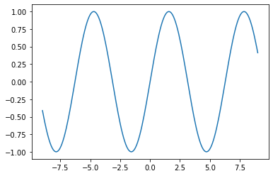

La libreria Numpy
-----------------

El nombre **numpy** vienen de *Numerical Python*. Es una librería de
software libre que permite a Python trabajar con vectores y matrices de
forma muy oficiente. Entro otras cosas, el almacenamiento y el acceso es
muy rápido, y permite operaciones vectorizadas, acceso por nomemclarura
de slices y selección mediante vectores booleanos.

Instalar numpy
~~~~~~~~~~~~~~

Se puede instalar con pip

.. code:: bash

    pip install numpy

.. parsed-literal::

    Requirement already satisfied: numpy in /home/jileon/.virtualenvs/eoi/lib/python3.8/site-packages (1.19.2)
    Note: you may need to restart the kernel to use updated packages.

A la hora de importar numpy es muy normal, como con matplotlib, usar la
siguiente forma abreviada:

.. code:: ipython3

    import numpy as np

Usar Arrays en numpy
^^^^^^^^^^^^^^^^^^^^

Una de las razones para la optimización que consigue numpy es que los array
solo admiten un determinado tipo de datos, no son tan versátiles como las
listas o conjuntos de Python, que aceptan cualquier clase de elemento. Además,
el tipo de dato esta definido muy rigurosamente. Podemos definir el tipo cuando
creamos el array o dejar que numpy lo infiera a partir de los datos que le
damos. Si son todo enteros, por ejemplo, seguramante creará un array de
*enteros de 64 bits*.

Podemos crear un array a partir de cualquier secuencia homogenea de valores
Python usando la función ``array``. Es muy habitual usar una lista:

.. code:: ipython3

    import numpy as np
    
    a = np.array([1, 2, 3, 4])
    print(a, type(a))

.. parsed-literal::

    [1 2 3 4] <class 'numpy.ndarray'>

Pero vale cualquier secuencia:

.. code:: ipython3

    import numpy as np
    
    a = np.array(range(24))
    print(a)

.. parsed-literal::

    [ 0  1  2  3  4  5  6  7  8  9 10 11 12 13 14 15 16 17 18 19 20 21 22 23]

Podemos crear una matriz usando una lista de listas:

.. code:: ipython3

    import numpy as np
    
    b = np.array([
        [1, 1.1, 1.2, 1.3],
        [2, 2.1, 2.2, 2.3],
        [3, 3.1, 3.2, 3.3],
    ])
    print(b)

.. parsed-literal::

    [[1.  1.1 1.2 1.3]
     [2.  2.1 2.2 2.3]
     [3.  3.1 3.2 3.3]]

Los arrays tienen un atributo que define su tipo, ``dtype`` y otro que
define su forma: ``shape``:

.. code:: ipython3

    import numpy as np
    
    b = np.array([
        [1, 1.1, 1.2, 1.3],
        [2, 2.1, 2.2, 2.3],
        [3, 3.1, 3.2, 3.3],
    ])
    
    b.shape

.. parsed-literal::

    (3, 4)

.. code:: ipython3

    import numpy as np
    
    b = np.array([
        [1, 1.1, 1.2, 1.3],
        [2, 2.1, 2.2, 2.3],
        [3, 3.1, 3.2, 3.3],
    ])
    
    b.dtype

.. parsed-literal::

    dtype('float64')

Podemos usar el método ``reshape`` para cambiar las dimensiones de una
array; esto puede ser útil para crear arrays grandes a partir de una
secuencia lineal:

.. code:: ipython3

    import numpy as np
    
    b = np.array(range(16)).reshape((4, 4))
    b

.. parsed-literal::

    array([[ 0,  1,  2,  3],
           [ 4,  5,  6,  7],
           [ 8,  9, 10, 11],
           [12, 13, 14, 15]])

.. code:: ipython3

    b = np.array([
        [1, 1.1, 1.2, 1.3],
        [2, 2.1, 2.2, 2.3],
        [3, 3.1, 3.2, 3.3],
    ])
    print(b.shape)
    b = b.reshape((1,12))
    print(b.shape)

.. parsed-literal::

    (3, 4)
    (1, 12)

**Nota** : Obsérvese que el parámetro que se le pasa a ``reshape`` es
una tupla.

Una forma muy eficiente de crear matrices es la función ``zeros`` para
crear vectores o matrices con todos los valores a cero:

.. code:: ipython3

    import numpy as np
    
    z = np.zeros((4,4))
    z = z.reshape((16, 1))
    z

.. parsed-literal::

    array([[0.],
           [0.],
           [0.],
           [0.],
           [0.],
           [0.],
           [0.],
           [0.],
           [0.],
           [0.],
           [0.],
           [0.],
           [0.],
           [0.],
           [0.],
           [0.]])

**Ejercicio**: Convierte la matriz del ejemplo anterior, de 4x4, a un
vector de 1x16 (o 16x1, lo que se prefiera)

La función ``eye`` permite crear una matriz cuadrada con la diagonal a 1
y el resto de valores a 0. Solo hay que pasarle un dato, ya que al ser
cuadrada el número de columnas es igual el de filas.

.. code:: ipython3

    import numpy as np
    
    i = np.eye(4)
    print(i)

.. parsed-literal::

    [[1. 0. 0. 0.]
     [0. 1. 0. 0.]
     [0. 0. 1. 0.]
     [0. 0. 0. 1.]]

También tenemos la función ``arange``, que funciona como el range
normal, pero vectorizado (Veremos que significa esto más adelante):

.. code:: ipython3

    import numpy as np
    
    np.arange(1, 36, 5)

.. parsed-literal::

    array([ 1,  6, 11, 16, 21, 26, 31])

.. code:: ipython3

    import numpy as np
    
    np.arange(1, 11, 2)

.. parsed-literal::

    array([1, 3, 5, 7, 9])

.. code:: ipython3

    import numpy as np
    
    np.arange(36).reshape((6,6))

.. parsed-literal::

    array([[ 0,  1,  2,  3,  4,  5],
           [ 6,  7,  8,  9, 10, 11],
           [12, 13, 14, 15, 16, 17],
           [18, 19, 20, 21, 22, 23],
           [24, 25, 26, 27, 28, 29],
           [30, 31, 32, 33, 34, 35]])

La función ``linspace`` es similar a range, pero en vez de aceptar como
tercer parámetro un paso, se le indica el número de valores que queremos
en ese intervalo, y el último valor indicado tamnbién está dentro del
rango:

.. code:: ipython3

    import numpy as np
    
    np.linspace(2, 9, 100)

.. parsed-literal::

    array([2.        , 2.07070707, 2.14141414, 2.21212121, 2.28282828,
           2.35353535, 2.42424242, 2.49494949, 2.56565657, 2.63636364,
           2.70707071, 2.77777778, 2.84848485, 2.91919192, 2.98989899,
           3.06060606, 3.13131313, 3.2020202 , 3.27272727, 3.34343434,
           3.41414141, 3.48484848, 3.55555556, 3.62626263, 3.6969697 ,
           3.76767677, 3.83838384, 3.90909091, 3.97979798, 4.05050505,
           4.12121212, 4.19191919, 4.26262626, 4.33333333, 4.4040404 ,
           4.47474747, 4.54545455, 4.61616162, 4.68686869, 4.75757576,
           4.82828283, 4.8989899 , 4.96969697, 5.04040404, 5.11111111,
           5.18181818, 5.25252525, 5.32323232, 5.39393939, 5.46464646,
           5.53535354, 5.60606061, 5.67676768, 5.74747475, 5.81818182,
           5.88888889, 5.95959596, 6.03030303, 6.1010101 , 6.17171717,
           6.24242424, 6.31313131, 6.38383838, 6.45454545, 6.52525253,
           6.5959596 , 6.66666667, 6.73737374, 6.80808081, 6.87878788,
           6.94949495, 7.02020202, 7.09090909, 7.16161616, 7.23232323,
           7.3030303 , 7.37373737, 7.44444444, 7.51515152, 7.58585859,
           7.65656566, 7.72727273, 7.7979798 , 7.86868687, 7.93939394,
           8.01010101, 8.08080808, 8.15151515, 8.22222222, 8.29292929,
           8.36363636, 8.43434343, 8.50505051, 8.57575758, 8.64646465,
           8.71717172, 8.78787879, 8.85858586, 8.92929293, 9.        ])

**Ejercicio**: Usar numpy para representar la funcion seno (Puedes usar
la funcion ``math.sin``.) Crea un espacio lineal entre -9 y 9 y luego
calcula un vector con valores de sen(x) para tener los valores de y.
Luego usa plot para representar la funcion

.. code:: ipython3

    import math
    import matplotlib.pyplot as plt
    import numpy as np
    
    X = np.linspace(-9, 9, 200)
    
    Y = np.array([math.sin(x) for x in X]) # Tu codigo aqui
    
    plt.plot(X, Y)

.. parsed-literal::

    [<matplotlib.lines.Line2D at 0x7fed45ce7b80>]

Esto funciona, pero no es optimo para numpy.

Estamos haciendo un ``for`` para calcular cada valor del :math:`sen(x)`.

Pero numpy tiene incoporada en su funcionalida el paralelismo. Eso
significa que, desde nuestra perspectiva, hace todas las operaciones a
la vez.

Si tenemos dos arrays numpy como

.. code:: ipython3

    import numpy as np
    
    A = np.array(range(0, 10))
    B = np.array(range(-5, 5))
    
    A, B

.. parsed-literal::

    (array([0, 1, 2, 3, 4, 5, 6, 7, 8, 9]),
     array([-5, -4, -3, -2, -1,  0,  1,  2,  3,  4]))

Podemos sumarlos desde python asi:

.. code:: ipython3

    C = [a + b for a, b in zip(A, B)]
    C

.. parsed-literal::

    [-5, -3, -1, 1, 3, 5, 7, 9, 11, 13]

pero es mucho más sencillo hacer:

.. code:: ipython3

    C = A + B
    C

.. parsed-literal::

    array([-5, -3, -1,  1,  3,  5,  7,  9, 11, 13])

Las ventajas de hacerlo asi son varias:

-  Es mas sencilla de escribir y de leer

-  Las operaciones se hacen internamente en paralelo, eso significa que
   si tienen un core 8, se haran 8 sumas a la vez.

-  La salida es un array de numpy, no una lista de p Python

En el caso anterior, que usamos la funcion ``sin`` del modulo ``math``,
no podemos usarla directamente, pero numpy tiene funciones paralelas
equivalentes, en este coso ``numpy.sin``.

.. code:: ipython3

    
    import matplotlib.pyplot as plt
    import numpy as np
    
    X = np.linspace(-9, 9, 200)
    
    Y = np.sin(X) * X**2 
    
    plt.plot(X, Y)

.. parsed-literal::

    [<matplotlib.lines.Line2D at 0x7fed45c59c10>]

.. image:: output_40_1.png

**Ejercicio**: Representa :math:`y = sin(x)x^2`

Otras ventajas de los arrays de numpy
~~~~~~~~~~~~~~~~~~~~~~~~~~~~~~~~~~~~~

Operaciones vectorizadas
^^^^^^^^^^^^^^^^^^^^^^^^

Una operación vectorizada es una una técnica que consiste en aplicar una
misma operación a un array (o a parte de un array) sin necesidad de
especificar bucles. Como este se implementean en C y tiene acceso
inmediato a los datos el rendimiento se eleva en varios ordenes de
magnitud. Además, el código resultante es más corto y se entiende mejor.

Por ejemplo, vamos a calcular lo que lleva calcular el cubo de una serie
de números, haciendlo nativamente en Python o usando Nunpy:

Primero sin numpy.

.. code:: ipython3

    %%timeit
    
    import random
    
    n1 = (random.random() for i in range(10000000))
    c1 = [x**3 for x in n1]

Usando numpy, podemos usar ``numpy.random.rand`` para crear el array, y
luego simplemente lo elevamos al cubo:

.. code:: ipython3

    %%timeit
    
    import numpy as np
    
    n2 = np.random.rand(10000000)
    c2 = n2 ** 3

En resumen: Siempre que puedas, usa operaciones vectorizables. Si estás
trabajando con arrays de numpy y estas haciendo un for en algún lado,
estás haciendo algo mal.

Selección booleana
^^^^^^^^^^^^^^^^^^

Podemos hacer un filtrado de filas dentro de un array de numpy usando un
vector de booleanos; las filas en las que haya un verdadero en el la
posicción del vector booleano equivalente pasan el filtro. En caso
contrario no. Mejor vamoslo con un ejemplo:

Podemos crear un array de numpy a partir de la función ``array``,
pasándole cualquier secuencia. Es muy habitual usar una lista:

.. code:: ipython3

    a = np.array([1,2,3,4])
    print(a)

Si queremos quedarnos solo con la primera y tercera columnas, podemos
filtrar usando un vector de booleanos:

.. code:: ipython3

    a = np.array([1,2,3,4])
    f = np.array([True, False, True, True])
    print(a[f])

Lo que es interensate es que podemos obtener este tipo de vectores
haciendo comparaciones entre arrays. Por ejemplo, supongamos que
tennemos el siguiente array:

.. code:: ipython3

    l = np.array([-23, 144, 85, 36, -2, 0, 7, 92])

Podemos hacer la siguiente comparación: ``l < 0``. En principio esta
comparación no tiene ninguna lógica; estamos comparando un array de
valores con un solo número. Y es verdad que con listas nativas de Python
no tienen sentido, de hecho, daria un error.

.. code:: ipython3

    l = np.array([-23, 144, 85, 36, -2, 0, 7, 92, 0])
    l2 = l[l % 2 == 0]
    l2

pero las clases que implementan los array usan una técnica de OOP
llamada **sobrecarga de operadores**, es decir, que redefinen el
comportamiento y los resultados cuando se opera con los arrays. En este
caso, al comparar con un valor escalar, aplica esa comparación de forma
vectorizada a todos los valores del array, y devuelve un array con los
resultados:

**Ejercicio**: Intenta comparar una lista de numeros con un solo numero.
Por ejemplo:

.. code:: ipython3

    # [1, 2, 3] > 2

**Ejercicio**: Realiza una comparacion similar, pero usando arrays de
numpy:

.. code:: ipython3

    import numpy as np
    
    l = np.array([1, 2, 3])
    l > 2

Usando este vector de booleanos como filtro, puedo obtener un array que
es un sobconjunto de las filas de l, en el que las filas solo tienen
valores positivos:

.. code:: ipython3

    import numpy as np
    
    l = np.array([-12, 23, 31, -100, 4, 754, 0, 63, 0, 2])
    
    print('Menores que 0:', l[l<0])
    print('Mayores que 0:', l[l > 0])
    print('Igual que 0:', l[l == 0])
    print('Pares:', l[l % 2 == 0])
    print('Impares:', l[l % 2 == 1])

Slices
^^^^^^

Los arrays de numpy también se puede operar com slices, como las listas
o las cadenas de texto.

Los elementos de una matriz bidimensional se pueden acceder de dos
maneras:

-  usando ``[fila][columna]``
-  usando ``[fila, columna]``

.. code:: ipython3

    import numpy as np
    
    m = np.arange(1, 17).reshape((4, 4))
    assert list(m[1]) == [5, 6, 7, 8]
    assert m[1][3] == m[1,3] == 8
    m

**Ejercicio**: Usando arrays de numpy y natplotlib, representar la
grafica de la ecuacion

.. math::  y = sin(x)  

Entre los valores 0 y 5

.. code:: ipython3

    import numpy as np
    import matplotlib.pyplot as plt
    
    %matplotlib inline
    
    x = np.linspace(0, 5, 200)
    y = np.cos(x)
    plt.title("$y = sin(x)$")
    plt.plot(x, y)

