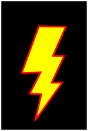
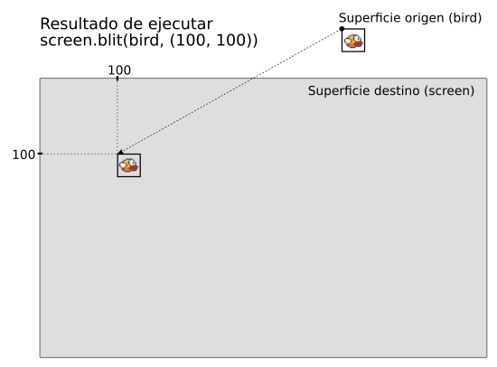

``PyGame``: Creación de juegos 2D
=================================

La libreria PyGame
------------------

PyGame_ es un conjunto de librerías para python orientadas a hacer juegos.

Internamente usa unas librerías escritas en C/C++ llamadas
`SDL <http://www.libsdl.org/>`__ (*Simple DirectMedia Layer*), que dan
acceso a bajo nivel a los sistemas de audio, teclado, ratón, joystick y
gráficos. Tanto SDL como PyGame funcionan en diferentes plataformas:
Windows, Mac OS X y Linux, entre otras.

Existen muchas alternativas para programar juegos en Python, algunas de
las más conocidas son:

`Pyglet <http://www.pyglet.org/>`__ Es otra librería muy interesante
para programar aplicaciones multimedia o juegos. No tiene dependencias
externas, al contrario que PyGame, que depende de SDL. Es ligeramente
más complicada que PyGame, pero también tiene cosas más avanzadas.
Desgraciadamente, el proyecto parece un poco parado ultimamente.

`Python-Ogre <http://python-ogre.org/>`__ es una librería que permite
acceder al motor `OGRE 3D <http://www.ogre3d.org/>`__, un motor de
juegos 3D y a una serie de librerías relacionadas con los juegos que dan
acceso a gráficos, física, efectos especiales, sonido y muchas cosas
más.

`Panda3d <http://www.panda3d.org/>`__ es otro motor de juegos 3D de
softweare libre, diseñado expresamente para Python pero escrito en C++
por cuestiones de rendimiento.

Entre sus características más destacadas están: Un rendimiento muy
bueno, incluso en máquinas antiguas, soporte multiplataforma,
importación y exportación de modelos, audio 3D, detección de colisiones,
físicas, dispositivos >de entrada/salida no habituales, una librería de
IA básica y muchas cosas más.

`cocos2d`_ es un *Framework* para crear juegos 2D.

`kivy <http://kivy.org/>`__ es otro framework multiplataforma,
incluyendo dispositivos móviles, que ofrece como aspectos realmente
interesantes el compilado para diferentes soportes
(Android/iPhone/Blackberry), controles avanzados y soporte
*multi-touch*.

`Pilas Engine <http://pilas-engine.com.ar/>`__ Por último, pero no menos
interesante, un proyecto de motor de juegos realizado integramente en
Argentina. Está dirigido a personas que comienzan a programar
videojuegos y quieren lograr resultados sorprendentes y divertidos en
poco tiempo. Es multiplataforma, completamente en español e interactivo.
Está escrito sobre Pyglet.

Hay muchas más opciones, un buen lugar para buscar es el siguiente wiki:
    
    https://wiki.python.org/moin/PythonGameLibraries

Aunque, como vemos, hay muchas alternativas perfectamente válidas, vamos a usar
PyGame, por varias razones: Es de los más fáciles de instalar, es más sencillo
para empezar a utilizar que casi todos los demás y es bastante estable.

Además, podemos empezar a programar con él sin usar programación orientada a
objetos.

Por cierto, hay una competición de juegos escritos en Python que se celebra dos
veces al año, en el cual se debe realizar una implementación completa de un
juego en una semana exacta. Se llama PyWeek_.

    
Se puede usar cualquiera de las librerías que hemos mencionado hasta ahora.
Al principio de la semana se anuncia un tema, sobre el cual se deberá
inspirar el juego, ya sea por la parte estética, funcional o ambas. Hay
reconocimiento para los tres primeros seleccionados: oro, plata y bronce.
No hay ningún premio material, solo el reconocimiento de la comunidad y la
diversión de participar.

Nuestro primer programa en PyGame
---------------------------------

Siguiendo la tradición impuesta por Brian Kernighan, veamos la versión
pyGame del hola, mundo, el programa más sencillo que es capaz de hacer
algo.

Este es nuestro primer programa en Pygame::

   import pygame
   import time

   pygame.init()
   surface = pygame.display.set_mode((600, 400))
   pygame.display.set_caption("Hola, Mundo pygame")
   time.sleep(3)
   pygame.quit()

Este programa se limita a crear una ventana de unas dimensiones
determinadas, ponerle un título, espera tres segundos y termina.

No es el programa más exitante del mundo. Pero no está mal para 5 líneas de
código. Veamos cada línea de código con un poco más de detalle.

La llamada a ``pygame.init()`` simplemente inicializa el módulo pygame.
Carga las librerías necesarias y prepara algunos datos que va a
necesitar más adelante.

No tiene mayor interes, excepto hacer notar que es obligatorio ejecutar
esta inicialización antes de poder hacer nada con pygame, y que
cualquier llamada a los módulos de pygame que se haga sin haber
realizado antes esta inicialización muy probablemente de un error.

La línea ``ventana=pygame.display.set_mode((600, 400))`` es la que crea
la ventana sobre la que vamos a trabajar. Crea una ventana con una
superficie útil de 600 por 400 pixels. La superficie útil es el área
interna de la ventana, sin ninguno de los adornos que proporciona el
sistema operativo: bordes, barra del titulo, botones y demás añadidos.

Un detalle interesante (y que puede ser causa de problemas si se nos
olvida) es que ``set_mode`` espera un único parámetro, una tupla
conteniendo el ancho y el alto de la ventana. Observense los dobles
paréntesis; los parántesis internos crean la tupla que la función
necesita.

Sin estos paréntesis internos la función devolverá un mensaje de error
bastante explícito, en el que se quejará porque se le ha pasado un
entero, en vez de una tupla de dos elementos argumentos::

    import pygame
    pygame.init()
    s = pygame.display.set_mode(600, 400)
    Traceback (most recent call last):
      File "<stdin>", line 1, in <module>
    TypeError: must be 2-item sequence, not int

La tercera línea, la llamada a ``pygame.display.set_caption`` sirve para
establecer el título que mostrará la ventana. No es estríctemente
necesaria paro es conveniente que en algún lado aparezcan la frase
“hola, mundo”; así queda más claro que tipo de programa es.

En la cuarta llamamos a ``time.sleep`` para esperar tres segundos. Si no
lo hicieramos, el sistema crearia y destruiriria tan rapido la ventana
que podriamos ni darnos cuenta.

La última línea es importate, ``pygame.quit()`` debe ser llamada al
final del programa, de forma que se liberen los recursos y la memoría
que reservamos durante la llamada a ``pygame.init()``.

No es estrictamente necesaria: podriamos eliminarla y aun así el
programa seguiría funcionando, ya que el interprete de python lo hará
por nosotros cuando termine. Pero esta no es una manera elegante de
programar; es mejor incluir explicitamente nuestra llamada a
``pygame.quit()`` en el momento que sea conveniente y adecuado para
nosostros.

Sistema de coordenadas
----------------------

Antes de avanzar más en los detalles de PyGame, vamos a ver el sistema
de coordenadas que se usa en pantalla

En PyGame (y en muchísimos otros soportes gráficos orientados a
pantallas) las coordenadas ``Y`` aumentan de arriba hacia abajo. Es
decir, el origen de las coordenadas, el punto 0,0 si se prefiere, esta
en la **esquina superior izquierda**, tal y como podemos ver en el
siguiente esquema:
Nuestro primer programa en PyGame
---------------------------------
Este es nuestro primer programa en Pygame. Esta como texto, y no como
celda ejecutable porque da problemas ejecutar este codigo dentro de
Jupyter, hay que ejecutarlo directamntem ya sea desde la consola o desde
algun manejador de archivos::

   import pygame
   import time

   pygame.init()
   surface = pygame.display.set_mode((600, 400))
   pygame.display.set_caption("Hola, Mundo pygame")
   time.sleep(3)
   pygame.quit()

.. figure:: coords.png
   :alt: image

En PyGame, lo más normal es expresar las coordenadas de un pixel usando
una tupla de dos valores.

Existe además un objeto más complejo que permite definir una porción de
la imagen, un subconjunto de pixels, en forma rectangular, definidas por
unas coordenadas x e y, un ancho y un alto. Este objeto es de la clase
``Rect``.

Copiar el siguiente código en un editor, salvar y ejecutar con python::

    import random

    import pygame
    from pygame.locals import QUIT

    WIDTH = 600
    HEIGHT = 400

    BLACK = (0, 0, 0)
    RED = (255, 0, 0)

    pygame.init()
    pygame.display.set_caption("Circulos")
    screen = pygame.display.set_mode((600, 400))
    screen.fill(BLACK)
    for _ in range(10):
        x = random.randrange(WIDTH)
        y = random.randrange(HEIGHT)
        r = random.randrange(25, 75)
        pygame.draw.circle(screen, RED, (x, y), r, 0)
    pygame.display.update()

    #Run the game loop
    in_game = True
    while in_game:
        for event in pygame.event.get():
            if event.type == QUIT:
                in_game = False

    pygame.quit()

Pintar en pantalla con pygame
-----------------------------

Ya que tenemos creado la ventana, lo primero es ver que podemos hacer
con ella. La variable ``surface`` que obteniamos como resultado de la
llamada a ``set_mode``, es un tipo de dato especial, un objeto de tipo
``Surface``. Podemos llamar a una serie de funciones, a las que le
pasaremos, entre otros parámetros, esta superficie, para que nos pinte
diferentes tipos de gráficos. Veremos a continuación algunos de los más
usados.

Círculos y circunferencias
--------------------------

Podemos hacer circulos y circunferencias usando la llamada
``pygame.draw.circle()``. Los parámetros que espera esta función son:

-  La superficie (En algunos otros sistemas se habla de lienzo o
   *canvas*) sobre la que queremos pintar la circunferencia El color de
   la misma Las coordenadas del centro, en forma de tupla El radio y,
   ppcionalmente, el ancho de la línea.

Veámos un ejemplo:

.. literalinclude:: circle.py
   :language: Python
   :lines: 3-

Una curiosidad de esta función es que, si no especificamos el ancho como
último parámetro, se pintará un circulo; pero si lo especificamos, se
pintará una circunferencia. Podemos ver la diferencia con este segundo
ejemplo:

.. literalinclude:: circumference.py
   :language: Python
   :lines: 3-

Otra cosa que puede haber llamado la atención es la llamada a la misteriosa
función ``pygame.display.flip`` justo después de realizar las operaciones de
dibujo. Si probamos a ejecutar los programas comentando esta línea, solo
obtendremos una ventana en negro. La razón es que todas las operaciones de
dibujo que vamos a ver se realizan con una técnica llamada de doble buffer
(*double buffering*). La idea es que, durante el juego, podemos "pintar" en una
segunda pantalla, invisible. Cuando la imagen está terminada, se copia el
producto final de la pantalla invisible a la real. Las razones para hacer esto
son varias, pero principalmente estas dos:

- El jugador no tiene la posiblidad de ver las imagenes a medio
  formar.

- Normalmente, es más rápido dibujar en la pantalla "invisible" y,
  una vez terminado, copiar todo a la pantalla real, que pintar
  directamente a la pantalla. Por contra, se consume más memoria.

La técnica de doble buffer es de uso habitual en los desarrollos de
videojuegos.

Líneas y polígonos
------------------

Podemos usar la función ``pygame.draw.line`` para pintar un segmento de
una línea. Los parámetros que necesita son, en primer lugar, la
superficie a utilizar y el color conque se quiere pintar (casi todas las
llamadas del módulo ``pygame.draw`` tienen estos dos valores como
primeros parámetros. A continuación, vienen las coordenadas (en forma de
duplas) de los puntos de inicio y final de la línea. Finalmente, de
forma opcional, se puede incluir el ancho de la línea como último
parámetro.

Veamos el siguiente ejemplo, donde usaremos la función ``line`` para
pintar una retícula de 10 x 10 cuadrados:

.. literalinclude:: lines.py
   :language: Python 
   :lines: 3-

La función ``pygame.draw.lines`` es incluso más potente; en vez de pasarle dos
puntos, le podemos pasar una lista de puntos. Los parámetros que espera son, en
primer lugar, superficie y color. Luego espera un parámetro booleano, llamado
``closed``, que indica si queremos que el trazo sea cerrado o abierto, es
decir, que una el último punto de la lista con el primero, o no. A continuación
viene la lista de puntos y, finalmente, como de costunbre, el ancho. El
siguiente ejemplo muestra una gráfica de la función coseno:

.. literalinclude:: cosine.py
   :language: Python 
   :lines: 3-

El resultado debería ser algo así:

.. figure:: cosine.png
    :width: 601
    :height: 430

**Ejercicio**: Modificar el programa para que muestre a la vez la gráfica del
seno y la del coseno. **Extra bonus**: usa colors distintos para cada función.

Tanto para ``line`` como para ``lines`` existe unas versiones alternativas,
llamadas ``aaline`` y ``aalines`` respectivamente, que dibujan las líneas
usando una técnica llamada `Antialiasing`_.  Estas funciones producen una
líneas más "rectas" y agradables de ver, sin el efecto de escalón que se puede
ver en las líneas dibujadas con las versiones más dimples.

**Ejercicio**: Escribir un programa que dibuje dos líneas diagonales, una
desde la esquina superior izquierdo hasta la esquina inferior derecha, y
otra desde la esquina inferior izquierda a la esquina superior derecha.
Modificar el programa para que una de las líneas use ``aaline`` en vez
de ``line``. ¿Se ve la diferencia?

Con la función ``lines`` (o ``aalines``) podemos dibujar el perímetro de
un polígono, usando el parámetro ``closed``. Si queremos pintar el
interior del polígono podemos usar la función ``polygon``. Esta función
acepta los parametros superficie, color, y lista de puntos.

Ejercicio: Usar las funciones ``line`` (o ``aaline``) y ``polygon`` para
pintar una imagen similar a la siguiente:

   Shazam!

Elipses y semicírculos
----------------------

La función ``ellipse`` dibuja una elipse inscrita dentro del rectángulo
definido por un parámetro que le pasamos (en forma de cuadrupla o tupla
de cuatro elementos). Los parámetros son los habituales, superficie,
color, el retangulo en forma de tupla de cuatro elementos: los dos
primeros son la coordenada de la esquina superior izuierdda, y los dos
siguientes el anho y el alto respectivamente. Si añadimos el parámetro
opcional del ancho, que por defecto vale 1, dibujará el perímetro. Si
especificamos ancho 0, rellenara la elipse.

La función ``arc`` dibuja parte de una elipse. Además de las coordenadas
del rectangulo que inscribiría la elipse, hay que incluir tambien un
ángulo inicial y un ángulo final, en radianes. Solo se dibujará la parte
de la elipse comprendida entre esos dos ángulos.

El siguiente ejemplo demuestra el uso de estas dos funciones:

.. literalinclude:: elipses.py
   :language: Python
   :lines: 3-

El bucle del juego o *Game Loop*
--------------------------------

Todos los videojuegos tienen siempre la misma estructura. Es un bucle
continuo en el que se realizan tres cosas, siempre las mismas:

- Leer las entrada al sistema, normalmente los eventos producidos

- Actualizar el estado del juego

- Reflejar el estado del juego en la pantalla

En algunos *frameworks*, el propio bucle viene incluido dentro de la
librería. En PyGame es el usuario el que define su propio bucle, pero al
final, con mayor o menor diferencia, tendremos un bucle dentro del cual
realizamos estas tres fases.

En un programa normal de PyGame habrá, por lo tanto, un bucle principal.
Nuestros programas de ejemplo eran demasiado sencillos, así que ni nos
tomamos la molestia de incluirlo. Pero para poder hacer algo más
avanzado, es necesario incluir nuestro bucle. La estructura de un juego
en PyGame quedaria, pues, más o menos así::

    codigo_inicializacion()
    while True:
        analizar_eventos()
        actualizar_estado_juego()
        dibujar_y_refrescar_pantalla()
    codigo_finalizacion()

A modo de ejemplo, vamos a escribir un programa que pinte un paisaje
espacial, lleno de estrellas, que vayan desplazandose de derecha a
izquierda, como si fuera la ventanilla lateral de una nave espacial.

Codigo de Inicialización
------------------------

En primer lugar, necesitaremos guardar las posiciones de las estrallas.
Para ello, crearemos una lista de tuplas, donde cada tupla seran unas
coordenadas x e y de donde queremos que aparezcan las estrellas. Por el
momento, pintaremos las estrellas como circulos de radio 2. Hay formas
más eficaces de pintar un punto en la pantalla, pero ahora mismo no nos
importa demasiado el rendimiento.

Por tanto, en la fase de inicilización llenaremos la lista de estrellas
con unos 60 valores aleatorios. La parte del código que crea la lista es
la siguiente::

    estrellas = []
    for i in range(60):
        estrella = [
            random.randrange(0, 601),
            random.randrange(0, 481)
            ]
        estrellas.append(estrella)

Definiremos también una serie de constantes: algunos colores y el ancho
y alto en pixels de nuestra ventana.

Analizar eventos
----------------

En este programa no hay eventos que atender, pero si podemos poner una
pequeña gestión de eventos para tratar el único que nos interesa por
ahora, el que nos informa de que el programa ha terminado. El código de
tratamiento de eventos es el siguiente::

    for event in pygame.event.get():
        if event.type == QUIT:
            pygame.quit()
            sys.exit()

Explicaremos los eventos con más detalle en la siguiente sección.

Actualizar el estado del juego
------------------------------

Atendiendo a la descripción del problema, lo que hay que hacer es,
dentro del bucle del juego, hacer que las estrellas se desplazen hacia
la izquierda. En otras palabras, decrementar la coordenada x de cada
estrella. Como hemos guardado la posición de cada estrella como una
tupla de la forma (x, y), el código que actualiza el estado del juego es
tan sencillo como esto::

    for estrella in estrellas:
        estrella[0] = estrella[0]+1

Eesto hará que la coordenada x de cada estrella vaya disminuyendo, asi
que cada vez se irán pintando más hacia la izquierda. El problema será
cuando la coordenada x sea inferior a cero. En ese momento dejaremos de
poder ver a la estrella, porque está fuera de las coordenadas de nuestra
ventana.

Podemos resolver esto de varias maneras, una muy sencilla es conseguir
que la estrella que ha "desaparecido" por la izquierda vuelva a aparecer
por la derecha. es tan fácil como comprobar para cade estrella si la
coordenada ``x`` ha llegado a tener un valor negativo, en cuyo caso le
sumaremos la constante ``WIDTH`` para que vuelva a aparecer por la
derecha. Por ejemplo, si el valor de ``x`` llega a -2, y el valor del
ancho es 640, el nuevo valor de ``x`` debe de ser 640-2 = 638.

El código final queda, por tanto, así::

    for estrella in estrellas:
        estrella[0] = estrella[0]-1
        if estrella[0] < 0:
            estrella[0] += WIDTH

Dibujar y refrescar pantalla
----------------------------

Hay una cosa nueva de la que tenemos que preocuparnos, y es el
mantenimiento de la pantalla. En cada ciclo del bucle de juego, si no
hacemos nada se sigue manteniendo lo dibujado anteriormente. No es algo
que nos interese ahora mismo, ya que lo que queremos es borrar la
estrella de la posición anterior que ocupaba y pintarla en la posición
nueva. La forma más sencilla de conseguir esto es pintar toda la ventana
de negro (borrando así todo lo dibujado anteriormente) y luego
simplmente pintado cada estrella en su nueva posición. La superficie
tiene un método para esto llamado ``fill()``, método al que le pasaremos
un color con el cual queremos rellenar la superficie. Estando como
estamos en el espacio, habra que rellenar la pantalla de negro.

El código encargado de dibujar y refrescar la pantalla quedaría así::

    screen.fill(BLACK)
    for estrella in estrellas:
        pygame.draw.circle(screen, WHITE, estrella, 2)
    pygame.display.flip()

No nos olvidemos de la llamada a ``flip()`` en la última línea;
recordemos que las operaciones de dibujo se realizan en una superficie
auxiliar, invisible, y que solo se reflejan en la superficie real cuando
llamamos a este método

El listado completo del programa puede verse a continuación:

.. literalinclude:: starfield_01.py
   :language: python
   :lines: 3-

Los Frames Por Segundo o FPS
----------------------------

Los juegos de ordenador funcionan igual que el cine, proyectan una serie de
imagenes fijas muy rápido, de forma que el ojo humano es incapaz de detectar el
cambio y lo percibe como movimiento. En el cine actual se proyectan 24 imagenes
cada segundo (que, si hacemos los cálculos, nos sale que una película de una
hora y media de duración viene a estar compuesta por aproximadamente 130.000
fotografías). Un monitor de ordenador actual suele funcionar a un rango de 60
Hz, lo que es otra forma de decir que emite 60 imágenes cada segundo. El número
de imágenes o fotogramas que se proyectan cada segundo se conoce como **Frame
Rate**, **Frames por segundo** o **FPS**.

¿Cuantos FPS tiene nuestro programa? La respuesta exacta es: depende.  Depende
de lo rápido que sea nuestro ordenador, de la cantidad de tareas simultaneas
que este ejecutando, de la cantidad de memoria RAM que tenga, de si en ese
momento está haciendo operaciones a disco o no, etc... Si ejecutamos nuestro
programa en distintas máquinas, probáblemente obtendremos diferentes
velocidades y ratios FPS, ya que el programa intentará ejecutarse a la máxima
velocidad que se le permita.  Esto es inaceptable en un videojuego moderno,
donde se espera que el programa se comporte de forma similar en cualquier
ordenador.

En PyGame se resuelve este problema usando una variable de tipo reloj, llamada
``pygame.time.Clock``. Esta variable nos permite mantener un FPS fijo
independientemente de la máquina.

El mecanismo es el siguiente: para garantizar que el programa no se ejecute
demasiado rápido, se intercalan breves pausas en cada iteración del bucle del
juego. Al final de cada iteración, justo después de la llamada a ``flip`` o
``update`` (``update`` es una versión más avanzada de ``flip`` que veremos más
adelante, pero que por ahora pueden considerarse llamadas equivalentes), se
llama al método ``tick()`` de la variable reloj. la primera vez que se llame a
``tick`` no hará nada, pero toma nota del momento en que se le ha llamado. La
segunda vez calcula la diferencia con el momento de la llamada anterior y
comprueba si va demasiado rápido. Si es asi, ejecuta una pausa de tanto tiempo
como haga falta para garantizar los FPS que se le pasan como parámetro.

Por ejemplo, un FPS de 50 significa que hay que generar una imagen nueva cada
20 milisegundos. si entre una iteración y la anterior han pasado solo 5
milisegundos, la llamada a ``tick()`` hace una pausa de 15 milisegundos para
alcanzar los 20 que hacen falta para mantener un rango constante de 50 FPS.
Evidentemente, si la iteración ha llevado más de 20, no se realiza pausa de
ningún tipo, y el ratio de FPS bajará.

A efectos prácticos, lo único que hay que recordar es que tenemos que crear un
objeto reloj, del tipo ``pygame.time.Clock`` antes de entrar en el bucle, y
dentro de este, al final, poner una llamada al método ``tick`` pasando el
número de FPS que queremos. El codigo del campo de estrellas usando el reloj se
muestra a continuación, solo hay prqueños cambios: La definición de una
constante para almacenar los *frames* por segundo, ``FPS`` (Línea 15), la
creación de un reloj ``clock`` a partir de la clase ``pygame.time.Clock``
(línea 29) y la llamada al método ``tick`` del reloj (línea 47):

.. literalinclude:: star_field_02.py
   :language: python
   :lines: 3-
   :emphasize-lines: 13, 27, 45

Eventos
-------

En la programación de juegos, la estructura del programa no puede ser
igual que la que hemos visto hasta ahora, donde el programa se ejecuta
de forma lineal desde el principio hasta el final, y donde si necesita
algún dato simplemente esperamos hasta que el usuario lo introduce. Este
es un sistema de programación secuencial o estructurada.

La forma de obtener la información de entrada en estos sistemas es
aprovechar el bucle principal del juego y en cada iteración comprobar el
estado del teclado, del ratón y demás periféricos de entrada. Algunos
sistemas lo hacen así, interrogando o preguntado el estado de las
entradas con una determinada frecuencia. El problema principal de
hacerlo así es que desperdiciamos muchos ciclos de trabajo comprobando
cosas que en realidad no han cambiado.

Normalmente, tanto en los juegos como en los programas de escritorio, se
utiliza un sistema que se denomina `programación dirigida por eventos`_. En
este sistema, el programa simplemente espera de que se produzcan los eventos
que le interesen, y reaccionar en consecuencia. Los tipos de evento que se
puede producir van desde la pulsación de una tecla, movimientos de ratón o del
joystick, llegada de información desde la red o la conexión de un dispositivo
USB, por poner solo unos cuantos ejemplos. El programa no necesita atender a
todos los eventos, normalmente define el subconjunto de eventos que le
interesan y trabaja solo con esos.

Es decir, en la programación secuencial, nosotros como programadores
determinamos el flujo de ejecución de los programas. En la programación
dirigida por eventos, son las acciones del usuario las que determinan el flujo
del programa.

La gestión de estos eventos se realiza en un bucle especializado de gestión de
eventos (no confundir con el buqle del juego, el bucle de gestión de eventos se
ejecuta dentro del bucle general del juego). En PyGame la llamada a
``pygame.event.get`` nos devuelve una lista de todos los eventos que se han
producido en el sistema desde la última vez que la llamamos. El gestor de
eventos que tenemos ahora solo está pendiente de un tipo de evento, el que se
produce cuando el sistema operativo le dice que es hora de terminar.

Vamos a modificar el programa del campo de estrella para poder usar las teclas
para indicar en que dirección debe moverse el campo de estrellas.  Para ello
debemos saber una serie de cosas:

- Cada evento de los devueltos por ``pygame.event.get`` tiene un atributo,
  llamado ``type``, que nos indica que clase de evento es: movimiento del
  ratón, pulsación de una tecla, etc...

- Para cada posible tipo, el evento dispondrá de una serie de atributos que nos
  dan más información sobre los detalles del evento en concreto. Por ejemplo,
  los eventos de tipo movimiento del ratón (``MOUSEMOTION``) suelen indicar las
  coordenadas del puntero del ratón en el atributo ``pos``, los eventos de tipo
  se ha pulsado una tecla (``KEYDOWN``) tiene un código de la tecla en questión
  en el atributo ``key``.

Volviendo a nuestro ejemplo, para que podamos cambiar la orientación del
movimiento, tendremos que indicar de alguna manera si queremos que la
coordenada X aumente o disminuya. Vamos a crear una nueva variable
``movimiento``, inicialmente a cero. Si mantenemos pulsada la tecla de flecha
derecha cambiaremos el valor de ``movimiento`` a -1, si pulsamos la flecha
izquierda, cambiamos a +1. Si pulsamos la tecla ``ESC`` salimos del juego. En
la fase de actualización de estado cambiaremos las coordenadas X de las
estrellas en función de esta variable.

El bucle de eventos quedaría así:

.. literalinclude:: star_field_03.py
   :language: python
   :lines: 3-

A la hora de actualizar las posiciones de las estrellas, ahora habrá que
tener en cuenta que las estrellas pueden desaparecer tanto por la
derecha como por la izquierda, así que hay que comprobar ambos márgenes:

En la parte de actualización, no hay que hacer ningún cambio.

Ejercicio: Mejorar la sensación de perspectiva
----------------------------------------------

El programa funciona, pero podemos mejorar un poco el efecto si conseguieramos
que las estrellas se movieran a velocidades diferentes.  Esto provoca un efecto
de perspectiva que da más realismo a nuestra simulación. Además, vamos a añadir
movimientos hacia arriba y hacia abajo. Para ello vamos a incorporar algunos
cambios.

En primer lugar, en la lista de estrellas guardaremos la velocidad a la que
debe moverse la estrella, en forma de número de coma flotante, en un rango
comprendido entre 0 y 3. El código sería simplemente:

.. literalinclude:: star_field_03_plus.py
   :language: python
   :lines: 3-

El ``movimiento`` ahora no puede ser un único número, vamos a cambiar
movimiento para que sea una lista de dos valores, el movimiento en el
eje X y el movimiento en el eje Y. Podríamos haberlo transformado en una
tupla, pero como vamos a cambiar muy a menudo sus valores, parece más
comodo, y eficiente crear una lista que estar creando y destruyendo
nuevas tuplas cada vez.

Ahora, a la hora de actualizar las posiciones de las estrellas, tenemos
que aumentar o disminuir según su velocidad. Para ello, multiplicamos la
velocidad de la estrella por la variable ``movimiento``. Para el eje X
usaremos ``movimiento[0]`` y para el eje Y, ``movimiento[1]``.

Al actualizar las coordenadas de las estrellas, que son enteros, con
números en coma flotante, estos se convierten a su vez en números de
coma flotante. El problema es que las llamadas para dibujar exigen
valores enteros. Por eso, en la parte de actualización de los gráficos
convertimos los valores de las coordenadas a enteros realizando antes un
redondeo con la función ``round()``. Puede verse esta conversion en el
código de las líneas 68 a 72:

El listado completo del ejercicio se puede descargar con el nombre de
``starfield_03_plus.py``.

.. literalinclude:: starfield_03_plus.py
   :language: Python
   :lines: 3-

Usando imágenes
===============

Existe un módulo de PyGame, ``pygame.image``, destinado especificamente para
trabajar con imágenes prediseñadas, que son las que usaríamos en la mayoría de
los casos. Las funciones de este módulo nos permiten cargar y salvar imágenes
desde archivos, y proyectar esas imágenes en nuestras ventanas o superficies.

Podemos cargar una imagen a partir de un fichero ya existente con la función
``pygame.image.load``, que acepta como parámetro la ruta o nombre del fichero.
La librería es capaz de entender muchos formatos diferentes de imágenes, siendo
los más habituales los archivos PNG, GIF y JPG. El resultado de la función es
un objeto de tipo ``Surface``, es decir, del mismo tipo que la superficie que
estamos usando para pintar.  Eso significa que todas las funciones que hemos
visto hasta ahora aplicables a una superficie (líneas, círculos, arcos,
elipses, polilíneas...) se pueden usar con una imagen cargada en memoria.

Si queremos que una imagen tenga trasparencia, es decir, que algunos pixels de
la misma no se vean o sean traslucidos, tenemos que realizar una operación
adicional sobre la superficie devuelta, que es llamar al método
``convert_alpha()``.

Una vez cargada la imagen en forma de superficie, podemos "pegarla" en otra
superficie, por ejemplo la ventana principal del juego, usando el método
``blit()`` de la superficie destino. El método acepta varios parámetros, pero
los más importantes son los dos primeros, que son obligatorios: La superficie
origen que queremos pintar y la posición destino en la que queremos colocar la
imagen, en forma de tupla con los valores x e y de la esquina superior
izquierda. En el siguiente diagrama se ve más claro:

Veamos un ejemplo sencillo, solo cargaremos una imagen y la mostramos en
la mitad de la pantalla:

.. literalinclude:: flappy_01.py
   :language: python
   :lines: 3-

Vamos a hacer un pequeño clon del flappy bird. Para ello solo necesitamos
aplicar un sencillo modelo físico, el de un objeto que cae por la atracción de
la gravedad y que puede recibir un empuje hacia arriba cuando pulsemos una
tecla. No hacen falta ecuaciones complicadas.

Sabemos que, al empezar, el pajaro aparece en reposo, lo que significa
velocidad cero, pero sabemos también que esta sujeto a una aceleración producto
de la gravedad. Esta aceleración lo que va a hacer es aumentar la velocidad a
medida que pasa el tiempo. Una aceleracion de 9.8 m/s\ :sup:`2` significa que
cada segundo que pase la velocidad va a aumentar en 9.8 m/s.

El problema es que para nosotros no resulta cómodo trabajar con segundos; si
trabajamos a 25 FPS, por ejemplo, nuestra unidad de medida más cómoda seria
1/25 de segundo, o 20 milisegundos.

La aceleración producidad en la superficie de la tierra por la gravedad,
normalmente abreviada como ``g``, tiene un valor aproximado de 9.8 m/s\
:sup:`2`, simplemente con dividir este valor por 25 obtenemos la aceleración a
aplicar en cada frame, mejor que cada segundo. Solo tenemos que inicializar
estos valores antes del bucle del juego:

.. literalinclude:: flappy_02.py
   :language: python
   :lines: 3-

Dentro del bucle, actualizamos la posición, sumando a la posición actual la
velocidad. Sumamos en vez de restar, que sería lo lógico en caida libre, porque
nuestro sistema de coordenadas tiene la coordenada Y al reves; cuanto más
aumenta, más abajo estamos.

Como es un movimiento uniformemente acelerado, la velocidad también cambia a
medida que pasa el tiempo, en función de la aceleración. Es tan sencillo como
sumar el valor de la aceleración a la velocidad.

Ya que estamos modificando la posición, comprobamos que no nos hayamos salido
de la pantalla por abajo (posición Y mayor que la altura de la ventana). Si
tocamos tierra, simplemente salimos del programa; hemos perdido. El código que
hace esto son las siguientes cuatro líneas:

.. literalinclude:: flappy_02.py
   :language: python
   :lines: 3-

Solo nos resta darle un pequeño impulso al pajaro a toque de teclado.  Esto se
realiza el el gestor de eventos. Analizamos los eventos que llegan buscando el
que nos interesa, que se haya pulsado la tecla de espacio o la tecla de flecha
arriba. Si es el caso, modificamos las velocidad, restandole un valor
redeterminado (De nuevo, restamos por la inversión del eje Y). No hace falta
más para modelar el ejemplo.

El código completo se puede descargar como ``flappy_02.py``:

.. literalinclude:: flappy_02.py
   :language: python
   :lines: 3-

Textos
------

Queda un poco brusco que cuando termina el juego porque el pajaro choque
con el suelo, el programa simplemente acabe. Sería más apropiado enseñar
algún mensaje de tipo *Game Over* para que el usuario sepa al menos que
la ha pifiado. Ha llegado el momento de ver como podemos presentar texto
en pantalla.

Imprimir un texto en un entorno gráfico es más complicado que es los
programas sencillos que haciamos al principio, donde solo hacia falta
usar el ``print``. En un entorno gráfico hay que tener en cuenta una
serie de cosas que en el entorno de texto ya nos venían resueltas:

En primer lugar, hay que decidir que
`tipografía <http://es.wikipedia.org/wiki/Tipograf%C3%ADa>`__ y que
tamaño de texto vamos a utilizar. Además, hay que "dibujar" cada letra,
de forma que al final obtengamos una imagen o superficie con la que
podamos trabajar. Una vez que tenemos esa imagen, podemos hacer un
``blit`` para ponerla donde queramos.

Para las tipografías usaremos ``pygame.font.Font()``. Esta llamada nos
permite crear una tipografía lista para ser usada. A ``Font()`` le
pasamos dos parámetros: el primero es el nombre del fichero que contiene
la tipografía, o el valor especial ``None`` si queremos usar la
tipografía por defecto. El segundo parámetro es el tamaño o altura
máxima de la fuente, en pixels.

Para convertir un texto a imagen usaremos el método ``render`` de la propia
fuente. Este nos devolverá una imagen de tipo ``Surface``, que podemos usar
como cualquier otra superficie. El método ``render`` espera varios parámetros.
El primero es el texto. El segundo es un valor lógico (Verdadero o falso) para
indicar si queremos que las letras a pintar tengan un borde suave, con
antialiasing_ o no. El tercer parámetro es el color en que queremos pintar las
letras. Hay un cuarto parámetro, opcional, para indicar el color del fondo.

Veamos un ejemplo sencillo:

.. literalinclude:: texto_01.py
   :language: python
   :lines: 3-

El texto no aparece centrado. Es lógico, ya que la llamada a ``blit``
usa como coordenadas un punto que sera donde pondrá la esquina superior
izquierda de lo que vamos a pintar, y le estamos pasando el centro de la
ventana. Si queremos centrarlo, es de gran ayuda el método ``get_rect``
de las superficies, que nos devuelve un rectangulo de coordenadas
iniciales 0, 0, y campos ancho y alto correspondientes al tamaño de la
superficie.

Un rectángulo es equivalente a una tupla de cuatro elementos. La ventaja
de un rectángulo sobre una tupla es que tiene unos atributos y métodos
muy útiles. Por ejemplo, podemos accdeder a los atributos por nombre:
``x``, ``y``, ``width``, ``height``. Y no solo estos, sino también otros
valores calculados o *virtuales* muy interesantes, como ``top``,
``left``, ``bottom``, ``right``, ``topleft``, ``bottomleft``,
``topright``, ``bottomright`` ``midtop``, ``midleft``, ``midbottom``,
``midright``, ``center``, ``centerx``, ``centery`` y ``size``. Lo bueno
es que podemos cambiar cualquiera de estos valores y se recalculan
automáticamente todos los datos virtuales de nuevo.

Por ejemplo, asignar un nuevo valor a los atributos ``size``, ``width``
o ``height`` cambiará el tamaño del rectángulo. Modificar cualquier otro
atributo moverá el rectángulo sin afectar a su tamaño. Debe hacerse
notar que algunos atributos son enteros, pero que otros son tuplas de
enteros.

Volviendo al ejemplo de centrar el texto, podriamos realizar una serie
de cálculos para obtener las coordenadas finales correctas para que el
texto salga centrado, pero una forma más sencilla de conseguirlo es
obtener el rectangulo que circunscribe el texto, que inicialmente tendrá
valores quivalentes a (0,0, *ancho*, *alto*), asignar su atributo
``center`` para que sea el centro de la pantalla, y luego usar las
coordenadas X e Y del rectángulo resultante como coordenadas para
``blit()``. Veamos un ejemplo de esto en ``texto_02.py``:

.. literalinclude:: texto_02.py
   :language: python
   :lines: 3-

Con esto podemos ahora emitir un mensaje de aviso al usuario para
indicarle que ha perdido. El código mejorado de nuestra simulación de
flappy bird está en ``ejemplos/flappy_03.py``.

.. figure:: flappy_03.png
   :width: 501
   :height: 516

Sonidos
=======

La librería de sonido de PyGame nos da la posibilidad de hacer reproducir
sonidos a partir de ficheros de audio. En los juegos, los sonidos se usan sobre
todo para dos cosas, para añadir música de fondo o para añadir efectos de
sonido.

Los formatos más usados para almacenar audio son el .WAV, que normalmente
reservaremos para los efectos de sonido, porque es un formato sin compresión, y
los formatos .ogg o .mp3 que se suelen utilizar para canciones o sonidos de más
largos, ya que ambos incluyen conpresión.

Lo primero que tenemos que hacer para poder usar el sistema de sonido de PyGame
es inicializar el mezclador o **mixer**. Normalmente esta es una de las cosas
de las que se ancarga automáticamente el ominipresente ``pygame.init()``, asi
que no nos preocuparemos por ello, a menos que queramos cambiar alguna de los
parámetros de configuración del mezclador. Si fuera este el caso, tenemos que
llamar a la función ``pygame.mixer.pre_init()`` con los parámetros que
deseemos, y hacerlo antes de la llamada a ``pygame.init()``.

Para poder usar un fichero de música en nuestro juego, primero debemos cargarlo
en memoria. Normalmente hacemos esto antes de empezar el juego, para evitar
atrasos y pausas innecesarias. Para cargar un fichero de música usaremos la
función ``pygame.mixer.music.load``, a la que pasaremos como parámetro la ruta
del fichero de audio. Esta llamada solo carga el fichero, la música no empieza
todavía.

Una vez cargada la música, podemos dar la orden de que empieze a sonar, con
``pygame.mixer.music.play()``. Esta función acepta dos parámetros, el primero
es el número de veces que queremos repetir la canción; si indicamos, por
ejemplo, 5, la canción se tocará 6 veces (1 vez y 5 repeticiones) y luego
parará automáticamente. El valor por defecto de este parámetro es 0, que
significa que la música se reproducirá una sola vez. Si indicamos ``-1``, la
música estará reproduciendose en un bucle sin fin (o hasta que se llame a
``pygame.mixer.music.stop()``). El segundo parámetro indica en que momento de
la canción queremos empezar la reprodución, medido en segundos. El valor por
defecto es 0.0, es decir, desde el principio.

Podemos controlar el volumen de la música con las funciones
``pygame.mixer.music.set_volume()`` y ``pygame.mixer.music.get_volume()``. El
valor del volumen es un número fraccionario comprendido entre 0.0 y 1.0.

Tambien podemos ordenar a la canción que pare, bien con la llamada a
``pygame.mixer.sound.stop()``, que parará inmediatamente el sonido, o con la
llamada a ``pygame.mixer.sound.fadeout()``, que primero irá bajando
gradualmente el volumén del sonido, durante los milisengundos que le
indiquemos, y finalmente parará la reproducción. Las llamadas a
``pygame.mixer.music.pause()`` y ``pygame.mixer.sound.unpause()`` hacen
exactamamente lo que parece.

El siguiente programa empieza y toca indefinidamente una canción:

.. literalinclude:: audio_01.py
   :language: python
   :line: 3-

.. note:: las llamadas a ``play`` o a ``fadeout`` son asíncronas, es decir, el
   programa no se queda bloqueado durante el tiempo que suena la música o
   durante el tiempo que tarde el fade-out, sino que se sigue ejecutando, por
   eso hacemos un primer ``time.sleep()`` de 10 segundos justo despues de que
   empieza a sonar, para poder oir la canción durante esos 10 segundos, y
   también tenemos que hacer un segundo ``sleep()`` de 2 segundos para que
   podemos apreciar como la música va bajando de volumen hasta terminar.

Con respencto a los efectos de sonido, se gestionan de forma diferente a
la música, pero tienen en común el que lo normal es que se carguen antes
de empezar el juego, para que esten disponibles inmediatamente cuando
hagan falta.

Para cargar un sonido, crearemos un objeto de tipo
``pygame.mixer.Sound()``, que necesita un parámetro que le indique el
fichero donde está almacenado el sonido (Sólo acepta ficheros en formato
.OGG o .WAV) y nos devuelve un objeto ya preparado para sonar. Podemos
llamar a sus métodos ``play`` y ``pause``, ``stop`` y ``fadeout``, etc.
El uso es similar a la interface de ``pygame.mixer.music``, pero podemos
tener multiples sonidos cargando y preparados para ser reproducidos.
Este es el mecanismo que usaremos para los efectos de sonido y
ambientación.

.. _Antialiasing: http://es.wikipedia.org/wiki/Antialiasing
.. _cocos2d: http://cocos2d.org/
.. _programación dirigida por eventos: http://es.wikipedia.org/wiki/Programaci%C3%B3n_dirigida_por_eventos
.. _PyGame: http://pygame.org/
.. _PyWeek: http://pyweek.org/
