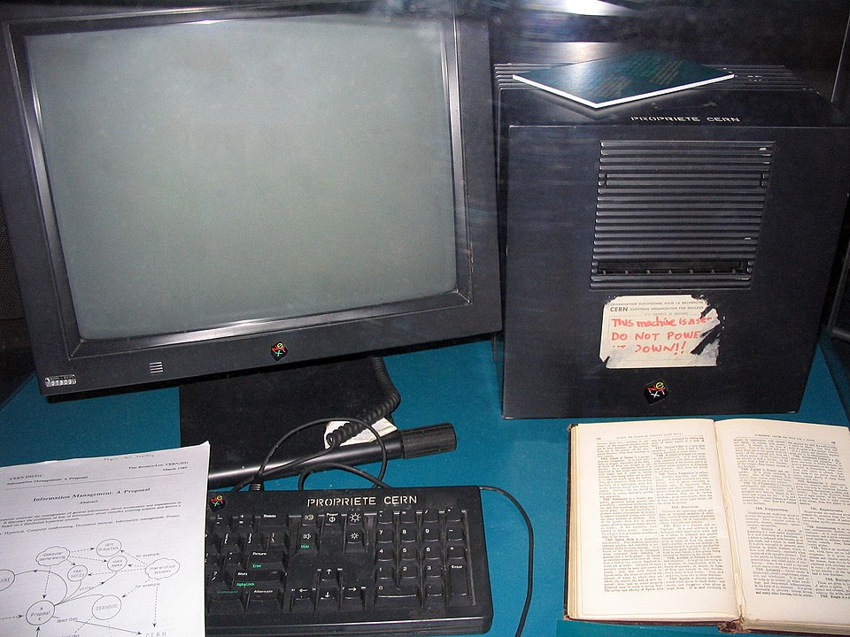

## Introducción al desarrollo web

### Breve historia de la WEB

{.align-center}

Allá por 1980, un joven físico llamada [Tim
Barners-Lee](https://es.wikipedia.org/wiki/Tim_Berners-Lee) fue
contratado por el [CERN](http://public.web.cern.ch/public/)
(Organización Europea para la Investigación Nuclear), en calidad de
consultor independiente. Entre otras cosas, el joven propuso un proyecto
para facilitar el intercambio de información dentro de la comunidad
científica, utilizando un concepto denominado
[hipertexto](https://es.wikipedia.org/wiki/Hipertexto).

La idea germinó, pero no prosperó. En 1989, de regreso al CERN después
de un tiempo trabajando para otras empresas, y ya con el laboratorio
convertido en el nodo más grande de Internet en Europa, la idea se
consolidó. En sus propias palabras: «Simplemente conecté la idea del
hipertexto con el protocolo TCP y el sistema de nombres de dominio».

{.align-center}

Berners-Lee usó esta NeXTcube en el CERN, y fue el primer servidor web
del mundo.

El joven físico había inventado lo que se llamó inicialmente **World
Wide Web**, **WWW** y más tarde simplemente **La Web**.

{.align-center}

### Las bases tecnológicas

En estos primeros tiempos, alla por los inicios de los 90 del pasado
siglo, la web estaba constituida básicamente por unas pocas tecnologías:
[HTML](http://es.wikipedia.org/wiki/HTML),
[HTTP](http://es.wikipedia.org/wiki/Hypertext_Transfer_Protocol) y
[MIME](http://es.wikipedia.org/wiki/MIME).

**HTML** son las siglas en inglés de **Lenguaje de Marcado de Contexto**
(*HyperText Markup Language*). El lenguaje de marcado HTML abriría
muchas puertas a la publicación de artículos científicos (Esta era la
idea inicial: facilitar la publicación de documentos científicos).

En un entorno donde empezaban a proliferar las estaciones de trabajo,
con monitores gráficos y recursos suficientes, HTML permitía ciertos
lujos en lo que respecta a la presentación: efectos como diferentes
tipografías, textos en cursiva o en negrita, imágenes empotradas pero,
por encima de todo, enlaces hipertextuales. Volveremos sobre estos
enlaces más adelante.

**HTTP** por su parte, proviene de **Protocolo de Transferencia de
Hipertexto** (*Hypertext Transfer Protocol*). En su forma más simple, la
cosa funciona así: Hay un programa cliente, llamada normalmente
navegador, que es capaz de entender un documento escrito en HTML y
presentarlo correctamente al usuario.

El cliente es capaz de solicitar estos documentos a cualquier servidor;
para ello, el cliente y el servidor utilizan un protocolo común, el
protocolo HTTP. El cliente puede hacer uso de un conjunto muy reducido
de peticiones, de las cuales la más usual es `GET`, que simplemente es
una petición de un determinado recurso al servidor.

Ante esa petición, el servidor o bien sirve el documento solicitado, si
es que lo tiene, o devuelve un mensaje de error indicando la causa por
la que no le puede servir el documento.

**MIME**, iniciales de Extensiones Multiproposito de Correo Internet,
(*Multipurpose Internet Mail Extensions*) era una tecnología \"tomada
prestada\" de una parte de las especificaciones del correo electrónico
en Internet, que por esa época estaba bastante desarrollada. Para que el
protocolo HTML funcionara correctamente, hacía falta un sistema que
permitiera al servidor informar sobre que tipo de contenido estaba
sirviendo.

Veamos cada una de estas tecnologías con un poco más de detalle en las
siguientes secciones.

### HTML (HyperText Markup Language)

HTML es, como indica su nombre, un lenguaje de marcado. Un lenguaje de
marcado o de marcas, una forma de añadir a un texto información
adicional, a menudo en forma de etiquetas.

Esta información adicional suele servir para indicar la estructura del
texto (por ejemplo, para dividir el texto de un libro en capítulos) o
para indicar aspectos relativos a la representación del texto (por
ejemplo, esta palabra debe representarse con una determinada tipografía,
o en itálica).

HTML es solo otro lenguaje de marcado, de los cuales ya existían varios
ejemplos previos, como [RTF](http://es.wikipedia.org/wiki/RTF) o
[SGML](http://es.wikipedia.org/wiki/SGML), del cual deriva.

Pero HTML tenía una virtud que, a la postre, resultó ser determinante
para su éxito: era muy sencillo crear textos en él.

Esta sencillez tuvo dos consecuencias importantes: Por un lado,
cualquiera que le dedicara un mínimo de tiempo a entender el formato
podía producir un texto en HTML usando el más sencillo de los editores
de texto.

Por otro lado, para los programadores era muy fácil generar textos
marcados automáticamente.

El siguiente texto es un ejemplo de un texto muy sencillo en HTML:

    <html>
      <head>
        <title>Ejemplo de texto HTML</title> 
      </head>
      <body>
        <h1>Ejemplo</h1>
        
Hola, mundo.

      </body>
    </html>

En el ejemplo podemos apreciar algunas de las caracterísiticas del HTML.
Las marcas, que en la nomenclatura de HTML se llaman **etiquetas**,
estan diferenciadas del texto en si por un par de corchetes angulares,
también conocidos como símbolos «menor que» y «mayor que», `<` y `>`.

Algunas etiquetas tienen sentido por si solas (por ejemplo `img`, que se
usa para insertar una imagen externa dentro de la página), pero la mayor
parte de ellas solo tienen sentido cuando se refieren a una determinada
parte del texto. Para acotar el área sobre la que actúan, se utiliza una
etiqueta de inicio y otra de final, siendo la etiqueta del final la
misma que la de inicio, pero precedida por el carácter «barra inclinada»
`/`.

Por ejemplo, esta es la forma de indicar un párrafo de texto (etiqueta
`p`):

    
Hola, mundo.

**Ejercicio**: Copia el documento HTML de ejemplo de la celda y crea un
nuevo documento con tu editor favorito. Salvalo con el nombre de
`ejemplo.html`. Abrelo con cualquier navegador y comprueba que se ve
correctamnte.

Modifica el documento para poner la palabra mundo en negrita (etiqueta
`b` o `strong`). Guarda de nuevo el documento. Verifica que el navegador
sigue mostrando la version anterir. Recarga la pagina en el navegador
para ver los cambios.

El documento en si se compone de dos partes, la cabecera, etiquetada con
`head`, donde irán normalmente metadatos del documento, como el título,
indicado con las etiqueta `title` en nuestro ejemplo. El contenido real
de documento, el *cuerpo* si seguimos su terminología, está marcado por
la etiqueta `body`. La etiqueta *raiz*, que las engloba a todas es, como
no, `html`.
Untitled Folder 2
De las etiquetas usadas en nuestro ejemplo, solo nos faltaría explicar
la etiqueta `h1` y `p`. La etiqueta `p` vimos antes que indica un
párrafo.

La etiqueta `h1` indica una cabecera de nivel uno (Hay hasta 6 niveles
definidos en el HTML original, desde `h1` hasta `h6`). Estas etiquetas
sirven para definir la estructura del documento: el navegador sabe que
las secciones son más importantes cuanto más bajo el número, y lo
representa con tipografías más grandes. Un párrafo irá con tipografía
normal.

En la especificación inicial del HTML había tanto etiquetas con
información estructural como de presentación. Así, había etiquetas como
`b` para indicar texto en negrita o `i` para texto en itálicas.

Esta práctica se ha abandonado y ahora se recomienda usar HTML sólo para
indicar la estructura del documento. Estas etiquetas en concreto, `b` e
`i`, aunque soportadas en HTML5, están en vías de desaparición y se
recomienda usar en su lugar las versiones más *semánticas* `strong` y
`em`.

Los aspectos de la representación se resuelven con una tecnología que
veremos posteriormente, llamada **Hojas de Estilo en Cascada** o
[CSS](http://es.wikipedia.org/wiki/CSS) (*Cascading Style Sheets*).

### HTTP (Hypertext Transfer Protocol)

La tecnología HTTP es un protocolo, es decir, son unas normas que
permiten al cliente y al servidor entenderse. Viendo el resultado, se
advierte que se pretendía la máxima sencillez. El protocolo define solo
un número limitado de operaciones posibles: 3 en el protocolo HTTP 1.0,
8 en el estandar más usado en la actualidad, HTTP 1.1. Las ordenes más
usadas son `GET`, `POST` y `HEAD`.

Cada operación se realiza de la misma manera: El cliente solicita una
determinada petición, y el servidor, o bien acepta la petición, o bien
la rechaza. En cualquier caso, enviará la respuesta correspondiente al
cliente.

Tanto la petición como la respuesta contienen una cabecera donde pueden
ir varios campos de información adicional. La cabecera está separada de
los datos adjuntos, si los hubiera, con un doble salto de línea. Fin de
la petición. No hay más, en realidad.

Además, es un protocolo sin estado. Es decir, no se almacenada ninguna
información entre peticiones y, por lo tanto, cada petición es un todo
completo, totalmente aislada de las peticiones que pudieran venir antes
o después. Esto simplifica enormemente el protocolo, pero dificulta
realizar algunas operaciones, que se tienen que realizar fuera del
mismo.

La sencillez del protocolo era, por tanto, deliberada, igual que en el
HTML, y de igual manera fue un factor importante en el éxito del
protocolo.

De hecho, la mayor parte de los lenguajes modernos, como
[Python](http://www.python.org/) o [Ruby](http://www.ruby-lang.org/),
incluyen de serie una implementación de un servidor HTTP, y en cualquier
caso, hay implementaciones para prácticamente cualquier lenguaje en uso
en la actualidad: Java, C\#, C, C++,
[Scala](http://www.scala-lang.org/), por citar algunos.

### MIME (Multipurpose Internet Mail Extensions)

MIME, como vimos antes, era tecnología reciclada, una parte de las
especificaciones del correo electrónico que, en 1995, ya era una
tecnología probada y conocida.
Untitled Folder 2
las primeras direcciones de correo electrónico con la ahora reconocible
arroba separando el nombre del usuario del nombre del ordenador
empezaron a usarse en 1971, más de veinte años antes.

MIME resolvía un problema importante para la web: como indicar de forma
fiable y estándar que tipo de contenidos se están transfiriendo en una
petición HTTP. Después de todo, un documento HTML es, como hemos visto,
simplemente un fichero de texto normal.

Algo había que hacer para que el cliente pudiera distinguir si lo que el
servidor le envía es texto plano normal, texto HTML o cualquier otro
tipo de contenido, como una imagen, por ejemplo.

MIME era la solución perfecta para este problema, porque realizaba
exactamente la misma función dentro del correo electrónico. El correo
electrónico lo había incorporado para poder añadir anexos a los mensajes
de texto, anexos que podían ser de cualquier tipo. Fue otro acierto de
Tim Barners-Lee adaptar este sistema que era ya un estándar ampliamente
utilizado, en vez de reinventar la rueda.

MIME se utiliza en la cabecera `content-type`, que especifica el formato
usado en los datos, y que consiste en un tipo seguido de un subtipo; por
ejemplo, para indicar que los datos que estamos trasmitiendo son texto
html, usaríamos el tipo `text` y el subtipo `html`.

Dentro de la cabecera de la respuesta tendríamos algo como esto:

    content-type: text/html

Si quisiéramos indicar que la respuesta es un texto sin ningún formato,
la cabecera sería:

    content-type: text/plain

Es decir, tipo `text` (texto) y subtipo `plain` (plano, es decir, sin
marcas). Prácticamente cualquier tipo de archivo está reconocido y
estandarizado como tipo/subtipo MIME. Por ejemplo, una imagen en formato
PNG tiene un tipo/subtipo `image/png`.

Una petición web sencilla
-------------------------

Ahora que hemos visto las tecnologías implicadas, podemos entender como
es una operación típica en la web.

Empezamos con el cliente (que, si somos fieles a la reconstrucción
histórica, podría ser
[Mosaic](http://en.wikipedia.org/wiki/Mosaic_%28web_browser%29) , el
segundo navegador en la historia y antecesor del actual
[Firefox](http://www.mozilla.org/).

El primer navegador web se llamaba WorldWideWeb, pero se cambio su
nombre a **Nexus** cuando se empezó a usar esta expresión para referirse
a la naciente red de páginas y servidores que estaban surgiendo por
doquier).

El usuario solicita una página, ya sea porque se sabe la dirección y la
escribe en la barra de direcciones, o porque pulsa en un enlace dentro
del texto que está leyendo. Para el navegador, cualquiera de los dos
casos significan lo mismo: tiene que solicitar una nueva página para
sustituir la que tiene en la actualidad.

Lo primero que hace es analizar la petición, extrayendo de la misma el
nombre del servidor al cual debe solicitar la petición. A continuación,
realiza una petición HTTP a dicho servidor (usando el puerto 80 si no se
indica lo contrario, porque el puerto 80 es el puerto por defecto para
el protocolo HTTP).

Al estar conectados mediante Internet, no importa donde esté físicamente
el servidor, el protocolo TCP y otros protocolos de nivel inferior, como
el Servicio de Nombres de Dominios
[DNS](http://es.wikipedia.org/wiki/DNS) (siglas de *Domain Name
System*), resuelven todos los detalles por nosotros.

En la petición irá la ruta del documento, extraída también de la
dirección de la página, acompañada de otros datos que pudieran ser de
interés para el servidor, como la versión del protocolo HTTP a usar, si
se aceptan o no algún tipo de compresión de datos en la respuesta y todo
tipo de detalles técnicos que, por el momento, no nos afectan.

El servidor recibe la petición, y como vimos en el apartado sobre el
HTTP, solo tiene dos opciones, o enviar como respuesta el documento o
indicar un error que especifique la razón por la que no lo pudo servir.

Las causas pueden ser muchas, pero la más frecuente con diferencia es el
famoso **Error 404**, código de error que indica que en la dirección
indicada no existe ningún documento, ya sea porque el documento se ha
borrado o, bastante más habitual, porque se ha escrito mal la dirección.

Si todo ha ido bien, el servidor encontrará el documento solicitado en
su sistema de ficheros. Ahora envía al cliente el documento, precedido
por una cabecera donde incluye información de diversa índole. Por
ejemplo, la cabecera incluirá un campo `content-type` para especificar
que tipo de documento se está enviando.

Como vimos en la sección sobre MIME, si el documento es HTML, el tipo
MIME correspondiente es `text/html`. Otro tipo de información adicional
que el servidor puede decidir incluir en la cabecera es la fecha y hora
de la última modificación del documento, el tamaño en bytes del mismo o
una *firma electrónica* que identifique el software usado como servidor,
entre otras.

Una vez que el cliente recibe el documento, le presenta al cliente. Esto
implica leer y entender la estructura del HTML que se ha recibido, para
poder representarlo gráficamente. Esta operación es con mucho la tarea
más ardua de las que realiza el navegador.

La parte buena es que, como desarrolladores web, estamos en el extremo
del servidor y, por tanto, los problema del cliente no nos deberían
afectar.

La parte mala es que, en la realidad, como cualquier desarrollador web
puede atestiguar, las diferencias en la forma que diferentes navegadores
web interpretan el mismo código HTML representan una importantísima
parte del trabajo, y es la causa del 99% de los dolores de cabeza de los
desarrolladores.

Pero en 1995 todavía no existía ese problema, así que el desarrollo web
era, por encima de todo, bastante sencillo.

Si es tan sencillo ¿Para que necesito un *framework*?
-----------------------------------------------------

La respuesta rápida es: porque yo no estamos en 1995. El escenario
típico de una petición web es considerablemente más complejo ahora. Hay
nuevas tecnologías en casi cada parte del proceso.

Las páginas web ya no se usan mayoritariamente para facilitar las
publicaciones científicas, sino para miles de usos, la mayoría de ellos
impensables en 1995.

En algunos casos, no tiene ni siquiera sentido hablar de "páginas web".
¿Quién podría argumentar que Google Mail, por ejemplo, es simplemente
una página web? No, la convergencia de tecnologías como CSS, JavaScript,
Ajax, HTML5 han permitido un nuevo tipo de producto Web, las
aplicaciones Web. Para monstruos de estas dimensiones, tener un
*framework* es una gran ayuda.

Básicamente, los problemas que resuelve un *framework* de desarrollo web
como Django o flask son todos los relativos a crear una aplicación o
servicio web, siendo especialmente interesantes los siguiente:

> -   Servidor web autónomo para desarrollo y pruebas
> -   Caché
> -   Sistemas middleware
> -   ORM (Motor de acceso a bases de datos en forma de objetos)
> -   Motor de plantillas
> -   Procesamiento de formularios
> -   Sistemas de autenticación
> -   Interfaz administrativa con paginas generadas automáticamente para
>     operaciones CRUD
