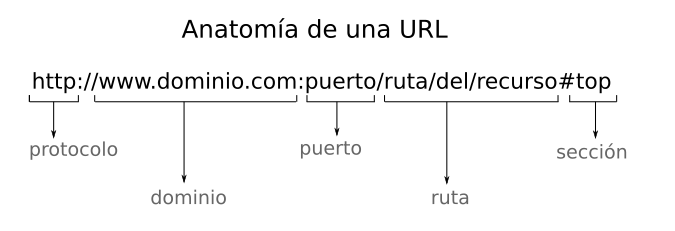
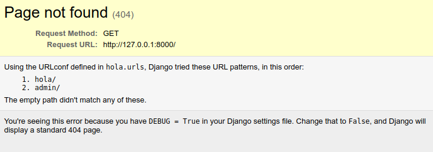
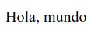

Introducción a Django
=====================


Qué es Django
-------------

**Django** es un *framework* para el desarrollo de aplicaciones web,
gratuito y de código abierto (open source) escrito en Python.

Un **framework**, desde el punto de vista informático, es un marco o
estructura conceptual y tecnológica, definida normalmente mediante
módulos concretos de software, y que sirve de base para el desarrollo de
un *tipo* de software.

Suele incluir programas, librerías y otras herramientas para ayudaa a
desarrollar y unir los diferentes componentes de un proyecto.

Django, al ser un framework *para desarrollo web*, nos ayudará a
desarrollar ese tipo de aplicaciones, aplicaciones web. Seria absurdo
intentar usarlo para el desarrollo de una aplicación de terminal, una
app movil, o un sistema operativo.

Diferencia entre librerías y frameworks
---------------------------------------

A primera vista, pueden parecer muy similares, al fin y al cabo son,
como una libreria de software, solo un conjunto de módulos que podemos
empezar a usar tan pronto como lo instalemos. De hecho, veremos que
instalaremos Django exactamente igual que cualquier otra librerîa.
02-prototype/
La principal diferencia radica en *como se usa* y *quien mantiene el
control*.

-   En el caso de una librería, tú mantienes el control, y tu realiza
    llamadas a la librería cuando estimas conveniente.
-   Con un *framework*, la situación se invierte, y es el propio
    *framework* el que llama a las funciones que tu escribes. El
    framework es el que mantiene el control.

Esto se puede conseguir por la restriccion que el propio framework ha
hecho sobre el **dominio**, es decir, sobre el área de problemas que
soluciona. Decidir que solo te vas a encargar de solucionar el hacer una
web, o que solo vas a dedicar a hacer juegos (para un framework de
desarrollo de juegos) simplifica el framework, por varias razones:

-   El esquema principal o esqueleto de la aplicación ya viene
    determinado. Todas las aplicaciones web se estructuran de una forma
    parecida, de la misma forma que todos los juegos tienen un bucle
    interno que es basicamente igual para todos: Leer controles -\>
    modificar estado del juego -\> representar estado del juego -\>
    repetir.
-   En cada dominio hay una serie de problemas comunes, que se pueden
    resolver e implementar en el *framework* porque hay una probabilidad
    muy alta de que te vayas a encontrar con ese problema, por ejemplo,
    en desarrollo web, gestionar todo el proceso de *login* y *logout*,
    manejo de sesiones, etc.
    
-   Al restringir las capacidades, puedes presuponer o dar por fijas
    determinadas condiciones, asi como el entorno de ejecución.
  
- Elimina muchisimos problemas de los que no te vas a tener que
  preocupar. Ningun framework web se tiene que preocupar de los
  *frames por segundo* que pueda dar.

Instalar django
---------------

Como se comentó antes, instalar django es como instalar cualquier otra
libreria, usando pip.

Vamos a verificar primero la versión de Python que tenemos instalada. Es
recomendable tener Python 3.7 o superior:

    python -V

Si todo está bien, podemos instalar Django:

    pip install django

Si no funciona, prueba con alguna de estas formas alternativas:

    pip3 install django
    python -m pip install django
    python3 -m pip install django
    

Podemos comprobar que django esta corectamente instalando simplemente
intentado importarlo. Si no da error, es que esta instalado:

    python -c "import django"


Nota: La opcion `-c` de Python nos permite ejecutar el código python que le
pasamos como parámetro y luego salir del interprete.


Incluso podremos comprobar la versión instalada:

    python -c "import django; print(django.__version__)"

Deberia devolver algo como esto:

```
3.1.2
```

### Nuestra primera aplicación Django: Hola, Mundo

Es una tradición en el mundo de la informática, a la hora de aprender un
nuevo lenguaje, librería o *framework*, empezar desarrollando la versión
más sencilla que se pueda implementar de un programa que haga algo. Esta
tradición se remonta al famoso libro sobre el lenguaje C, escrito por
Kernighan y Ritchie.

Esto nos permite eliminar toda la complejidad adicional que pueda tener
el lenguaje y centrarnos en una única funcionalidad relativamente
trivial; tradicionalmente, escribir o representar de algún modo el
mensaje «Hola, mundo» (*Hello, World*).

Nota: En este repositorio [https://github.com/leachim6/hello-world](https://github.com/leachim6/hello-world) puedes consultar
versiones del "hola, mundo" en más de 700 lenguajes.

Además, el programa «hola, mundo» nos permite hacernos una idea rápida
de la sintaxis, la semántica y las particularidades de lo que quiera que
estás aprendiendo.

Para verificar que Django está instalado haremos:

    python -c "import django"

De nuevo, la ausencia de mensajes de error es buena noticia (Si diera un
error, instalar django como pip `pip install django`).

Ahora, el siguiente paso será crear nuestra aplicación. Django, al
instalarse, he añadido una utilidad muy cómoda que permite crear una
aplicación mínima al toque. Podemos ejecutar esta utilidad haciendo:

    $ django-admin

Si todo ha ido bien, deberíamos ver un resultado como este, en el que la
utilidad nos señala amablemente que no le hemos indicado ninguna acción
a ejecutar, y a continuacón, lista las acciones que podemos ejecutar:

```bash
django-admin

Type 'django-admin help <subcommand>' for help on a specific subcommand.

Available subcommands:

[django]
    check
    compilemessages
    createcachetable
    dbshell
    diffsettings
    dumpdata
    flush
    inspectdb
    loaddata
    makemessages
    makemigrations
    migrate
    runserver
    sendtestemail
    shell
    showmigrations
    sqlflush
    sqlmigrate
    sqlsequencereset
    squashmigrations
    startapp
    startproject
    test
    testserver
```

De todas esas acciones que podemos hacer, la que nos interesa ahora
mismo es `startproject`. Esta acción es la que crea una aplicación
básica, o como se dice a veces, el *esqueleto* de una aplicación.

Antes de ejecutar la acción, tenemos que pensar el nombre de la misma,
ya que va a crear un directorio con ese mismo nombre. En este curso
vamos a crear varias aplicaciones diferentes, asi que esta la vamos a
crear con el nombre `hola`.

Para crear la aplicación, por tanto, ejecutamos:

    django-admin startprojec hola

Como es habitual, la falta de mensajes de error indica que
todo ha ido bien. El resultado de la ejecución es que se ha creado una
carpeta nueva con el nombre de la aplicacion, 'hola' en este caso
(habria dado un error si ya existiera una carpeta con ese nombre; esto
es así para evitar destruir un proyecto ya existente por descuido).

**Ejercicio**: Intentar crear nuevamente la aplicación `hola`. Describir
lo que pasa.

#### Examinado la aplicacion `hola`

Vamos a ver los contenidos que hay en la carpeta recien creada.

Para nuestra versión de Hola, mundo, nos contentaremos con una única
página web,con el texto "hola, mundo".

En Django (y en la mayoría de los *framework webs*), cuando queremos crear una
nueva sección o página web, tenemos que realizar dos operaciones separadas: Por
un lado tenemos que escribir el cógigo que genere el contenido HTML de la
página; por otro, tenemos que enlazar o mapear la parte de la ruta de la
direccion web o URL que queremos usar para publicar la página. Esta operación
de asignarle una ruta a un contenido se suele denominar **mapear** la url.



El que estas dos cosas estén separadas es intencionado. Lo que se busca
es desacoplar la página web en si de la dirección donde está publicada,
de forma que conseguimos al menos estas ventajas:

- Podemos cambiar una pagina web de una ruta  a otra distinta sin tener que
  modificar el código de generación de la página en si, solo el mapeo.

- Podemos reutilizar la misma página web wen diferentes rutas.

- Las cuestiones de como se genera el contenido estan totalmente aisladas de
  las de como se accede al contenido. Esto permite crear difecciones URL
  más sencillas y eficaces.

Vamos ahora a crear nuestra primera página web. Siguiendo la filosofia
anteriormente expuesta, haremos una página que simplemente contenga el texto "hola, mundo".

En django, los contenidos de la página web se generan usando lo que
en la documentación llaman **vistas**. Veremos las vistas con más detalle en un
tema posterior, pero ahora lo unico que nos interesa sabes es que las vistas
son simplemente funciones python, que tienen que cumplir obligatoriamente estas
dos condiciones:

1) Que acepten, como primer argumento, un objeto tipo `request` (Una instancia
de la clase `HttpRequest`). La función podra tener o no más parámetros, ya sea
por posicion o por nombre, pero en cualquier caso el primero
será siempre un objeto `request`.

2) La función debe retornar, obligatoriamente, un objeto de la clase
`HttpResponse`

Si una función (O, para ser más precisos, cualquier objeto *callable*)
cumple estas condiciones, podemos considerarlo una vista Django.

Veremos más adelante que es el objeto `request` y para qué sirve, pero por
ahora, con esto ya *casi* podemos crear la vista. El parametro `request`
podemos ignorarlo por el momento, asi que solo nos falta saber como crear un
objeto `HttpResponse`, y que en esa respuesta este incluido el texto "hola,
mundo".

La respuesta es sencilla, `HttpResponse` es una clase que podemos
importar de `django.http`, y para obtener una respuesta concreta (Una
instancia) simplemente le pasamos al constructor el texto que queremos
que contenga.

Por tanto, la función `hola` podría escribirse así:

    from django.http import HttpResponse

    def hola(request):
        return HttpResponse("Hola, Mundo")

En que fichero podemos guardar este código? En principio, en cualquiera, pero
la costumbre en Django es que las vistas se definan en un fichero que
se llame `views.py`.

Ejercicio: Crear el fichero `views.py` (en la misma carpeta donde está el
fichero `manage.py`) e incluir en él la vista `hola` que acabamos de
describir.

Una vez creado el fichero, falta la segunda parte, que es enlazar o mapear
la url que queramos con esta nueva página. Supongamos que queremos que la
ruta sea `hola`. Como vimos cuando arrancamos el `runserver`, este por defecto
arranca un servidor en nuestro ordenador (Que siempre se puede acceder con el tiene `localhost` o la dirección IP `127.0.0.1`), o sea que el servidor
esta *esperando* peticiones en:

    http://localhost:8000/

y nosotros queremos *colgar* o publicar nuestra página en:

    http://localhost:8000/hola

Nota: Por el momento no podemos controlar ni la parte del dominio (`localhost`)
ni el puerto (`8000`), aunque esto si lo controlaremos cuando
realmente se pase a producción. Pero tenemos control absoluto
de la ruta.

Para mapear entonces la ruta `hola/` con la vista `views.hola`, lo haremos
usando el fichero `urls.py`, que es uno de los ficheros que creo por
nosotros el comando `startproject`.

Abrir el archivo `urls.py` e incluir la siguiente línea:

    path('hola/', views.hola),

en la variable `urlpatterns`. Previamente habremos de realizar la importación 
del módulo `views`, si no resultaría imposible acceder a la vista `hola`. El
código de `urls.py` debería quedar asi (Ignorando los comentarios al principio):

```python
from django.contrib import admin
from django.urls import path

import views

urlpatterns = [
    path('hola/', views.hola),
    path('admin/', admin.site.urls),
]
```

Ahora, si arrancamos otra vez el servidor de desarrollo:

    python manage.py runserver

Nota: Si lo habiamos dejando arrancado antes, veríamos que detecta el cambio
en el fichero `urls.py` y se reinicia automáticamente.

Al acceder ahora a la web:

    http://localhost:8000/

Veremos que la página inicial que se nos mostraba antes ha desaparecido,
y vemos por el contrario una página de error similar a esta:




La explicacióon es que esta pagina de bienvenido la muestra
automáticamen Django solo cuando el en mapa de urls
hay una unica referencia, la que viene por defecto apuntando
al admin. Al añadir una nueva url, este comportamiento por defecto se anula.

El mensaje de error viene, por tanto, de que ahora no hay ninguna vista
definida para la ruta '/', solo para 'hola/' y 'admin/. Probemos con
la primera (El admin se tratará más adelante):

    http://localhost:8000/hola

Debería mostrarnos:



**Ejercicio**: Cambiar el texto del mensaje en la vista. Ver que si recargamos
la página en el navegador, el nuevo texto aparece en la página. **Extra bonus:**
Intenta incluir un par de saltos de línea en el texto (Usar comillas triples
te puede ayudar con eso). ¿Que pasa con esos saltos delínea en la página
resultante?

**Ejercicio**: Añadir una unueva entrada en el mapa de urls, que enlace
la ruta 'hello/' con la misma vista `views.hola`.
