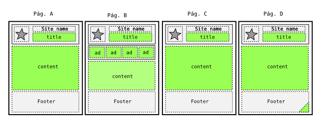

## Plantillas en Django

Las plantillas son simplemente documentos de texto, normalmente en formato
`html`, aunque nada impide que se use con cualquier otro tipo de textos, como
`XML`, `CSV` o código `C`.

En el texto de las plantillas hay ciertos marcas o etiquetas (**template
tags**) que indican que en ese sitio falta contenido, el cual será
incluido más adelante.

La operación más sencilla que podemos
hacer con una plantilla es mostrar el valor de una variable, y lo
hacemos de la siguiente forma:

```
{{ nombre }}
```

Esto indica que, en el resultado final, sustituiremos todo el texto comprendido
entre las marcas `{{` y `}}`
(Incluyendo las marcas) por el contenido de una variable llamada `nombre`. 

Django incluye además en el sistema de plantillas un mini-lenguaje, útil para
definir parte de las interfaz de la aplicación. De esta forma se promueve una
clara distinción entre la lógica de negocio y la representación. Las marcas de
control de las plantillas se llaman etiquetas (No confundir con las etiquetas
de HTML)


## Ventajas de las plantillas

El uso de un buen sistema de plantillas presenta muchas ventajas:

- Las plantillas pueden ser editadas y modificadas por especialistas en diseño
  o experiencia de usuario sin necesitar conocimientos de programación. Al fin
  y al cabo, son como cualquier otra página web, solo que con algunas marcas
  especiales más.

- El sistema de herencias y la inclusión de plantillas es realmente potente, y
  permite realizar modificaciones globales en la aplicación tocando un solo
  fichero.

- El sistema deja que algunos problemas se puedan resolver usando etiquetas y
  filtros, y permite incluir un poco de lógica en las vistas, pero el está
  **diseñado expresamente para que etiquetas y filtros sean pobres**, desde el
  punto de vista de un programador.

Aunque puede parecer extraño diseñar una parte del sistema para que sea
débil, existe una razón. La idea es forzar a hacer las tareas realmente
complejas en la vista, donde disponemos de toda la potencia del lenguaje
Python, y que lo hagan los programadores. La lógica de la vista está
pensada para ayudar a los los diseñadores, no para crear un segundo
lenguaje de programación.

Las plantillas, por tanto, están pensadas para ser
usadas por personas con conocimiento de `HTML` y `CSS`, sin que haga falta
conocimientos sobre Python.


## El sistema de carga de plantillas

Podríamos escribir una función para leer el contenido de la
plantilla desde ficheros externos, pero como pasa a menudo, la gente de
Django se nos ha adelantado.

Podemos confiar en el cargador de plantillas de Django para que cargue
las plantillas desde el sistema de ficheros. Veamos como funciona.

Si le decimos a Django que nos busque una plantilla determinada,
indicándole el nombre de un fichero, por ejemplo, `hola.html`, el
cargador que viene activo por defecto busca dentro de cada una de las
aplicaciones instaladas una carpeta que se llame `templates`.

Por ejemplo, si tenemos dos _apps_ instaladas, `alfa` y `beta`, buscara
en cada uno de estos directorios buscando si existe un subdirectorio
llamado `templates`. Si lo encuentra, lo añade a la lista de sitios
donde debe buscar las plantillas

Ahora, si le pedimos que use `hola.html`, buscará en todos esos
directorios hasta que encuentra un archivo que se llame así, y creará la
plantilla a partir del texto de ese fichero.

Si existe más de un fichero `hola.html`, usará el primero que encuentre.
Esto puede ser útil en ciertas ocasiones. También puede ser fuente de
errores y frustración en otras.

Por ahora, creemos un directorio `templates` dentro de nuestra única
aplicación, y dentro escribimos un fichero `homepage.html`. El código de
la vista podría ahora escribirse como:

```python
from django.shortcuts import render

def homepage(request):
    return render(request, 'homepage.html', {
        'message': '¡En obras! Pronto abriremos',
    })
```        

La función `render` es una función de ayuda para trabajar con plantillas, e
implementa un patrón de uso que es muy, muy frecuente: Obtener una plantilla,
fusionarla con una serie de datos que hemos obtenido o calculado previamente,
usando un `RequestContext`, y devolver el resultado en forma de `HttpResponse`.
El código de ``render`` es más o menos así:

```python
from django.http import HttpResponse
from django.template import Template, RequestContext
from django.templae.loader import get_template

def render(request, template, data):
    t = get_template(template)
    ctx = RequestContext(request, data}
    return HttpResponse(t.render(ctx))
```

Usando `render` evitamos duplicar código similar en cada vista.

Vamos a realizar un par de ejercicios de ejemplo

Usando el siguiente fichero en formato CSV, [projects.csv](./projects.csv), que incluye un listado
de proyectos.

```
--8<--
./docs/projects.csv
--8<--
```

1.-  Mostrar una lista de projectos, que muestren tanto el identificador
(primera columna) como el nombre del proyecto.

2.- Hacer que el nombre del proyecto se vea en
negrita.

Para ello vamos a necesitar una etiquetas nueva: `for`.

### La etiqueta `for`

La etiqueta `for` es el equivalente al `for` de Python. A diferencia de este,
no podemos basarnos en la indentación del código, porque en general los
espacios, tabuladores y saltos de línea no son significativos en Html, así que
tiene una etiqueta, `endfor`m asociada que usamos para indicar el final del
`for`. Al igual que Python, necesita trabajar sobre una secuencia, como una
lista, tupla, diccionario, cadena de texto, etc...

Por ejemplo, si desde la vista hemos pasado a la plantilla una lista de
elementos, con el nombre `lista`:

```python
return render(request, 'ruta/plantilla.html', {
    ...
    'lista': list(range(5)),
    ...
    })
```

En la plantilla, podemos mostrar el contenido de la lista
con:

```html

<ul>

    <li> {{ n }} </li>

</ul>

```

## Herencia de plantillas

Una de las partes más potentes de las plantillas es que mantiene un
sistema de herencia, equivalente al que podemos encontrar en sistemas
orientado a objetos. Al igual que en estos sistemas, se parte de un
concepto general, que se va particularizando mediante herencias.

En los sistemas de plantillas que no tiene herencia, lo normal es que
tengan la posibilidad de incluir otros ficheros. La herencia de
plantillas es similar, pero con un pequeño giro conceptual que lo hace a
la vez más sencillo y más potente, una vez se entiende su funcionamiento.

En un sistema que trabaja con inclusión de ficheros, normalmente tenemos
un fichero de cabecera y un fichero de pie, que van respectivamente al
principio y al final de cada página. El código se limita a incluir la
cabecera, hacer su trabajo y a continuación incluir el pie. Con este
sistema, lo que hacemos es definir en los ficheros a incluir **las
partes que son iguales para todas lás páginas**.

Imaginemos que en el pie de cada página está nuestro teléfono de
asistencia, y que dicho número ha cambiado. Queremos que el cambio se
refleje en todas las páginas hechas hasta ahora. Como hemos tenido la
precaución de separar el contenido del pie en un único fichero, el
cambio es fácil.

Sin embargo, otros cambios no son tan fáciles. Imaginemos que nos piden
ahora otro cambio aparentemente trivial: que en el *title* de cada
página vaya, añadido al final, la dirección acortada de nuestra web. Es
decir, que una página titulada "Acerca de", deberá titularse ahora
"Acerca de - shield.com". Esto implica que la página de cabecera, que
antes era *igual* para cada página, ahora es *distinta* para cada
página.

Con el sistema de Django, partimos de una página base, una página que
dice: "Todas las paginas de este sitio como yo", y le indicamos, usando
las tag `block` y `endblock`, las distintas zonas que pueden cambiar.

Ahora, podemos crear una plantilla *hija* o *derivada* de esta plantilla
base, que reescribe esas zonas diferentes.

Veamos un ejemplo. Supongamos que tenemos en este momento 4 páginas web:
El siguiente esquema muestra en gris las partes que son iguales en todas
las páginas, y en verde las que son diferentes:



Vemos que hay una cabecera con espacio reservado para el titulo que
varía en cada página. Aparte de eso, la cabecera es igual, con el logo y
el nombre del sitio. Las páginas A y C son casi iguales. La página B
incluye una sección de anuncios, ausente en las demas. La página D, por
otro lado, define un recurso diferente en el pie, que las demás no
tiene.

Con el sistema de plantillas, definimos primero una página base, que
incluya todo lo que necesite cualquiera de las paginas hijas. En esta
página base se definirán diferentes zonas o bloques, algunos de ellos
posiblemente vacíos, para indicar las partes que pueden cambiar. Luego
cada una de las paginas hijas redefine solo las partes que le interesen.

Podemos representarlo en el siguiente gráfico, donde las zonas vacias en
la plantilla base se indican en azul claro:


Ahora, realizar un cambio que afecte a todas lás páginas solo implica
tocar la plantilla base. Además, no hace falta marcar todas las zonas
previamente.

En el ejemplo anterior, todas las páginas tienen el mismo logo; si ahora
nos pidieran crear una nueva página, la quinta, pero con un logo
diferente, solo tenemos que:

1) Editar la plantilla base y definir la zona del logo como un bloque
 reemplazable, dejando el logo actual como contenido por defecto
 
2) Crear una nueva plantilla para la nueva página, derivada de base y
 que reescriba la parte del logo.

No hay límite en los niveles de herencia. Por ejemplo, si nuestro _site_
se divide en cuatro secciones: A, B, C, D, podemos definir una plantilla:
`base.html`, luego una base para cada una de la secciones:
`base_a.html`, `base_b.html`, `base_c.html` y `base_d.html` (todas
ellas, derivadas de `base.html`)

Escribimos luego las plantilla de las páginas finales, que extienden de
la plantilla `base_<seccion>.html` que corresponda.

Para marcar una zona como modificable por las plantillas hijas se usan
las marcas `block` y `endblock`. Con el *tag* de inicio se define el
nombre que le vamos a dar al bloque, para identificarlo.

En la marca de fin de bloque no es necesario especificar el nombre, pero
podemos hacerlo si queremos. Para nuestras páginas iniciales partimos de
este esquema, bastante espartano, hay que reconocerlo:

```html
<!DOCTYPE html>
<html lang="en">
  <head>
    <title>
      ERROR: Falta definir título
    </title>
  </head>
  <body>

    <h1>Bienvenidos a S.H.I.E.L.D.</h1>
    <h2>Sistema Homologado de Inteligencia, Espionaje,
    Logística, y Defensa</h2>
    <h3>{{ title }}</h3>

    

    

  </body>
</html>
```

Solo hay dos bloque, uno llamado `title` y otro que hemos llamado
`content`.

Queremos que el título de la página lo defina cada vista de la forma que
crea conveniente, pero hemos puesto por defecto en mensaje de error para
el caso de que la plantilla base se *olvide* de redefinir el título.

De esta forma podemos hacer un test automático que busque este mensaje
de error en la etiquete `title` y avise o incluso prevenga que esta
plantilla pase a producción.

## Ejemplo: Listado de tareas

La plantilla de la página que nos presenta la lista de tareas puede
ser tan sencilla como:

```html




    <ul>
    
        <li>{{ t.title }} ({{ h.level }})</li>
    
    </ul>


```

Hemos usado la etiqueta `extends` para indicar que esta plantilla es
hija de `base.html`. La etiqueta `extends`, si se usa, tiene que ser
obligatoriamente la primera que aparezca en la página. No se permite
herencia múltiple, es decir, una plantilla solo puede tener un padre.

La vista que podríamos escribir para esta plantillas podría ser:

```python

from tasks.models import Task

def view_all_tasks(request):
    return render(request, 'view_all_tasks.html', {
        'tasks': Task.objects.all(),
        'title': 'Listado de tareas',
        })

```

¿Se puede hacer aun más sencillo? Si, con las vistas genéricas, que
veremos más adelante, pero por ahora es bastante compacto.


## Inclusión de Variables

Ya sabemos que podemos usar las variables en las plantillas usando:

```html

{{ variable }}

```

Donde `variable` es el nombre de la variable cuyo valor queremos
representar en la plantilla. Los nombres de las variables deben seguir
las reglas de Python para nombres de variables: Letras y numeros y el
carácter `_`, pero no pueden emepzar por un número y sin espacios en
medio.

Podemos usar el carácter punto, para acceder a atributos o indicar una
jerarquía de variables. El punto en este caso tiene un significado
diferente que en Python. Cuando el sistema de plantillas encuentra un
punto, por ejemplo `a.b`, internamente prueba diferentes tácticas, hasta
que encuentre una que funcione:

- Intenta hacer una búsqueda como si `a` fuera un diccionario, es decir,
  intenta obtener en Python `a['b']`. Si esto produce algún significado, se usa
  ese valor. Si da un error, se siguen probando opciones.

- Intenta la posibilidad de que `b` sea un atributo o un método, así que
  intenta acceder como `a.b`.

  - Si lo consigue, y `a.b` es invocable (es un _callable_, es decir, un
    metodo, función o clase) intenta llamarlo sin parámetros, es decir, ejecuta
    `a.b()` y devuelve el valor de retorno.

  - Si no es un `callable`, devuelve directamente el valor de `a.b`.

  Si esta posibilidad falla por lo que sea, sigue intentadlo.

- Intenta ver si puede usar `b` como un índice y acceder por posición: `a[b]`.
  Si funciona, devuelve el valor encontrado.

Este orden, un tanto complicado, está pensado para hacer la vida del
escritor de plantillas más fácil, pero puede complicarnos la vida como
desarrolladores. Por ejemplo, si usamos un `defaultdict`, el siguiente
código fallaría:

```html


    Do something with k and v here...


```

El problema viene porque se prueba primero el acceso como un
diccionario, así que se busca dentro del diccionario por un elemento
llamado `items`. Este elemento probablemente no existe, pero da igual
porque es un diccionario por defecto, así que devolverá lo que sea que
se haya definido como valor por defecto. No podemos, por tanto, acceder
al método `items`.

Podemos resolver este problema convirtiendo el diccionario por defecto
en un diccionario normal

## Etiquetas (*tags*)

Las etiquetas nos permiten añadir cierta lógica al proceso de
representación de la plantilla.

Esta definición nos permite hacer cosas muy diferentes con las
etiquetas: Pueden generar contenido, servir como estructuras de control
de flujo, como `if` o `for`, obtener contenidos desde una base de datos
e incluso habilitar acceso a otras etiquetas.

Las etiquetas en Django siempre viene rodeadas por `{%` y 
`%}`, como:

```html



```

Muchas de las etiquetas acepta parámetros:

```



```

Y algunas etiquetas necesitan también marcar un inicio y un final de se
área de actuación:

```html


    Hello, {{ user.username }}.


```

En la documentación oficial se pueden consultar todas las [etiquetas
definidas en
Django](https://docs.djangoproject.com/en/3.0/ref/templates/builtins/#ref-templates-builtins-tags)
por defecto, que son las siguientes:

- `autoescape`
- `block`
- `comment`
- `csrf_token`
- `cycle`
- `debug`
- `extends`
- `filter`
- `firstof`
- `for`
- `for … empty`
- `if`
- `ifequal`
- `ifnotequal`
- `ifchanged`
- `include`
- `load`
- `lorem`
- `now`
- `regroup`
- `resetcycle`
- `spaceless`
- `templatetag`
- `url`
- `verbatim`
- `widthratio`
- `with`

Aquí veremos algunas de ellas:

### La etiqueta if

Esta etiqueta evalúa una variable o expresión, si es "verdadera" (en
este sistema, si existe, no esta vacía y no evalúa a `False`) se muestra
el contenido definida dentro del bloque:

```python


    <p>Atención: {{ message }}</p>


```

Tiene una clausula opcional, definida con `else`, para mostrar contenido
en el caso de que la variable no sea "verdadera" (Es decir, si no
existe, o existe pero esta vacia o evalua a `False`):

```python


    <p>Atención: {{ warning }}</p>

    <p>Todo OK</p>


```

Y también tiene la opción de usar `elif` para condiciones múltiples:

```python


    <p class="error">Error: {{ error }}</p>

    <p class="warning">Aviso: {{ warning }}</p>

    <p>Todo OK</p>


```

Se pueden usar los operadores booleanos `and`, `or` y `not` a la hora de
evaluar la variable:

```python


    


```

Se pueden usar también los operadores `==`, `!=`, `<`, `>`, `<=`, `>=`,
`in`, `not in`, `is` e `is not`:

```html


    Uno

    Dos

    Tres

    Varios


```

Se pueden usar los filtros (véase más adelante) dentro de una expresión
`if`:

```html


    <p>¡Tienes un montón de mensajes!</p>


```

### La etiqueta for

Es similar al `for` de Python, itera sobre una secuencia, normalmente
una lista, permitiendo en cada iteración acceder al elemento
correspondiente dentro del área o contexto definido entre el `for` y el
`endfor`.

El siguiente ejemplo muestra una lista de superheroes, si tenemos una
lista (o un `queryset`, o cualquier otra secuencia) de los mismos en la
variable `avengers`:

```html

<ul>

    <li>{{ hero.name }}</li>

</ul>

```

Se puede recorrer la lista en orden inverso usando la forma:

```python

.

```

Si se va a recorrer una lista de listas o una lista de tuplas, se pueden
desempaquetar estos valores en variables individuales. Por ejemplom si
en `coordinates` tenemos una lista de tuplas con dos elementos,
representando un punto en dos dimensiones, podemos hacer:

```html


    <p>Hay un punto en {{ x }},{{ y }}<\p>


```

Esto es muy útil para acceder a los diccionarios, usando el método
`items` para acceder a la vez a la clave y al contenido. Si `data` es un
diccionario, podemos hacer:

```html

<dl>

    <dt>{{ key }}<dt>
        <dd>{{ value }}<dd>

</dl>

```

Como se explicó antes, esto fallará si hubiera una entrada en el
diccionario con la clave `items`. Evita siempre usar nombres de metodos
en el diccionario, porque impide acceder a los metodos desde la
plantilla.

El bucle `for` añade por su cuenta una serie de variables que estaran
disponibles dentro del contexto del bucle:

| Variable              | Descripción                                    |
|-----------------------|------------------------------------------------|
| `forloop.counter`     | Nº de iteración actual (basado en 1)           |
| `forloop.counter0`    | Nº de iteración actual (basado en 0)           |
| `forloop.revcounter`  | Nº de iteraciones desde el final (basado en 1) |
| `forloop.revcounter0` | Nº de iteraciones desde el final (basado en 0) |
| `forloop.first`       | `True` si es el primer elemento                |
| `forloop.last`        | `True` si es el último elemento                |
| `forloop.parentloop`  | En bucles anidados, acceso al bucle externo    |


El bucle `for` tiene una etiqueta opcional, `empty`, con la que podemos
definir el contenido a mostrar si la lista o itereador a usar esta
vacío:

Por ejemplo, usando la lista `avengers` del ejemplo anterior, podriamos
hacer:

```html

<ul>
    
    <li>{{ hero.name }}</li>
    
    <li>Lo siento, no hay ningún heroe en este equipo</li>
    
</ul>

```

Que es más corto, legible y posiblemente más rápido que:

```html

<ul>
    
    
        <li>{{ hero.name }}</li>
    
      
    <li>Lo siento, no hay ningún heroe en este equipo</li>
    
</ul>

```

### La etiqueta extends

Sirve para indicar que una plantilla deriva o hereda de otra. Si se
utiliza, debe ser obligatoriamente la primera etiqueta de la plantilla.

### La etiqueta load

Carga un conjunto de etiquetas y/o filtros personalizados. Es la forma
de ampliar el sistema de plantillas para adecuarlo a nuestra
necesidades.

Por ejemplo, si en la *app* de shield creamos un directorio
`templatetags`, y dentro del mismo creamos un fichero con filtros
llamado `shield_filters.py`, podemos usar estos filtros dentro de
nuestras plantillas, pero primero tenemos que usar `load` -normalmente
al principio de la plantilla, porque funcionan como los imports de
Python-, para que se carguen estas extensiones:

```python



```

También podemos usar de forma selectiva o individual alguno de estos
filtros, usando la formula:

```python



```

### La etiqueta lorem

Genera texto al azar, en latin. Esto es util para porporcionar contenido
de ejemplo en las plantillas. Se usa de la siguiente manera:

```python



```

Se pueden especificar ninguno, uno, dos o los tres parámatros, que
tienen el siguiente significado

| Parámetro | Descripción  |
|-----------|----------------------------------------------------|
| `count`   | Número de párrafos a generar (uno por defecto)     |
| `method`  | `w` (para palabras), `p` para parrafos HTML, `b` para parrafos de texto (Por defecto `b`) |
| `random`  | Generar parrafos al azar |

### La etiqueta include

Esta etiqueta carga una plantilla y la representa usando el contexto
actual. Es una forma de reutilizar o incluir una plantilla dentro de
otra. El nombre de la plantilla puede ser un valor (el nombre de la
plantilla entre comillas) o una variable cuyo valor sea el nombre de la
plantilla:

```python



```

### La etiqueta block

define un bloque que puede ser sobreescrito por una plantilla hija.

### La etiqueta comment

El sistema de plantilla ignorará todo lo que este incluido dentro de un
`comment`. esto puede ser muy útil para desabilitar parte de la
plantila, cuando estamos depurando errores.

### La etiqueta debug

Muestra información útil de cara al desarrollo, incluyendo el
contexto actual y los módulos importados:

```python



```

### La etiqueta verbatim

Evita que el sistema de plantillas interprete el contenido. Esta pasa a
través del sistema de plantillas inalterado. Es muy útil para incluir
contenido, como por ejemplo código Javascript cuya sintaxis puede entrar
en conflicto con el sistema de plantillas de Django:

```python


    {{if dying}}Still alive.{{/if}}


```

## Los filtros (*Filters*)

Los filtros permite transformar los valores obtenidos mediante
variables, así como de los argumentos de las etiquetas. El nombre de
filtros es muy explicito: la idea es que entra un valor como entrada del
filtro y se obtiene otro a la salida.

La forma de usar el filtro es usar el carácter tubería o *pipe* `|`,
como en el siguiente ejemplo:

```python

{{ titulo|title }}

```

Si la variable titulo contiene el valor `'HOLA'`, el resultado mostrado
seria `Hola`.

Algunos filtros pueden aceptar un parámetro:

```python

{{ hoy|date:"Y-m-d" }}

```

La lista de filtros incluidos en Django es:

- `add`
- `addslashes`
- `capfirst`
- `center`
- `cut`
- `date`
- `default`
- `default_if_none`
- `dictsort`
- `dictsortreversed`
- `divisibleby`
- `escape`
- `escapejs`
- `filesizeformat`
- `first`
- `floatformat`
- `force_escape`
- `get_digit`
- `iriencode`
- `join`
- `json_script`
- `last`
- `length`
- `length_is`
- `linebreaks`
- `linebreaksbr`
- `linenumbers`
- `ljust`
- `lower`
- `make_list`
- `phone2numeric`
- `pluralize`
- `pprint`
- `random`
- `rjust`
- `safe`
- `safeseq`
- `slice`
- `slugify`
- `stringformat`
- `striptags`
- `time`
- `timesince`
- `timeuntil`
- `title`
- `truncatechars`
- `truncatechars_html`
- `truncatewords`
- `truncatewords_html`
- `unordered_list`
- `upper`
- `urlencode`
- `urlize`
- `urlizetrunc`
- `wordcount`
- `wordwrap`
- `yesno`

Veremos alguna de las etiquetas más usadas:

### El filtro add

Suma un valor a la entrada:

Por ejemplo, si `value` vale $5$, la salida del siguiente fragmento
seria $7$:

```python

{{ value|add:"2" }}

```

### El filtro default

Si el valor de entrada evalua a falso o no está definido, se sustituye
por el valor indicado como parametro:

Por ejemplo:

````python

{{ option|default:"nada" }}

```

### El filtro divisibleby

Devuelve `True` si el valor que se le pasa es divisible por el
parámetro:

```html

{{ value|divisibleby:"3" }}

```

Si el valor de `value` fuera $21$, la salida seria `True`

### El filtro first

Devuelve el primer elemento de una lista/secuencia.

Por ejemplo:

```html

{{ tareas|first }}

```

### El filtro join

Une los elementos de una lista de cadenas de texto, usando como
separador el parámetro indicado. Es equivalente al método `join(list)` de las
cadenas:

```html

{{ mh.powers.all|join:", " }}

```
