## Frameworks CSS

Hay varios _frameworks CSS_ que sirven de ayuda para construir sobre ellos
nuestra página web. Un _Framework CSS_ es un conjunto de estilos y clases
predefinidos, que siguen determinados patrones y proporcionan una base
consistente para una web. Por lo normal incluyen algún sistema de _grid_,
tipografías y elementos de interfaz habituales como botones, formularios,
menús, barras de navegación, etc.

Algunos de ellos son [Booostrap](https://getbootstrap.com/),
[TailWindCSS](https://tailwindcss.com/),
[SemanticUI](https://semantic-ui.com/), [Foundation](https://get.foundation/),
[Pure.css](https://github.com/pure-css/pure) o
[Bulma.css](https://github.com/jgthms/bulma), entre muchos otros. Vamos a ver
con más detalle 
este último.


(No confundir com Vilma)

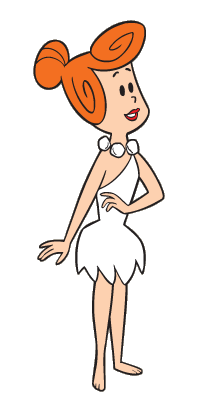


## Ventajas de Bulma.css

Las ventajas principales de **Bulma.css** es que es ligero y modular, por lo que se
puede configurar para usar solo los componentes que necesites. Además, no
necesita _javascript_. Es uno de las _frameworks css_ más populares, con una
comunidad muy activa. Además, cuenta con muchas plantillas, integraciones y
ejemplos de uso.

## Instalación

En nuestro caso, lo más sencillo es 
descargar la hoja de estilos directamente desde github:

[bulma.css](https://raw.githubusercontent.com/jgthms/bulma/master/css/bulma.css)

Lo salvamos en `commons/static/css/` (Si no existe este direcotorio, lo
crearemos). Podemos ahora reemplazar la plantilla `base.html` por la siguiente:

```html
--8<--
./docs/base.html
--8<--
```

!!! note "no debería ser `commons/static/commons/css`?"

    La recomendacion general es que todas las apps definan un directorio
    propio para evitar conflictos de nombres, pero como la idea de
    `commons` es precisamente proporcionar los elementos que son comunes
    a todo el proyecto, podemos hacer una excepción y tener así
    URLs ligeramente más cortas para los elementos que más usamos.

## Clases CSS

La filosofía de Bulma es definir clases para que nosotros las podamos
usar, pero sin afectar en los estilos que ya hubiera definidos previamente, ya
sean los estilos por defecto del navegador u otros.

La mayor parte de las veces define un estilo para cada componente o elemento, que
tendremos que añadir explícitamente para usarlo. Por ejemplo, se define una
clase `.table` para que se la añadamos a la etiqueta `<table>`,
quedando `<table class="table">`. 

[ ] **Ejercicio**: Cambiemos la lista de tareas para
usar la clase `table`

## Modificadores

Hay muchos elementos en Bulma que tienes estilos alternativos. La mayoría de
estos estilos se definen con clases que empiezan con los prefijos `is-` o
`has-`. Por ejemplo, tenemos una clase para los botones que se llama `button`:

```html
<button class="button">
  Button
</button>
```

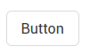

Añadiendo a laa clase `button` la clase `is-primary`, podemos modificar el
color del botón.

```html
<button class="button is-primary">
  Button
</button>
```

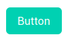

Bulma define 6 colores principales:


- `is-primary`
- `is-link`
- `is-info`
- `is-success`
- `is-warning`
- `is-danger`

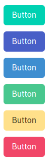


También se puede cambiar el tamaño:

- `is-small`
- `is-medium`
- `is-large`

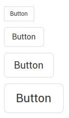


Y el estilo o estado:

- `is-outlined`
- `is-loading`
- `[disabled]`

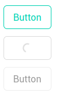

Y todos estos modificadores se pueden combinar. Algunos modificadores de uso
general son `is-rounded`

## Diseño responsive

Bulma es un framework `responsive`, es decir, que se puede adaptar
a la presentación edistintos dispositivos como teléfonos móbiles,
tablets, ordenadores, etc. Cada elemento de Bulma esta diseñado como
_mobile-first_ y optimizado para la lectura en vertical. POr lo tanto, en un
teléfono móbil tendriamos:

- Las columnas se apilan verticlamente

- El componente de nivel (level) mostrara sus contenidos
  apilados verticalmente.
  
- El menú de navegación está oculto.

Pero se puede forzar a adoptar el diseño horizontal aun en un teléfono móbil
añadiendo la clase `is-mobile`.

### Puntos de ruptura

Bulma define 4 puntos de ruptura, que define **5 tamaños de pantalla**.

- `mobile` : Hasta 768px
- `tablet` : A partir de 769px
- `desktop`: A partir de 1024px
- `fullhd`: A partir de 1408px

Con estos 4 puntos de ruptura, Bulma proporciona 9 clases:

- `mobile` : Hasta 768px
- `tablet` : A partir de 769px
- `tablet-only` : A partir de 769px hasta 1023px
- `desktop`: A partir de 1024px
- `desktop-only`: A partir de 1024px hasta 1215px
- `widescreen`: A partir de 1216px
- `widescreen-only`: A partir de 1216px hasta 1407px
- `fullhd`: A partir de 1408px
- `touch`: hasta 1024px (`mobile` + `tablet`)
- `until-widescreen`: Hasta 1215px (`mobile` + `tablet` + `desktop`)
- `until-fullhd`: Hasta 1408px

### Colores

Bulma define varios colores y tonos de gris como clases. Como internamente usa
sass, calcula los colores inversos para que se puedan leer siempre bien.

| Color   | Variable  |
|---------|-----------|
| White   | `white`   |
| Black   | `black`   |
| Light   | `light`   |
| Dark    | `dark`    |
| Primary | `primary` |
| Link    | `link`    |
| Info    | `info`    |
| Success | `success` |
| Warning | `warning` |
| Danger  | `danger`  |


Y esttos son los tonos de gris:

| Color        | Variable       | Value               |
|--------------|:--------------:|--------------------:|
| Black bis    | `black-bis`    | hsl(0, 0%, 7%)      |
| Black ter    | `black-ter`    | hsl(0, 0%, 14%)     |
| Grey darker  | `grey-darker`  | hsl(0, 0%, 21%)     |
| Grey dark    | `grey-dark`    | hsl(0, 0%, 29%)     |
| Grey light   | `grey-light`   | hsl(0, 0%, 71%)     |
| Grey lighter | `grey-lighter` | hsl(0, 0%, 86%)     |
| White ter    | `white-ter`    | hsl(0, 0%, 96%)     |
| White bis    | `white-bis`    | hsl(0, 0%, 98%)     |


## Elementos de Bulma.css


### Columnas

Hacer una maquetación con columnas es sencillo, solo hay que añadir un
contendor con la clase `columns`, y dentro tantos contenedores de la clase
`column` como queramos. Por defecto todas las columndas tendrán el mismo ancho.

[ ] Modificar el base.html para que la cabecera sean dos columnaas

Para cambiar el tamaño de una columna en particular, podemos usar alguna de los
siguientes clases:

- `is-three-quarters`
- `is-two-thirds`
- `is-half`
- `is-one-third`
- `is-one-quarter`
- `is-full`

Las otras columnas rellenarán el espacio sobrante. También se pueden usar
las siguientes clases si queremos usar múltiplos del 20%:

- `is-four-fifths`
- `is-three-fifths`
- `is-two-fifths`
- `is-one-fifth`

El sistema más flexible supone usar un grid de 12 columnas. Podemos controlar
el ancho de cada columna con las siguientes clases:


- `is-1`
- `is-2`
- `is-3`
- `is-4`
- `is-5`
- `is-6`
- `is-7`
- `is-8`
- `is-9`
- `is-10`
- `is-11`
- `is-12`

Se puede hacer que una columna tenga un _offset_ o desplazamiento hacia la
derecha con las clases `is-offset-x`.

Si queremos que una columna solo use el espacio mínimo que necesite, se usa la clase
`is-narrow`, el resto de columnas consumira el epacio que deja.


Por defcto, las columnas solo están activas a partir del _breakpoint_ `tablet`.
Esto significa que por debajo de eso, las columnas se representan apiladas
verticlamente. Podem,os forzar que se vean en tamaños menores usando la clase
`is-mobile`.

De forma similar, si solo se quieren las columnas a partir de `desktop`,
podemos usar la clase `is-desktop`.

También podemos definir **tamaños de columna diferentes** dependiendo
del tamaño del navegador. Un elemento con las siquietes clases:

```css
is-three-quarters-mobile
is-two-thirds-tablet
is-half-desktop
is-one-third-widescreen
is-one-quarter-fullhd
```

Ocuparía diferentes tamaños dependiendo del tamaño de visualización disponible.
En un teléfono móbil ocupara tres cuartos de pantalla, en `fullhd` ocupara un
cuarto del espacio disponible.

Las columnas tienen una separación por defecto, definida en la variable
`$column-gap`. El valor por defecto es $0.75 rem$. La separacíon se aplica a
ambos lados de la columna (Excepto en la primera y la ultima), así que el
espacio final entre dos columas será de $1.5 rem$. Se puede elimiar este margen
en una columna concreta con la clase `is-gapless`.

Para alinear el contenido de las columna verticlamente, se usa la clase
`is-vcentered` en el componente con la clase `columns`. Usando la clase
`is-centerd` en la clase contendora, las columnas en si seran centradas.


Para empezar una nueva serie de columnas, podemos cerrar el contendor con la
clase `columns` y empezaar uno nuevo, pero también se puede hacer de otra
manera: Añadir la clase `is-multiline` al contendor de columnas. De esta
manera, cuando una serie de columas hayan consumido todo el espacio disponible,
se salta automáticamente a otra serie.

Combinando `is-centered` con `is-multiline` podemos crear lista de columnes
flexibles y centradas.

## Formularios

Bulma define ls siguientes clases para formularios:

- `.button`
- `.input`
- `.select`
- `.file-cta`
- `.file-name`
- `.pagination-previous`
- `.pagination-next`
- `.pagination-link`
- `.pagination-ellipsis`

los controles tienen un tamaño por defecto (Definido en la 
variable `$size-normal`) a partir del cual se generan tres clases adiciones:
`is-small`, `is-medium` e `is-large`.

PAra mantener un equilibrio balanceado, Bulma proporciona un contenedor
`control` con en el que podemos recubrir cada elemento del formulario. Para
mantener la integridad entre el control y la etiqueta, recubrimos todo con un
elemento `field`.

Así quedaría un control input:

```html
<div class="field">
  <label class="label">Name</label>
  <div class="control">
    <input class="input" type="text" placeholder="Text input">
  </div>
</div>
```

Para integrarse bien con Bulma, es recomnedable siempre usar esta clase `control`.
La estructura general a usar sería:

Un contenedor con la clase `field`, que contenga:
    
- Una etiqueta con la etiqeuta `label`

- Un control con la etiqueta `control`

- Un texto de ayuda, opcional, con la clase `help`.

El contendeo `control` está diseñado para contener un único control
de formulario. Como tiene la misma altura y anchura que el elemento que
contiene, solo debe contener elementos de alguno de estos tipos

- `<input>`
- `<select>`
- `<button>`
- `<icon>`

Usándolo, conseguimos:

- Mantener un espacionado consistente

- Combinar los controles en un grupo

- Combinar los controles en una lista

- Anadir iconos al control, tante antes como después, o ambos.

2 modifiers on a control

Para los iconos, tenemos que añadir al `control` los modificadores
`has-icons-left` y/o `has-icons-right`. También 
tenemos que añadir al icono la clase 
`is-left` si se ha usado `has-icons-left`, y/o 
`is-right` isi se ha usado `has-icons-right`.

```html
<div class="field">
  <p class="control has-icons-left has-icons-right">
    <input class="input" type="email" placeholder="Email">
    <span class="icon is-small is-left">
      <i class="fas fa-envelope"></i>
    </span>
    <span class="icon is-small is-right">
      <i class="fas fa-check"></i>
    </span>
  </p>
</div>
```

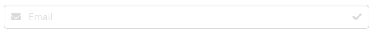

Podemos añadir iconos a los elementos`select` también:

```html
<div class="field">
  <p class="control has-icons-left">
    <span class="select">
      <select>
        <option selected>Country</option>
        <option>Select dropdown</option>
        <option>With options</option>
      </select>
    </span>
    <span class="icon is-small is-left">
      <i class="fas fa-globe"></i>
    </span>
  </p>
</div>
```

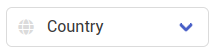


Tambien podemos pegar dos controles entre si, siendo tipico
en los formularios de busqueda pegar el control del texto a buscar y el de
botonde busqueda. Para eso añadimos la clase `has_addons` en el contenedor
`fields`.

```HTML
<div class="field has-addons">
  <div class="control">
    <input class="input" type="text" placeholder="Find a repository">
  </div>
  <div class="control">
    <a class="button is-info">
      Search
    </a>
  </div>
</div>
```

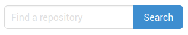

!!! note "Solo se pueden pegar controles de tipo `input`, botones y `sekect`."


### Elementos


La clase `box` es un cuadro de fondo blanco que contiene otros elementos. Es un
contendor excelenete para formularios, por ejemplo, o para un elemento `media`
(que veremos más adelante).

La clase `button` la vimos antes. Solo comentar aquí que podemos añadior la
clase `is-responsive` para que el botón cambie de tamaño automaticamente.

LA clase `Content` es para contener texto en Html y que no se vea afectado por
los estilos de Bulma.


### Imágenes

La clase `image` es un contenedor pensado para imágenes. Como las imágenes
pueden tardar un tiempo en ser cargadas y mostradas, se incluyen unos
modificadores con tamaños predeterminados, para que la maquetación
de la página no tenga que esperar por la carga de las imágenes.

```html
<figure class="image is-128x128">
  
</figure>
```

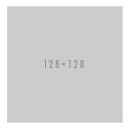

Hay 7 tamaños para elegir:

| Clases             | Tamaño de la imagen |
|--------------------|--------------------:|
| `image is-16x16` 	 | 16x16px             |
| `image is-24x24` 	 | 24x24px             |
| `image is-32x32` 	 | 32x32px             |
| `image is-48x48` 	 | 48x48px             | 
| `image is-64x64` 	 | 64x64px             |
| `image is-96x96` 	 | 96x96px             |
| `image is-128x128` | 128x128px           |

También se pueden hacer las imágenes redondas, con la clase `is-rounded`
aplicada a la etiqueta `img`.

```html
<figure class="image is-128x128">
  
</figure>
```

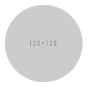

#### Notificaciones

The notification is a simple colored block meant to draw the attention to the user about something. As such, it can be used as a pinned notification in the corner of the viewport. That's why it supports the use of the delete element. The notification element is available in all the different colors defined. Each color also comes in its light version. Simply append the is-light modifier to obtain the light version of the notification. 

```html
<div class="notification is-warning">
  <button class="delete"></button>
  Lorem ipsum dolor sit amet, consectetur
  adipiscing elit lorem ipsum dolor. <strong>Pellentesque risus mi</strong>, tempus quis placerat ut, porta nec nulla. Vestibulum rhoncus ac ex sit amet fringilla. Nullam gravida purus diam, et dictum <a>felis venenatis</a> efficitur.
</div>
```

[ ] Ejercicion: cambiar de `is-warnig` a `is-link` o `is-success`.

he Bulma package does not come with any JavaScript. Here is however an implementation example, which sets the click handler for Bulma delete elements, anywhere on the page, in vanilla JavaScript.

```js
document.addEventListener('DOMContentLoaded', () => {
  (document.querySelectorAll('.notification .delete') || []).forEach(($delete) => {
    const $notification = $delete.parentNode;

    $delete.addEventListener('click', () => {
      $notification.parentNode.removeChild($notification);
    });
  });
});
```

#### Progress Bar

The Bulma progress bar is a simple CSS class that styles the native <progress> HTML element. Está disponible en todos los colores.

```html
<progress class="progress" value="15" max="100">15%</progress>
```

If you don't set the HTML value attribute, you can display an indeterminate progress bar. It's used to show that some progress is going on, but the total duration is not yet determine


#### Tablas

 You can create a Bulma table simply by attaching a single table CSS class on a <table> HTML element with the following structure:

```
    <table class="table"> as the main container
        thead the optional top part of the table
        tfoot the optional bottom part of the table
        tbody the main content of the table
            tr each table row
                th a table cell heading
                td a table cell
```

Marca una fila como selecciona añadiendo la clase `is-selected` al elemento `<tr>`.

[ ] Marcar las tareas de prioridad `H` como `is-warning`.

Ecisten estan clases auxiliares para tablas:

- `is-bordered`: Añade bordes
- `is-stripd`: Añade bandas
- `is-narrow`: Hace la tabla un poco más estrecha
- `is-hoverable`: resalta la fila sobre la que se mueve el cursor
- `is-fullwidth`: La tabla ocupa todo el ancho disponible.

You can create a scrollable table by wrapping a table in a table-container element:

#### tags

The Bulma `tag` is a small but versatile element. It's very useful as a way to attach information to a block or other component. Its size makes it also easy to display in numbers, making it appropriate for long lists of items. By default, a tag is a 1.5rem high label.

```html
<span class="tag">
  Tag label
</span>
```

Like with buttons, there are 10 different colors available. Y 10 más usando la
version `-light`.

```html
<span class="tag is-primary">Primary</span>
<span class="tag is-link">Link</span>
<span class="tag is-info">Info</span>
<span class="tag is-success">Success</span>
<span class="tag is-warning">Warning</span>
<span class="tag is-danger">Danger</span>
<span class="tag is-primary is-light">Primary</span>
<span class="tag is-link is-light">Link</span>
<span class="tag is-info is-light">Info</span>
<span class="tag is-success is-light">Success</span>
<span class="tag is-warning is-light">Warning</span>
<span class="tag is-danger is-light">Danger</span>
```

El modificador `is-rounded` hace que la etiqueta tenga bordes redondeados.
El modificador `is-delete` convierte la tetiqueta en un boton de borrado.


You can now create a list of tags with the `tags` container.

```html
<div class="tags">
  <span class="tag">One</span>
  <span class="tag">Two</span>
  <span class="tag">Three</span>
</div>
```

If the list is very long, it will automatically wrap on multiple lines, while keeping all tags evenly spaced.

You can attach tags together with the has-addons modifier. 

```html
<div class="tags has-addons">
  <span class="tag">Package</span>
  <span class="tag is-primary">Bulma</span>
</div>
```

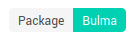


#### Título y subtítulos


There are 2 types of heading: `title` y `subtitle`. Yambien hay 6 tamaños de
texto, desde `is-1` a `is-6`. When you combine a title and a subtitle, they move closer together. As a rule of thumb, it is recommended to use a size difference of two. So if you use a title is-1, combine it with a subtitle is-3. You can maintain the normal spacing between titles and subtitles if you use the is-spaced modifier on the first element.


#### Breadcrumb

A simple breadcrumb component to improve your navigation experience

The Bulma breadcrumb is a simple navigation component that only requires a breadcrumb container and a ul list. The dividers are automatically created in the content of the ::before pseudo-element of li tags.

You can inform the current page using the is-active modifier in a li tag. It will disable the navigation of inner links.

```html
<nav class="breadcrumb" aria-label="breadcrumbs">
  <ul>
    <li><a href="#">Bulma</a></li>
    <li><a href="#">Documentation</a></li>
    <li><a href="#">Components</a></li>
    <li class="is-active"><a href="#" aria-current="page">Breadcrumb</a></li>
  </ul>
</nav>
```

For alternative alignments, use the is-centered and is-right modifiers on the breadcrumb container.

You can choose between 4 additional separators: `has-arrow-separator`, `has-bullet-separator`, `has-dot-separator` y `has-succeeds-separator`.


You can choose between 3 additional sizes: `is-small`, `is-medium` e `is-large`.

#### Cards


An all-around flexible and composable component

The card component comprises several elements that you can mix and match:

```
    card: the main container
        card-header: a horizontal bar with a shadow
            card-header-title: a left-aligned bold text
            card-header-icon: a placeholder for an icon
        card-image: a fullwidth container for a responsive image
        card-content: a multi-purpose container for any other element
        card-footer: a horizontal list of controls
            card-footer-item: a repeatable list item
```


You can center the card-header-title by appending the `is-centered` modifier.

The `card-header` can have a title and a Bulma icon

The `card-image` is a container for a Bulma image element

The `card-content` is the main part, ideal for text content, thanks to its padding

The card-footer acts as a list of for several card-footer-item elements

#### Dropdown


The dropdown component is a container for a dropdown button and a dropdown menu.

```
    dropdown the main container
        dropdown-trigger the container for a button
        dropdown-menu the toggable menu, hidden by default
            dropdown-content the dropdown box, with a white background and a shadow
                dropdown-item each single item of the dropdown, which can either be a a or a div
                dropdown-divider a horizontal line to separate dropdown items

```

Ejemplo:

```
<div class="dropdown is-active">
  <div class="dropdown-trigger">
    <button class="button" aria-haspopup="true" aria-controls="dropdown-menu">
      <span>Dropdown button</span>
      <span class="icon is-small">
        <i class="fas fa-angle-down" aria-hidden="true"></i>
      </span>
    </button>
  </div>
  <div class="dropdown-menu" id="dropdown-menu" role="menu">
    <div class="dropdown-content">
      <a href="#" class="dropdown-item">
        Dropdown item
      </a>
      <a class="dropdown-item">
        Other dropdown item
      </a>
      <a href="#" class="dropdown-item is-active">
        Active dropdown item
      </a>
      <a href="#" class="dropdown-item">
        Other dropdown item
      </a>
      <hr class="dropdown-divider">
      <a href="#" class="dropdown-item">
        With a divider
      </a>
    </div>
  </div>
</div>
```

While the dropdown-item can be used as an anchor link <a>, you can also use a <div> and insert almost any type of content.


The dropdown component has 2 additional modifiers

- `is-hoverable`: the dropdown will show up when hovering the dropdown-trigger
- `is-active`: the dropdown will show up all the time

While the CSS `:hover` implementation works perfectly, the `is-active` class is available for users who want to control the display of the dropdown with JavaScript. 

You can add the `is-up` modifier to have a dropdown menu that appears above the dropdown button. 


#### Menu

A simple menu, for any type of vertical navigation


The Bulma menu is a vertical navigation component that comprises:

- the `menu` container
- informative `menu-label` labels
- interactive `menu-list` lists that can be nested up to 2 levels


```html
<aside class="menu">
  <p class="menu-label">
    General
  </p>
  <ul class="menu-list">
    <li><a>Dashboard</a></li>
    <li><a>Customers</a></li>
  </ul>
  <p class="menu-label">
    Administration
  </p>
  <ul class="menu-list">
    <li><a>Team Settings</a></li>
    <li>
      <a class="is-active">Manage Your Team</a>
      <ul>
        <li><a>Members</a></li>
        <li><a>Plugins</a></li>
        <li><a>Add a member</a></li>
      </ul>
    </li>
    <li><a>Invitations</a></li>
    <li><a>Cloud Storage Environment Settings</a></li>
    <li><a>Authentication</a></li>
  </ul>
  <p class="menu-label">
    Transactions
  </p>
  <ul class="menu-list">
    <li><a>Payments</a></li>
    <li><a>Transfers</a></li>
    <li><a>Balance</a></li>
  </ul>
</aside>
````


#### Message

Colored message blocks, to emphasize part of your page

The Bulma message is a multi-part component:

- the `message` container
- the optional `message-header` that can hold a title and a delete element
- the `message-body` for the longer body of the message

The message component is available in all the different colors. You can remove
the `message-header` if you don't need it, which will add a left border to the `message-body`. You can add one of 3 size modifiers to the message component.


#### Modal

A classic modal overlay, in which you can include any content you want

The modal structure is very simple:

```
    modal: the main container
        modal-background: a transparent overlay that can act as a click target to close the modal
        modal-content: a horizontally and vertically centered container, with a maximum width of 640px, in which you can include any content
        modal-close: a simple cross located in the top right corner
```

To activate the modal, just add the `is-active` modifier on the `.modal` container. You may also want to add `is-clipped` modifier to a containing element (usually html) to stop scroll overflow. 

Because a modal can contain anything you want, you can very simply use it to
build an image gallery for example.
If you want a more classic modal, with a head, a body and a foot, use the modal-card..

```
<div class="modal">
  <div class="modal-background"></div>
  <div class="modal-card">
    <header class="modal-card-head">
      <p class="modal-card-title">Modal title</p>
      <button class="delete" aria-label="close"></button>
    </header>
    <section class="modal-card-body">
      <!-- Content ... -->
    </section>
    <footer class="modal-card-foot">
      <button class="button is-success">Save changes</button>
      <button class="button">Cancel</button>
    </footer>
  </div>
</div>
```


The Bulma package does not come with any JavaScript. Here is however an implementation example, which sets the click handlers for custom elements, in vanilla JavaScript.

There are 3 parts to this implementation:

- add the HTML for the modal (this modal is hidden by default)

- add the HTML for a button to trigger the modal (you can style this button however you want)

- add the JS code to add the click event on the trigger to open the modal


1. Add the HTML for the modal

At the end of your page, before the closing </body> tag, at the following HTML snippet:

<div id="modal-js-example" class="modal">
  <div class="modal-background"></div>

  <div class="modal-content">
    <div class="box">
      <p>Modal JS example</p>
      <!-- Your content -->
    </div>
  </div>

  <button class="modal-close is-large" aria-label="close"></button>
</div>

The id attribute's value must be unique.

2. Add the HTML for the trigger

Somewhere on your page, add the following HTML button:

<button class="js-modal-trigger" data-target="modal-js-example">
  Open JS example modal
</button>

You can style it however you want, as long as it has the js-modal-trigger CSS class and the appropriate data-target value. For example, you can add the button is-primary Bulma classes:


3. Add the JS for the trigger

In a script element (or in a seperate .js file), add the following JS code:

```js
document.addEventListener('DOMContentLoaded', () => {
  // Functions to open and close a modal
  function openModal($el) {
    $el.classList.add('is-active');
  }

  function closeModal($el) {
    $el.classList.remove('is-active');
  }

  function closeAllModals() {
    (document.querySelectorAll('.modal') || []).forEach(($modal) => {
      closeModal($modal);
    });
  }

  // Add a click event on buttons to open a specific modal
  (document.querySelectorAll('.js-modal-trigger') || []).forEach(($trigger) => {
    const modal = $trigger.dataset.target;
    const $target = document.getElementById(modal);

    $trigger.addEventListener('click', () => {
      openModal($target);
    });
  });

  // Add a click event on various child elements to close the parent modal
  (document.querySelectorAll('.modal-background, .modal-close, .modal-card-head .delete, .modal-card-foot .button') || []).forEach(($close) => {
    const $target = $close.closest('.modal');

    $close.addEventListener('click', () => {
      closeModal($target);
    });
  });

  // Add a keyboard event to close all modals
  document.addEventListener('keydown', (event) => {
    const e = event || window.event;

    if (e.keyCode === 27) { // Escape key
      closeAllModals();
    }
  });
});
```


#### Navbar

A responsive horizontal navbar that can support images, links, buttons, and dropdowns


The navbar component is a responsive and versatile horizontal navigation bar with the following structure:

```
    navbar the main container
        navbar-brand the left side, always visible, which usually contains the logo and optionally some links or icons
            navbar-burger the hamburger icon, which toggles the navbar menu on touch devices
        navbar-menu the right side, hidden on touch devices, visible on desktop
            navbar-start the left part of the menu, which appears next to the navbar brand on desktop
            navbar-end the right part of the menu, which appears at the end of the navbar
                navbar-item each single item of the navbar, which can either be an a or a div
                    navbar-link a link as the sibling of a dropdown, with an arrow
                    navbar-dropdown the dropdown menu, which can include navbar items and dividers
                        navbar-divider a horizontal line to separate navbar items
```

To get started quickly, here is what a complete basic navbar looks like:

```html
<nav class="navbar" role="navigation" aria-label="main navigation">
  <div class="navbar-brand">
    <a class="navbar-item" href="https://bulma.io">
      
    </a>

    <a role="button" class="navbar-burger" aria-label="menu" aria-expanded="false" data-target="navbarBasicExample">
      <span aria-hidden="true"></span>
      <span aria-hidden="true"></span>
      <span aria-hidden="true"></span>
    </a>
  </div>

  <div id="navbarBasicExample" class="navbar-menu">
    <div class="navbar-start">
      <a class="navbar-item">
        Home
      </a>

      <a class="navbar-item">
        Documentation
      </a>

      <div class="navbar-item has-dropdown is-hoverable">
        <a class="navbar-link">
          More
        </a>

        <div class="navbar-dropdown">
          <a class="navbar-item">
            About
          </a>
          <a class="navbar-item">
            Jobs
          </a>
          <a class="navbar-item">
            Contact
          </a>
          <hr class="navbar-divider">
          <a class="navbar-item">
            Report an issue
          </a>
        </div>
      </div>
    </div>

    <div class="navbar-end">
      <div class="navbar-item">
        <div class="buttons">
          <a class="button is-primary">
            <strong>Sign up</strong>
          </a>
          <a class="button is-light">
            Log in
          </a>
        </div>
      </div>
    </div>
  </div>
</nav>
```


The `navbar-brand` is the left side of the navbar. It can contain:

- a number of `navbar-item`
- the `navbar-burger` as last child

The navbar brand is always visible: on both touch devices < 1024px and desktop
>= 1024px . As a result, it is recommended to only use a few navbar items to
avoid overflowing horizontally on small devices.

The `navbar-burger` is a hamburger menu that only appears on touch devices. It
has to appear as the last child of navbar-brand. It has to contain three empty
span tags in order to visualize the hamburger lines or the cross (when active


The `navbar-menu` is the counterpart of the navbar brand. As such, it must
appear as a direct child of `navbar`, as a sibling of `navbar-brand`.  The
`navbar-menu` is hidden on touch devices < 1024px . You need to add the
modifier class is-active to display it.


On desktop >= 1024px , the `navbar-menu` will fill up the space available in the
navbar, leaving the navbar brand just the space it needs. It needs, however,
two elements as direct children:

- `navbar-start`
- `navbar-end`

The Bulma package does not come with any JavaScript.
Here is however an implementation example, which toggles the class is-active on both the navbar-burger and the targeted navbar-menu, in Vanilla Javascript.

```js
document.addEventListener('DOMContentLoaded', () => {

  // Get all "navbar-burger" elements
  const $navbarBurgers = Array.prototype.slice.call(document.querySelectorAll('.navbar-burger'), 0);

  // Add a click event on each of them
  $navbarBurgers.forEach( el => {
    el.addEventListener('click', () => {

      // Get the target from the "data-target" attribute
      const target = el.dataset.target;
      const $target = document.getElementById(target);

      // Toggle the "is-active" class on both the "navbar-burger" and the "navbar-menu"
      el.classList.toggle('is-active');
      $target.classList.toggle('is-active');

    });
  });

});
```

these are just implementation examples. The Bulma package does not come with any JavaScript.


The `navbar-start` and `navbar-end` are the two direct and only children of the navbar-menu.

On desktop >= 1024px :

- `navbar-start` will appear on the left

- `navbar-end` will appear on the right

Each of them can contain any number of navbar-item.

A `navbar-item` is a repeatable element that can be:

- a navigation link
- a container for the brand logo
- the parent of a dropdown menu 
- a child of a navbar dropdown
- a container for almost anything you want, like a field


 Transparent navbar
#

To seamlessly integrate the navbar in any visual context, you can add the
`is-transparent` modifier on the `navbar` component. This will remove any hover or
active background from the navbar items.

You can also fix the navbar to either the top or bottom of the page. This is a 2-step process:

- Add either `is-fixed-top` or `is-fixed-bottom` to the navbar component 

    ```html
    <nav class="navbar is-fixed-top">
    ```

- Add the corresponding `has-navbar-fixed-top` or `has-navbar-fixed-bottom`
  modifier to either `<html>` or `<body>` element to provide the appropriate
  padding to the page:

    ```html
    <html class="has-navbar-fixed-top">
    ```


#### Tabs

Simple responsive horizontal navigation tabs, with different styles

The Bulma tabs are a straightforward navigation component that come in a variety of versions. They only require the following structure:

- a `tabs` container
- a `<ul>` HTML element
- a list of `<li>` HTML element
- `<a>` HTML anchor elements for each link

The default tabs style has a single border at the bottom.

Example:

```html
<div class="tabs">
  <ul>
    <li class="is-active"><a>Pictures</a></li>
    <li><a>Music</a></li>
    <li><a>Videos</a></li>
    <li><a>Documents</a></li>
  </ul>
</div>
```

To align the tabs list, use the `is-centered` or `is-right` modifier on the
.tabs container. If you want a more classic style with borders, just append the
`is-boxed` modifier.  If you want mutually exclusive tabs (like radio buttons
where clicking one deselects all other ones), use the `is-toggle` modifier.  If
you use both `is-toggle` and `is-toggle-rounded`, the first and last items will
be rounded. If you want the tabs to take up the whole width available, use
`is-fullwidth`.


#### Level

A multi-purpose horizontal level, which can contain almost any other element

The structure of a level is the following:

```
    level: main container
        level-left for the left side
        level-right for the right side
            level-item for each individual element
```

In a level-item, you can then insert almost anything you want: a title, a
button, a text input, or just simple text. No matter what elements you put
inside a Bulma level, they will always be vertically centered.
If you want a centered level, you can use as many level-item as you want, as long as they are direct children of the level container. 

```html
<nav class="level">
  <div class="level-item has-text-centered">
    <div>
      <p class="heading">Tweets</p>
      <p class="title">3,456</p>
    </div>
  </div>
  <div class="level-item has-text-centered">
    <div>
      <p class="heading">Following</p>
      <p class="title">123</p>
    </div>
  </div>
  <div class="level-item has-text-centered">
    <div>
      <p class="heading">Followers</p>
      <p class="title">456K</p>
    </div>
  </div>
  <div class="level-item has-text-centered">
    <div>
      <p class="heading">Likes</p>
      <p class="title">789</p>
    </div>
  </div>
</nav>
```


#### Media Object

The famous media object prevalent in social media interfaces, but useful in any
context

The media object is a UI element perfect for repeatable and nestable content.

Example:

```html
<article class="media">
  <figure class="media-left">
    <p class="image is-64x64">
      
    </p>
  </figure>
  <div class="media-content">
    <div class="content">
      <p>
        <strong>John Smith</strong> <small>@johnsmith</small> <small>31m</small>
        <br>
        Lorem ipsum dolor sit amet, consectetur adipiscing elit. Proin ornare magna eros, eu pellentesque tortor vestibulum ut. Maecenas non massa sem. Etiam finibus odio quis feugiat facilisis.
      </p>
    </div>
    <nav class="level is-mobile">
      <div class="level-left">
        <a class="level-item">
          <span class="icon is-small"><i class="fas fa-reply"></i></span>
        </a>
        <a class="level-item">
          <span class="icon is-small"><i class="fas fa-retweet"></i></span>
        </a>
        <a class="level-item">
          <span class="icon is-small"><i class="fas fa-heart"></i></span>
        </a>
      </div>
    </nav>
  </div>
  <div class="media-right">
    <button class="delete"></button>
  </div>
</article>
```

You can include any other Bulma element, like inputs, textareas, icons, buttons… or even a navbar.


#### Hero

An imposing hero banner to showcase something

The hero component allows you to add a full width banner to your webpage, which
can optionally cover the full height of the page as well.

The basic requirement of this component are:

- `hero` as the main container

  - `hero-body` as a direct child, in which you can put all your content

As with buttons, you can choose one of the 8 different colors. 
For the fullheight hero to work, you will also need a `hero-head` and a `hero-foot`.
ou can have even more imposing banners by using one of 5 different sizes: `is-small`, `is-medium`, `is-large`, `is-halfheight` y `is-fullheight`.


#### Section

A simple container to divide your page into sections, like the one you’re currently reading

The section components are simple layout elements with responsive padding. They are best used as direct children of body.


