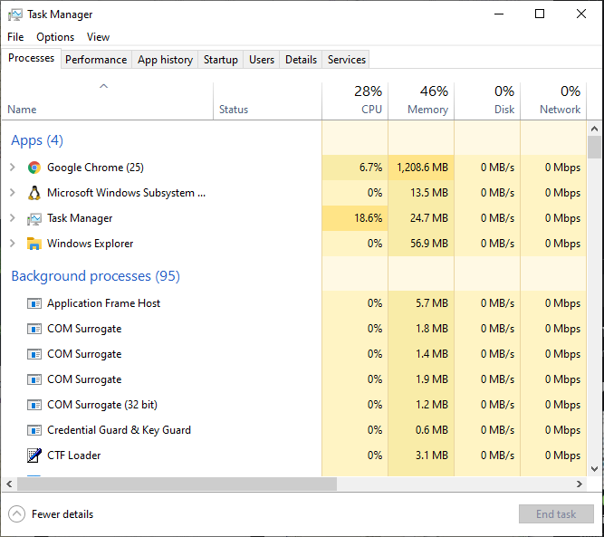

# Administración de sistemas


# ¿Quién es un SysAdmin?


- El día del Administrador de Sistemas Informáticos: 30 de julio  
(Se celebra el último viernes de julio desde el año 2000)

- Persona que tiene la responsabilidad de implementar, configurar, mantener, monitorizar, documentar y asegurar el correcto funcionamiento de un sistema informático, o algún aspecto de este.
- Tiene por objeto garantizar el tiempo de actividad (uptime), rendimiento, uso de recursos y la seguridad de los servidores que administra de forma dinámica.

# Qué un sistema informático


Un sistema informático es un sistema que permite almacenar y procesar información; es el conjunto de partes interrelacionadas: **software**, **hardware** y **personal informático**.
- El **software** incluye al sistema operativo, firmware y aplicaciones. 
- El **hardware** incluye computadoras o cualquier tipo de dispositivo electrónico(procesadores, memoria, sistemas de almacenamiento externo...)
- El **personal informático** incluye al personal técnico que apoya y mantienen el sistema (analistas, programadores, operarios, etc.) y a los usuarios que lo utilizan.

# Administración de sistemas
- **Software**
- Hardware
- Virtualización
- Gestión de usuarios

# Software

- Software de sistema
- Software de programación
- Software de aplicación

- **Software de sistema**: Sistemas operativos, controladores de dispositivos, herramientas de diagnóstico, herramientas de corrección y optimización, servidores, utilidades
- **Software de programación**: Editores de texto, compiladores, intérpretes, enlazadores, depuradores, entornos de desarrollo integrados (IDE)
- **Software de aplicación**: Aplicaciones ofimáticas, software educativo, empresarial, bases de datos, videojuegos, software de cálculo numérico y simbólico...

# Administración de sistemas
- Software
- **Hardware**
- Virtualización
- Gestión de usuarios

# Hardware

- CPU
- Memoria RAM
- Periféricos
- Tarjetas gráficas
- Placa base

- **CPU**: encargada de interpretar y ejecutar instrucciones y de procesar datos
- **Memoria RAM**: para el almacenamiento transitorio y de trabajo (no masivo)
- **Periféricos**: unidades o dispositivos para comunicarse con el exterior (entrada / salida)
- **Tarjetas gráficas**: realizar los cálculos asociados a operaciones gráficas, liberando así al procesador principal (CPU)
- **Placa base**: soporte fundamental que aloja y comunica a todos los demás componentes

### Cómo monitorizar el uso del hardware a través del SO

### En windows: Administrador de tareas


### En Linux / Mac
- `htop` : administrador de tareas en terminal
- `lshw`: para dar información del hardware del equipo (incluso en formato web!)
- `lscpu`: para ver las características de la CPU
- `free`: muestra el estado de la memoria RAM del sistema
- `df`: muestra el uso del disco
- `uptime`: para saber cuanto tiempo lleva el sistema encendido
- `ping`: útil para ver si somos capaces de llegar a otro host a través de la red
- `ifconfig`: muestra la configuración de una interfaz de red

### Introducción a la terminal Linux
Ve a [ejercicios/ubuntu-commands.ipynb](ejercicios/ubuntu-commands.ipynb)

### En Python - `psutil`

- Biblioteca multiplataforma para recuperar información sobre procesos en ejecución y utilización del sistema (CPU, memoria, discos, red, sensores) en Python
- Implementa muchas funcionalidades que ofrecen las herramientas clásicas de línea de comandos de UNIX como `ps`, `top`, `iotop`, `lsof`, `netstat`, `ifconfig`, `free` y otras

> Ve a [ejercicios/psutil.ipynb](ejercicios/psutil.ipynb)

# Administración de sistemas
- Software
- Hardware
- **Virtualización**
- Gestión de usuarios

## Virtualización


- En Informática, la virtualización es la creación a través de software de una representación (versión virtual) de algún recurso tecnológico.
- La virtualización es la base de la computación en la nube ya que el software de virtualización es el que ofrece los servicios de la nube a través de la red. Estos software de virtualización alojan instancias (máquinas virtuales, contenedores,...) que ofrecen los servicios.

### Vagrant
- Vagrant es una herramienta para la creación y configuración de entornos de desarrollo virtualizados.
- Aunque Vagrant se ha desarrollado en Ruby se puede usar en multitud de proyectos escritos en otros lenguajes, tales como PHP, Python, Java, C# y JavaScript.

Vagrant es una herramienta gratuita de línea de comandos que crea y configura máquinas virtuales a partir de ficheros de configuración.

Basta con compartir el fichero de configuración de Vagrant (llamado “Vagrantfile”) con otro desarrollador para que, con un simple comando, pueda reproducir el mismo entorno de desarrollo. 

Por defecto, Vagrant utiliza VirtualBox como motor de máquinas virtuales, aunque existe la opción de utilizar VMWare Workstation (Windows) o VMWare Fusion (MacOS X) con un plugin de pago.

**Recursos de vagrant**
- https://www.vagrantup.com/docs
- https://learn.hashicorp.com/vagrant

### Ejercicio de virtualización con Vagrant!
Ve a [ejercicios/vagrant.ipynb](ejercicios/vagrant.ipynb)

# Administración de sistemas
- Software
- Hardware
- Virtualización
- **Gestión de usuarios**

# Soporte a usuarios - Permisos y grupos

- Linux es un sistema multi-usuario
- Hay dos tipos de usuarios en Linux:
    - system users
    - regular users

Para ver los usuarios del sistema:
```
cat /etc/passwd
```

Para ver los grupos del sistema:
```
cat /etc/group
```

### Permisos

En Linux, cada fichero tiene un propietario, un grupo, y su propia configuracion de permisos. Se puede consultar esta configuración con el comando `ls`:
```
ls -l
```


### Ejemplos de configuración de permisos
`-rw-------`

`-rwxr-xr-x`

`-rw-rw-rw-`

`drwxr-xr-x`

`drwxrwx---`

`drwxr-x---`

- -rw-------: El fichero sólo es accessible por su propietario en modo lectura/escritura
- -rwxr-xr-x: El fichero es ejecutable por cualquier usuario del sistema “world-executable”
- -rw-rw-rw-: El fichero está abierto a modificaciones por cualquier usuario del sistema “world-writable”
- drwxr-xr-x: Un directorio al que puede leer y acceder cualquier usuario del sistema
- drwxrwx---: Un directorio donde sólo puede modificar el contenido su propietario o grupo
- drwxr-x---: Un directorio al que sólo pueden acceder los miembros del grupo

## En Linux
```
adduser
deluser

chmod
chown
chgrp
```

# Devops


2007 - Nace con el movimiento Agile, en contraposición al sistema en cascada tradicional

2009 - La charla "10+ Deploys Per Day: Dev and Ops Cooperation at Flickr" da visibilidad a esta filosofía y se crea mucho debate en twitter. En octubre se crea la primera DevOpsDays en Gante, Bélgica


## Áreas de acción
- Virtualización & contenedores
- Configuration Management
- Continuous Integration - CI
- Continuous Delivery and Continuous Deployment - CD
- Infrastructure as Code - IaC
- Orchestration
- Monitorización
- Microservicios

## Virtualización y Contenedores
- Virtualización: un sistema operativo completo funcionando de manera aislada sobre otro sistema operativo completo. 
- Contenedores: comparten los recursos del propio sistema operativo "host" sobre el que se ejecutan.

> Vagrant para virtualización, Docker para contenedores

## Configuration Management

- Cambiar y mantener el estado de algunas piezas de la infraestructura de manera consistente, sostenible y estable
- Automatizar operaciones que surgen del día a día, como la creación de usuarios, actualización de software, etc

> Ansible, Puppet, Chef, Salt

**Beneficios**
- Ahorro de tiempo - se tarda menos en hacer cambios en la configuración
- Mejor monitorización sobre los recursos
- Mejora la mantenibilidad del sistema
- Mantiene la configuración estandarizada en todos los servidores

## Continuous Integration - CI
- Es la práctica de fusionar con frecuencia los cambios realizados por los desarrolladores
- Para ello, se utilizan herramientas como los tests unitarios para comprobar que tras los cambios todo sigue funcionando correctamente

> Jenkins, Travis

**Beneficios**
- Detección rápida de bugs
- Elimina "la lucha" por mergear antes de una entrega grande
- Hace que se puedan hacer despliegues más rápidos y frecuentes
- Hace que el testing continuo sea posible

## Continuous Delivery and Continuous Deployment - CD
- Continuous Delivery: mantener continuamente un código en un estado listo para desplegar
- Continuous Deployment: despliegues frecuentes en lugar de grandes despliegues cada mucho tiempo

**Beneficios**
- El tiempo de puesta en producción es mucho más rápido
- Hay menos problemas de puesta en producción
- Menos riesgo de que algo falle en producción
- Facilita la vuelta a la versión anterior si algo va mal
- Elimina el miedo de subir a producción

## Infrastructure as Code - IaC
- Administrar y aprovisionar infraestructura usando código.  
En lugar de hacer cosas manualmente para administrar y aprovisionar estructura (servidores, máquinas virtuales, etc) usaremos scripts y código para crear y cambiar cosas como servidores, instancias, entornos, contenedores o clústers

> Ansible

**Beneficios**
- Consistencia en la creación y gestión de recursos
- Reusabilidad - el mismo script se utiliza para múltiples máquinas
- Facilita la escalabilidad - es fácil crear más máquinas o aumentar la infraestructura
- Es auto-documentada

## Orchestration
- Automatización que permite procesos y flujos de trabajo como el aprovisionamiento de recursos. 
- La orquestación trata de dejar de ser constructores para ser directores de orquesta, donde cada pieza sabe qué tiene que hacer y el director solo dice cuándo y cómo hacerlo.

> Docker Swarm, Kubernetes, Zookeeper, Terraform, 

**Beneficios**
- Mejora la escalabilidad - los recursos se pueden aumentar o disminuir fácilmente
- Mejora la estabilidad del sistema
- Ahorra tiempo - automatiza tareas y workflows
- Auto-servicio - se puede ofrecer a los usuarios
- Mucha información acerca del uso de los recursos

## Monitorización
- Se trata de recolectar y presentar datos sobre el rendimiento y la estabilidad de los servicios y de la infraestructura de un sistema
- Datos como: uso de memoria, cpu, tráfico de red, logs, etc.

> Sensu, NewRelic, AppDynamics

**Beneficios**
- Rápida recuperanción ante errores y fallos
- Rápida detección de errores
- Visibilidad ante otros equipos
- Posiblidad de automatizar respuestas ante falta de recursos (orquestación)

## Microservicios
- Arquitectura de software que divide una aplicación en una colección de pequeños servicios poco acoplados entre sí, como contraposición a la tradicional arquitectura monolítica.

**Beneficios**
- Modularidad
- Flexibilidad tecnológica - no tienes por qué usar el mismo lenguaje o las mismas versiones de software en cada servicio
- Escalabilidad - puedes escalar solo las partes más afectadas en cada momento

# Siguientes pasos en Administración de Sistemas


- Redes de computadoras
    * Protocolos (HTTP, SMTP, FTP, SSH)
- Servidores web
    * CGI, WSGI, ASGI, Gunicorn & NGINX
- Configuration Management & IaC
    * Fabric y Ansible
- Contenedores & Orquestación
    * Docker & Kubernetes
- Miniproyecto!
