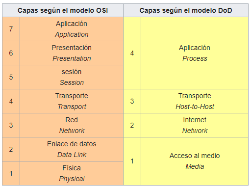

# Redes de computadoras


- Componentes básicos de las redes
- Protocolos de red
    - Sockets
    - Protocolo HTTP
    - Protocolo SMTP
    - Protocolo FTP
    - Protocolo SSH
- Modelos de Red
    - Modelo OSI
    - Modelo TCP/IP

# Componentes básicos de las redes


Para poder formar una red se requieren elementos: hardware, software y protocolos.

El fin de una red es interconectar los componentes hardware de una red, principalmente los ordenadores individuales (hosts), a los equipos que ponen los servicios en la red (servidores), utilizando el cableado (o tecnología inalámbrica) soportada por la electrónica de red y unidos por cableado (o radiofrecuencia). 

## Software
- **Sistema operativo de red**
- **Software de aplicación**

- **Sistema operativo de red**: Permite la interconexión de ordenadores para acceder a los servicios y recursos.  
Al igual que un equipo no puede trabajar sin un sistema operativo, una red de equipos no puede funcionar sin un sistema operativo de red.  
En muchos casos el sistema operativo de red es parte del sistema operativo de los servidores y de los clientes.
- **Software de aplicación**: En última instancia, todos los elementos se utilizan para que el usuario de cada estación, pueda utilizar sus programas y archivos específicos.

## Hardware
- Para lograr el enlace entre los ordenadores y los medios de transmisión

Para lograr el enlace entre los ordenadores y los medios de transmisión (cables de red o medios físicos para redes alámbricas e infrarrojos o radiofrecuencias para redes inalámbricas), es necesaria la intervención de una **tarjeta de red** (NIC, Network interface controller), con la cual se puedan enviar y recibir paquetes de datos desde y hacia otros ordenadores, empleando un **protocolo para su comunicación** y convirtiendo a esos datos a un formato que pueda ser transmitido por el medio (bits, -ceros y unos-). 
- El trabajo del adaptador de red es el de convertir las señales eléctricas que viajan por el cable (p. ej: red Ethernet) o las ondas de radio (p. ej: red Wi-Fi) en una señal que pueda interpretar el ordenador. Existen adaptadores que utilizan ondas de luz infrarrojas también, aunque de escaso desarrollo.
- Cabe señalar que a cada tarjeta de red le es asignado un identificador único por su fabricante, conocido como dirección MAC (Media Access Control), que consta de 48 bits (6 bytes). Dicho identificador permite dirigir el tráfico de datos de la red del emisor al receptor adecuado.

## Protocolos de redes
- Cada modelo estructura el funcionamiento de una red de manera distinta. 

- Los protocolos están repartidos por las diferentes capas pero no están definidos como parte del modelo en sí sino como entidades diferentes de normativas internacionales, de modo que el modelo OSI no puede ser considerado una arquitectura de red4, y de hecho es sólo una abstracción teórica.

## Tipos de redes
- **Por relación funcional** 
- **Por alcance**
- **Por tecnología**
- **Por topología física**
- **Por grado de autentificación**
- **Por grado de difusión**

- **Por relación funcional**: 
  - **Cliente-servidor** es la arquitectura que consiste básicamente en un cliente que realiza peticiones a otro programa (el servidor) que le da respuesta.
  - **Peer-to-peer**, o red entre iguales, es aquella red de ordenadores en la que todos o algunos aspectos funcionan sin clientes ni servidores fijos, sino una serie de nodos que se comportan como iguales entre sí.
- **Por alcance**: de área personal, de área local, metropolitana, de área local virtual...
- **Por tecnología**: punto a punto, de difusión (broadcast) o multipunto
- **Por topología física**: en bus, anillo, estrella, malla, árbol o híbrida
- **Por grado de autentificación**: privada o de acceso público
- **Por grado de difusión**: intranet o internet

y más

# Protocolos de red


_El protocolo sobre palomas mensajeras permite definir la forma en la que una paloma mensajera transmite información de una ubicación a otra, definiendo todos los aspectos que intervienen en la comunicación: tipo de paloma, cifrado del mensaje, tiempo de espera antes de dar a la paloma por 'perdida'... y cualquier regla que ordene y mejore la comunicación._

- Los sistemas de comunicación utilizan formatos bien definidos para intercambiar mensajes. Cada mensaje tiene un significado exacto destinado a obtener una respuesta de un rango de posibles respuestas predeterminadas para esa situación en particular.

- Un protocolo de comunicaciones es un sistema de reglas que permiten que dos o más entidades (computadoras, teléfonos celulares, etc.) se comuniquen entre ellas para transmitir información. 

- Los protocolos pueden ser implementados por hardware, por software, o por una combinación de ambos.

## Sockets

Socket designa un concepto abstracto por el cual dos procesos (posiblemente situados en computadoras distintas) pueden intercambiar cualquier flujo de datos, generalmente de manera fiable y ordenada.

Los sockets permiten implementar una arquitectura cliente-servidor. 
- La comunicación debe ser iniciada por uno de los procesos que se denomina programa "cliente". 
- El segundo proceso espera a que otro inicie la comunicación, por este motivo se denomina programa "servidor".

Un socket es un proceso o hilo existente en la máquina cliente y en la máquina servidora, que sirve en última instancia para que el programa servidor y el cliente lean y escriban la información. Esta información será la transmitida por las diferentes capas de red.

Para que dos procesos puedan comunicarse entre sí es necesario que se cumplan ciertos requisitos:
- Que un proceso sea capaz de localizar al otro.
- Que ambos procesos sean capaces de intercambiarse cualquier secuencia de octetos, es decir, datos relevantes a su finalidad.

Para ello son necesarios los dos recursos que originan el concepto de socket:
- Un par de direcciones del protocolo de red (dirección IP, si se utiliza el protocolo TCP/IP), que identifican la computadora de origen y la remota.
- Un par de números de puerto, que identifican a un programa dentro de cada computadora.

En este curso vamos a hablar de los sockets INET (como IPv4), ya que cubren el 99% del uso de los sockets.

#### ¿Qué pasa cuando haces click en una web?

De manera general, cuando hiciste click en el enlace que te trajo a esta página tu navegador hizo algo como lo siguiente:
``` python
# create an INET, STREAMing socket
s = socket.socket(socket.AF_INET, socket.SOCK_STREAM)
# now connect to the web server on port 80 - the normal http port
s.connect(("www.python.org", 80))
```


## Ejercicio de Sockets!
Ve a [ejercicios/sockets.ipynb](ejercicios/sockets.ipynb)

## Protocolo de transferencia de hipertexto - HTTP  
Protocolo de comunicación que permite las transferencias de información a través de archivos (XHML, HTML . . .) en la World Wide Web.

#### Mensajes 

Los mensajes HTTP son en texto plano y tienen la siguiente estructura:
- Línea inicial con
  - Para las peticiones: la acción requerida por el servidor (**método de petición**) seguido de la URL del recurso y la versión HTTP que soporta el cliente.
  - Para respuestas: La versión del HTTP usado seguido del **código de respuesta** (que indica qué ha pasado con la petición seguido de la URL del recurso) y de la frase asociada a dicho retorno.
- Las cabeceras del mensaje que terminan con una línea en blanco. Son **metadatos**. Estas cabeceras le dan gran flexibilidad al protocolo.
- Cuerpo del mensaje. Es opcional. Típicamente tiene los datos que se intercambian cliente y servidor.

#### Métodos de petición
- GET: El método GET solicita una representación del recurso especificado. 
- POST: Envía datos para que sean procesados orientado a la creación de nuevos contenidos
- PUT: Envía datos para que sean procesados orientado orientado a la actualización de los mismos
- DELETE: Borra el recurso especificado
...

#### Códigos de respuesta
- Códigos con formato 1xx: Respuestas informativas. Indica que la petición ha sido recibida y se está procesando.
- Códigos con formato 2xx: Respuestas correctas. Indica que la petición ha sido procesada correctamente.
- Códigos con formato 3xx: Respuestas de redirección. Indica que el cliente necesita realizar más acciones para finalizar la petición.
- Códigos con formato 4xx: Errores causados por el cliente. Indica que ha habido un error en el procesado de la petición a causa de que el cliente ha hecho algo mal.
- Códigos con formato 5xx: Errores causados por el servidor. Indica que ha habido un error en el procesado de la petición a causa de un fallo en el servidor.

[https://http.cat/](https://http.cat/)

#### Cabeceras o metadatos
- Cabeceras que indican las capacidades aceptadas por el que envía el mensaje: Accept (indica el MIME aceptado), Accept-Charset (indica el código de caracteres aceptado), Accept-Encoding (indica el método de compresión aceptado), Accept-Language (indica el idioma aceptado), User-Agent (para describir al cliente), Server (indica el tipo de servidor), Allow (métodos permitidos para el recurso)
- Cabeceras que describen el contenido: Content-Type (indica el MIME del contenido), Content-Length (longitud del mensaje), Content-Range, Content-Encoding, Content-Language, Content-Location.
- Cabeceras que hacen referencias a URIs: Location (indica donde está el contenido), Referer (Indica el origen de la petición).
- Cabeceras ....

## Ejercicio de protocolo HTTP!
Ve a [ejercicios/protocolo-http.ipynb](ejercicios/protocolo-http.ipynb)

## Protocolo para transferencia simple de correo - SMTP
Protocolo de red utilizado para el intercambio de mensajes de correo electrónico entre computadoras u otros dispositivos (PDA, teléfonos móviles, impresoras, etc). 

Una sesión SMTP consiste en comandos originados por un cliente SMTP (el agente de inicio, emisor o transmisor) y las respuestas correspondientes del SMTP del servidor (el agente de escucha, o receptor) para que la sesión se abra y se intercambian los parámetros de la sesión. 

Una transacción de SMTP se compone de tres secuencias de comando / respuesta:
- **MAIL**: para establecer la dirección de retorno (Return-Path), remitente o sobre
- **RCPT**: comando, para establecer un destinatario de este mensaje.
- **DATA**: para enviar el mensaje de texto. 

Ejemplo de una comunicación SMTP:

```
S: 220 Servidor SMTP
C: HELO miequipo.midominio.com
S: 250 Hello, please to meet you
C: MAIL FROM: <yo@midominio.com>
S: 250 Ok
C: RCPT TO: <destinatario@sudominio.com>
S: 250 Ok
C: DATA
S: 354 End data with <CR><LF>.<CR><LF>
C: Subject: Campo de asunto
C: From: yo@midominio.com
C: To: destinatario@sudominio.com
C:
C: Hola,
C: Esto es una prueba.
C: Hasta luego.
C:
C: .
C: <CR><LF>.<CR><LF>
S: 250 Ok: queued as 12345
C: quit
S: 221 Bye
```

- **SMTP** - Simple Mail Transfer Protocol _(Protocolo para transferencia simple de correo)_
- **POP3** - Post Office Protocol _(Protocolo de Oficina Postal)_
- **IMAP** - Internet Message Access Protocol _(Protocolo de acceso a mensajes de Internet)_

## Ejercicio de protocolo SMTP!
Ve a [ejercicios/protocolo-smtp.ipynb](ejercicios/protocolo-smtp.ipynb)

## Protocolo de transferencia de ficheros - FTP

- Desde un equipo cliente se puede conectar a un servidor para descargar archivos desde él o para enviarle archivos, independientemente del sistema operativo utilizado en cada equipo.
- El servicio FTP es ofrecido por la capa de aplicación del modelo de capas de red TCP/IP al usuario, utilizando normalmente el puerto de red 20 y el 21. 

- Un problema básico de FTP es que está pensado para ofrecer la máxima velocidad en la conexión, pero no la máxima seguridad, ya que todo el intercambio de información, desde el login y password del usuario en el servidor hasta la transferencia de cualquier archivo, se realiza en texto plano sin ningún tipo de cifrado, con lo que un posible atacante puede capturar este tráfico, acceder al servidor y/o apropiarse de los archivos transferidos.
- Para solucionar este problema son de gran utilidad aplicaciones como SCP y SFTP, incluidas en el paquete SSH, que permiten transferir archivos pero cifrando todo el tráfico

#### Ejemplo de código FTP


```python
from ftplib import FTP
ftp = FTP('ftp.us.debian.org')  # connect to host, default port
ftp.login()                     # user anonymous, passwd anonymous@
```


    '230 Login successful.'


```python
ftp.cwd('debian')               # change into "debian" directory
ftp.retrlines('LIST')           # list directory contents
```

    -rw-r--r--    1 4024     4024         1188 Mar 27 09:11 README
    -rw-r--r--    1 4024     4024         1290 Jun 26  2010 README.CD-manufacture
    -rw-r--r--    1 4024     4024         2898 Mar 27 09:11 README.html
    -rw-r--r--    1 4024     4024          291 Mar 04  2017 README.mirrors.html
    -rw-r--r--    1 4024     4024           86 Mar 04  2017 README.mirrors.txt
    drwxr-xr-x   19 4024     4024         4096 Mar 27 09:11 dists
    drwxr-xr-x    4 4024     4024         4096 Apr 24 13:54 doc
    -rw-r--r--    1 4024     4024       178491 Apr 24 14:20 extrafiles
    drwxr-xr-x    3 4024     4024         4096 Apr 24 14:15 indices
    -rw-r--r--    1 4024     4024     13635814 Apr 24 14:15 ls-lR.gz
    drwxr-xr-x    5 4024     4024           62 Dec 19  2000 pool
    drwxr-xr-x    4 4024     4024           67 Nov 17  2008 project
    drwxr-xr-x    3 4024     4024           77 Oct 10  2012 tools
    drwxr-xr-x   20 4024     4024         4096 Jul 07  2019 zzz-dists


    '226 Directory send OK.'


```python
with open('README', 'wb') as fp:
    ftp.retrbinary('RETR README', fp.write)
```


```python
ftp.quit()
```


    '221 Goodbye.'


## Protocolo Secure Shell - SSH

- Protocolo cuya principal función es el acceso remoto a un servidor por medio de un canal seguro en el que toda la información está cifrada. 
- Además de la conexión a otros dispositivos, SSH permite copiar datos de forma segura (tanto archivos sueltos como simular sesiones FTP cifradas), gestionar claves RSA para no escribir contraseñas al conectar a los dispositivos y pasar los datos de cualquier otra aplicación por un canal seguro tunelizado mediante SSH y también puede redirigir el tráfico del (Sistema de Ventanas X) para poder ejecutar programas gráficos remotamente. 
- El puerto TCP asignado es el 22.

Para comprender el funcionamiento de este sistema, primero hay que aprender a generar las claves. Mediante el comando `ssh-keygen` puedes generar una pareja de claves pública y privada como las que se usan para las conexiones seguras https o SSH.

```
ssh-keygen -t rsa -b 4096
```

- Estas claves funcionan de modo que la clave privada, que es la parte realmente importante, no sea accesible para otros. Es la llave con la que se descifran los mensajes.

- La clave pública puede ser compartida ya que, en realidad, a partir de una misma clave privada pueden generarse infinidad de claves públicas distintas. De hecho, una clave pública se envía en la comunicación inicial entre el cliente y el servidor SSH.

# Modelos de Red


## Modelo OSI (Open System Interconnection) 

- Fue creado por la ISO y se encarga de la conexión entre sistemas abiertos; esto es, sistemas abiertos a la comunicación con otros sistemas. 

- Los principios en los que basó su creación eran: una mayor definición de las funciones de cada capa, evitar agrupar funciones diferentes en la misma capa y una mayor simplificación en el funcionamiento del modelo en general.

Este modelo divide las funciones de red en siete capas diferenciadas:

| # | Capas | Descripción corta | Algunos protocolos |
| :-: |:------------- | :----- | :----- |
| 1 | Capa física | Estándares de medios físicos | Cable coaxial o UTP, de fibra óptica, microondas |
| 2 | Capa de enlace de datos | Qué tamaño tendrán los paquetes, dónde están los nodos | ARP, Ethernet, Token Ring |
| 3 | Capa de red | Cómo llevo el paquete de un nodo a otro por el mejor camino | IP, ICMP |
| 4 | Capa de transporte | Cómo saber si el paquete ha llegado bien y cómo reenvío si no ha llegado | TCP, UDP | 
| 5 | Capa de sesión | Cómo hacer la autenticación y reconexiones en los nodos | NetBIOS, SSL
| 6 | Capa de presentación | Cómo hacer operaciones en los extremos, como compresión o cifrado | ASN | 
| 7 | Capa de aplicación | Cómo convertir los datos en crudo en datos que puedan consumir las aplicaciones | FTP, HTTP, POP3... |

## Modelo TCP/IP

Este modelo es el implantado actualmente a nivel mundial en Internet y redes locales. 
- **TCP** es el **Protocolo de Control de Transmisión** que permite establecer una conexión y el intercambio de datos entre dos anfitriones. Este protocolo proporciona un transporte fiable de datos.
- **IP** o **protocolo de internet**, utiliza direcciones series de cuatro octetos con formato de punto decimal (como por ejemplo 75.4.160.25). Este protocolo lleva los datos a otras máquinas de la red.

## Relación entre TCP/IP y OSI


# Siguientes pasos en Administración de Sistemas


- Servidores web
    * CGI, WSGI, ASGI, Gunicorn & NGINX
- Configuration Management & IaC
    * Fabric y Ansible
- Contenedores & Orquestación
    * Docker & Kubernetes
- Miniproyecto!
