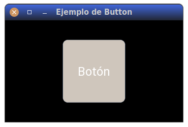
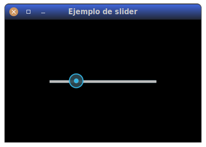
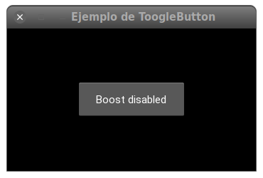
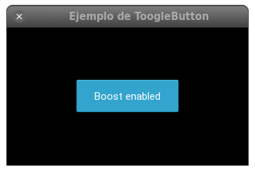

Ya hemos visto un control básico en el ejemplo de Kivy anterior:

```python
--8<--
./docs/hola-kivy.py
--8<--
```

Repasemos lo que hemos aprendido hasta ahora con este ejemplo.

- Para hacer una aplicacion Kivy, tenemos que crear **una clase que derive de
  `kivy.app.App`**. No es extrictamente ogligatorio pero si recomendable, por
  razones que veremos más adelante, que el nombre de nuestra clase termine en
  `App`.

- Podemos **declarar un método `build`** que nos debería devolver el árbol de
  componentes que formarían la estructura de la ventana principal de la
  aplicación. Como es un ejemplo sencillo, aquí solo devolvemos un control de
  tipo `kivy.uix.button.Button`.

- Para ejecutar la aplicación, primero **creamos una instancia** de nuestra clase
  derivada de `App`, y luego llamamos a su **método `run()`**.

Ahora vamos a ver otros controles, aparte del botón, que viene incluidos en
Kivy, como por ejemplo  las etiquetas (`Label`), poer antes vamos a estudiar un
poco la clase `Widget`. esta clase es importante porque tanto `Button` como los
demás controles que veremos derivan de ella. Esto significa que todas las
características que veamos en `Widget`: Atributos, métodos, etc. son también
utilizables en `Button`, `Label`, etc.

## La clase `Widget`

La clase `Widget` está definida en `kivy.uix.widget` y es la clase base de
todos los controles. Se diseñó en base a estos principios:

- **Gestionado por eventos**: Todos los controles están pensados para responder
  a los eventos que le puedan ocurrir. Si una propiedad cambia, el control
  podrá reaccionar a este cambio sobreescribiendo el método `on_<propiedad>`.

- **Seperación de responsabilides** (Entre el control y su representación
  gráfica). Los controles carecen de un método `draw`, y esto es así a
  propósito. La idea es permitir la creación de cualquier tipo de
  representación gráfica externa a la clase del control. Se pueden usar
  cualquier propiedad definida en el control para reflejar el estado
  gráficamente. Cada control tiene una propiedad `canvas` que puede usar para
  dibujar.

- **Contendores**. Los controles incluyen la capacidad de contener otros
  controles dentro, formando así el árbol de controles que esperamos en la
  organización de una ventana. Esto se gestiona con los métodos `add_widget()`,
  `remove_widget` y `clear_widgets()`,y con las propiedades `parent` y
  `children`, que veremos más adelante. Esta capacida de contener otros
  contreles sera usado casi siempre por una clase especial de `Widgets`, los
  `Layouts`, que veremos más adelante. A modo de adelanto, diremos que son
  controles especializados en posicionar y modificar el tamaño de los controles
  que tengan dentro.


- **Colisiones**. Muy a menudo necesitamos saber si un punto en concreto está
  dentro de los límites del control. Por ejemplo, para poder activar la acción
  de un botón solo si el cursor está tocándolo.

  Para ello la clase `Widget` y sus derivados cuentan con el método
  `collide_point`, que devuelve `True` si las coordenadas que se le pasan están
  dentro de la caja contenedora o _bounding box_ definida por el tamaño y
  posición del control. Si un rectángulo no fuera suficiente, se puede
  sobreescribir este método para realizar comprobaciones más complejas, como
  por ejemplo, usando un polígono.

  Se puede comprobar si dos _widgets_ se superponen (Se suele decir que los dos
  controles _colisionan_) con el método `collide_widget`.

Veamos algunas otras características y comportamientos que conviene conocer:

### Las propiedads `pos` y `size`, posición y tamaño de un Widget

Los `Widgets` tiene una propieda `pos`, para determinar su posición, y una
propiedad `size` para el tamañó. El tamaño por defecto de un _widget_ es 
de $100x100$ pixels, y la posición es $0, 0$, y los valores de ambos son
pixels.

!!! warning "El sistema de coordenadas de Kivy"

    Al contrario que la mayoría de los sistemas gráficos, las coordenadas
    de origen de Kivy no estan en la equina superior izquierda sino en la
    esquina inferior derecha, como en los sistemas cartesianos habituales.

Pero a pesar de los valores de posición y tamaño que pueda tener un cotrol, hay
que tener en cuenta que estos **pueden cambiar si el control está dentro de un
_Layout_**. Recordemos que los `Layouts`, son controles especializados en
posicionar y modificar el tamaño de los controles que contiene.

Un _Widget_ de por si **no** es un _Layout_. Nunca cambiará el tamaño o
posicion de otros controles que estén dentro de él. Si tienes que controlar la
posición o el tamaño de varios controles, hay que usar un _Layout_.  Por
ejemplo, si ponemos dentro de un _Label_ un _Button_, el segundo no va a
modificar ni su tamaño ni su posición basándose en las características del
primero, porque un _Label_ no es un _Layout_, es solo otro _Widget_.

Veamos el siguiente ejemplo:

```python
--8<--
./docs/widget-instance.py
--8<--
```

Si lo ejecutamos tal y como está, veremos el botón, pero no aparece la etiqueta
por ninguna parte.

Pregunta: ¿Por qué?

Pista: ¿Qué pasa si cambiamos el orden de los controles? Si definimos primero
el botón y luego la etiqueta.

Ejercicio: Cambiar la propiedad `pos` (Y, si se quiere,  la propiedad `size`)
de la etiqueta para que no se muestre encima del botón.

Este ejercicio también nos permite descubrir otro dato importante: **Los
controles se pintan en orden**, y los que ses pinten después se pintarán encima
de los que se pintaron antes, si ocupan la misma posición.

### las propiedades `size_hint` y `pos_hint`.

Hay otras propiedades relacionadas con el tamaño, aparte de `size` y `pos`, las
propiedad **`size_hint`** y **`pos_hint`** de un control. La propiedad
`size_hint` es una dupla que tiene un valor por defecto de $(1, 1)$.

En cierta medida están dos maneras de definir el tamaño del control, `size` y
`size_hint` están enfrentadas, porque las dos pueden definir tamaños
diferentes. Igual pasa con la propiedad `pos_hint` y `pos`.

Para entender un poco mejor cuando usar una u otra, nos pueden ayudar los siguientes
puntos:

- Las propiedades `size_hint` y `pos_hint` solo tiene sentido dentro de algún
  tipo de _Layout_. El problema es que el sentido puede variar segun eltipo de
  _Layout_.

- Dentro de un _layout_, las propiedades `*_hint` tienen más peso, y serán las
  que se tendrán en cuenta. Podemos poner la propiedad `size_hint` a la tupla
  `(None, None)` y de esta forma el _layout_ si que le prestará atención a la
  pripiedad `size`.

Los valores de `size_hint`, al contrario que los de size, no son valores
absolutos, en pixels, sino **relativos o proporcionales** al tamaño del contendor
(En estos casos sencillos, al tamaño de la ventana). El valor por defecto de
$(1, 1)$.  significa que si ponemos el control dentro de un _Layout_, el
_widget_ ocupará todo el tamaño disponible que le pueda conceder el _Layout_.

Veremos más detalles y particularidades de `size_hint` y `pos_hint` cuando
veamos los `Layoyts`.

### La propiedad `disabled`

La propiedad `disabled`, si se pone a `True`, desactiva el control. Por defecto vale
`False`, es decir, que el control estará activo.

**Ejercicio**: Desactivar el boton del ejempo anterior. Comprobar que ya no se
puede pulsar.


### Las propiedades `width`, `heigth`, `x` e `y`

las propiedades `width` y `height` siempre devuelven el tamaño actual del
control, en pixels. Podemos modificar el tamaño o bien usando la propiedad
`pos`, que espera una dupla con el ancho y el alto, o modificar/leer
directamente estas caracteriísticas con `width` y `height`

La propiedad `pos` es la posición actual del control, como una dupla de las
coordenadas `x` a `y` en pixels. También se puede acceder directamente a cada
coordenada con las propiedes `x` e `y`.


### La propiedad `opacity`

La propiedad `opacity` controla la opacidad del control. Es una propiedad
acumulatica, asi que la opacidad final será el producto de las opacidades de
todos los contenedores.


### Las propiedades `parent` y `children`

La propiedad `parent` siempre es el contenedor del control actual. En el caso de
ser el contenedor raíz, devuelve `None`. La propiedad `children`, por otro
lado, es una lista de los controles que son hijos. 

**Ejercicio**: Añadir una linea antes del retorno en el build para comprobar
que en la propiedad `children` del `Widget` `root` aparecen los dos controles
que hemos añadido


### Los métodos `on_touch_down()`, `on_touch_move()` y `on_touch_up() 

Estos métodos serán llamados de forma automatica cada vez que el raton se mueva
o se pulse uno de sus botones sobre un contro.

Nota: Los métodos `on_touch_down()`, `on_touch_move()` y `on_touch_up()` no realizan
ningún cálculo de colisiones. Si necesitas saber si un toque cae dentro de tu
control, hay que usar `collide_point()`.

Vamos a añadir estos tres métodos, con un simple `print` en cada caso, para
comprender mejor su funcionamiento:

```python
--8<--
./docs/on-touch-example.py
--8<--
```

Prueba ahora a pulsar dentro del botón, mover el ratón (tanto dento como fuera
del botón) y luego dejar de pulsarlo. Veremos que se pruducen multidud de
eventos. Hay un par de cosas que son interesantes.

- Si movemos el ratón por la esquina inferior derecha del botón, veremos que
  las coordenadas no son cercanas al punto $0, 0$, sino más bien
  a $100, 100$. Esto nos indica que esta usando las coordenadas de **toda
  la ventana**, no son relativas al control. De ahí la necesidad de los
  métedos de colisión que vimos antes.

- El comportamiento que tenía el botón antes (cambiaba el fondo a azul cuando
  se pulsaba) ya no está activo. Eso es porque hemos **interceptado** los
  eventos que `_down` y `_up` que son los que usa el control

- Son un montón de eventos `_move`. Pero en realidad, para saber si el botón se
  ha pulsado o no, nos basta con el `_up`.

Vamos a ver ahora algunos controles definidos a partir de `Widget`

## `Label` o etiquetas

El propósito de la clase **`Label`** es mostrar texto. Define una propiedad
`text` que es precisamente el texto a mostrar. Podemos modificar el tamaño
del texto con la propiedad `font_size`, que adminte una cedena de texto que
codifica tanto la cantidad como las unidades, por ejemlo `22px` para 22 pixels
o `14pt` para 14 puntos.

Se pueden usar las siguientes unidades para tamaños de tipos:

- `pt` para puntos
- `mm` para milímetros
- `cm` para centímetros
- `in` para pulgadas
- `dp` para pixeles independientemente de la densidad. Es una unidad abstrabta
  basada en la densidad de pixeles por pantalla. 
- `sp` pixeles independientes de la escala. Es como la anterior, pero además
  respeta las preferencias del usuario para tamañós de texto.

La propiedad `color` define el color del texto. es una tupla de cuatro valores
y por defecto vale $[1, 1, 1, 1]$, es decir, blando totalmente opaco.

Ejercicio: Cambiar la etiqueta para que el texto se vea de 72 pulgadas ('72in')

```python
--8<--
./docs/label-example.py
--8<--
```

Por defecto, el tamaño del control no se ve afectado por el texto, y el texto
no se ve afectado por el tamaño del control. debemos usar la propiedad
`text_size` para, o bien restringir el texto al control, o para vincular el tamaño
del control al texto de forma que crezca con él. 

Si pondemos una tupla de
valores fijos, estamos restringuiendo el tamañó del control y el texto tendra que
adecuarse el espacio disponible. Si lo exede, se omite.

Otras propiedades interesantes son  `halign` y `valign` que nos permite
controlar la alineación horizontal y vertical respectivamente. Si usamos los
valores por defecto de tamaño del control no podremoa apreciar estos valores,
ya que por defecto el tamaño del control ocupará tanto espacio como necesite
para acomodar el texto.

Podemos usar  un tipo especial de marcado en las etiquetas. Este maarcado está
inspirado en Html, pero se usan etiquetas de tipo `[tag]` y `[/tag]`. Por
ejemplo,la marca `[color=#ff2233]hola[/color]` coloreará el texto. Para poder
visualizarlo, es necesario ademáß ajustar la propiedad `markup` a `True`,
porque por defecto viene a `False`.

**Ejercicio** Cambier el texto de la etiqueta, poner la palabra 

```python
    Label(
        text="[color=#ff2233]Hola[/color], [u]mundo[/u]",
        markup=True,
        font_size="22",
        pos=(200, 200),
    )
```

Algunas de las etiquetas que podemos usar en este marcado son:

- `[b]...[/b]`: Negritas (_bold_)

- `[i]...[/i]`: Itálicas (_Italics_)

- `[u]...[/u]`: Subrayado (_Underline_)

- `[s]...[/s]`: Tachado (_Strikethrough_)

- `[font=<str>]...[/font]`: Fuente a usar. Debe estar registrada

- `[size=<integer>]...[/size]`: Tamaño

- `[color=#<color>]...[/color]`: Color 

- `[sub]...[/sub]`: Subíndice

- `[sup]...[/sup]`: Superíndice

Hay más en la [documentación oficial](https://kivy.org/doc/stable/api-kivy.uix.label.html?highlight=label#markup-text)

## Button

La clase `Button` se define en `kivy.uix.button`. En realidad no deriva de
`Widget` directamente, sido de `Label`, así que hereda todas las
caracteristicas definidas allí, como por ejemplo el texto enriquecido que
acabamos de ver.

Además, como hemos visto, se define una propiedad `background_color`. Esto, más
que un color, es un modificador de la textura del botón. La textura por defecto
es un tono de gris, asi que normalmente el color resultante será más oscuro del
esperable. Para que el color no funcione como un tinte, sino que sea el color
real que hemos especificado, hay que ajustar `background_normal` a `''`.

Pero lo más interesante es que añade la posibilidad de asignarle muy facilmente una
acción a ejecutar en el momento en que se pulsa el boton. Concretamente, se
genera un evento especial `on_press` si al recibir un evento de tipo `MOVE_UP`,
el cursor sigue posicionado sobre el control.

Para asignar la accion del `click`, usamos el método _bind_, asociado al evento `on_press`:

```
def pulsado(instance):
    print(f'El botón {instance} ha sido pulsado')

pb = Button(text='Hello')
pb.bind(on_press=pulsado)
```

Podemos estar informados de cada vez que cambie el estado del boton 
vinculado el evento `on_state`:

```
def cambio_de_estado(instance, value):
    print(f'Hola el botón {instance} esta en el estado {value}')

pb = Button(text='Hello')
pb.bind(on_state=cambio_de_estado)
```

Tambien podemos definir las imagenes o texturas a usar en los botones. Como se
dijo antes, por defecto es un color gris plano, peropodemos definir imágenes a
usar, definiendo las propiedades `background_normal` y `background_down`, que
se usaran respectivamente para el boton en estado normal o pulsado. 

El siguiente ejemplo muestra eluso de varias de estas propiedades y de los
metodos vinculaods con `bind`:


```python
--8<--
docs/button-example.py
--8<--
```

Daria como resultado algoo similar a:




## Slider

Un control para variar gráficamente un valor numérico. Puede usarse horizontal
o verticalmente, ajustando el valor de la propiedad `orientation` a `vertical`.
Podemos definir el valor mínimo con el parámetro `min` (Por defecto $0$), el
valor máximo con el parámetro `max` (Por defecto $100$) y el valor inicial con
el parámetro `value` (Por defecto a $0$). También se puede definer el
incremento a utilizar con con la propiedad `step`, cuyo valor por defecto es
$1$.

```python
s = Slider(min=-100, max=100, value=25)
```

Si definimos la propiedad `value_track` a  `True`, el control resaltará la
parte de la bara que ya haya sido superada, con el color que hayamos
definido en `value_track_color`.

Veamos el control en acción con el siguiente ejemplo:

```python
--8<--
docs/slider-example.py
--8<--
```

Si llamamos a este código con:

```shell
python slider-example.py --size=400x250
```

Debería producirse esta ventana:



**Ejercicio**: Cambiar el ejemplo anterior del `slider` para que se resalte el
valor pasado (A la izquierde del manejador) con un color 
verde, por ejemplo ${0.5, 0.9, 0.6, 1}$.

Hay varias cosas interesantes de este ejemplo. Vamos por partes, como decía
Jack el destripador.

En primer lugar, hemos usado el flag `--size` al ejecutar el programa para
especificar el tamaño en pixels de la ventana principal de la aplicación.
Prueba a cambiar los valores en la expresion `<ancho>x<alto>` para comprobar
como funciona.

Además, Hemos usado por primera vez un _Layout_, en concreto `AnchorLayout`.
Como ya dijimos, un _layout_ solo es un tipo especial de Widget, que se
especializa en colocar y disponer los controles que contenga de una determinada
manera.

Al estar dentro de un _Layout_, los valores definidos en `pos_hint` o
`size_hit` toman preferencia a los que haya en `pos` o `size`. En este caso
queriamos que el control ocupara exactamente $350x32$ pixels, asi que tenemos
que _desactivar_ el valor de `size_hint`, y esto lo hacemos asignándole una
tupla con los valores `None, None`. De esta forma, le decimos al layout que
ignore ambos valores de `size_hint`, lo que no le deja otra opción que
recurrir a los valores definidos en `size`.

Recordemos que los valores por defecto de `size_hint` son `(1, 1)`, que viene a
significar «Ocupa todo el espacio que puedas, tanto en altura como en anchura».
Si no los hubieramos cambiado a `(None, None)`, el `AnchorLayout` pasaria de
los valores definidos en `size` y respetaría el valor por defecto, con lo que
el slider ocuparía toda la ventana. Haz la prueba comentando la línea que define
`size_hint` y ejecuta de nuevo el programa.

Más sobre `AnchorLayout`. Este _Layout_ en concreto dispone los controles de
forma que los _anclamos_ a un borde o a un centro. Para ello usa los parámetros
`anchor_x` y `anchor_y`.

En el ejemplo que estamos mostrando, con ambos valores a `center`, lo que hace
este _layout_ es poner todo en el centro.  Los valores posibles de `anchor_x`
son `left`, `center` o `right` y los valores posibles de `anchor_y` son `top`,
`conter` o `button`.

**Ejercicio**: Modifica el programa anterior para que el slider se ubique
**arriba y centrado**.

## `ToogleButton` o botón de opción

Volvemos a los botones. El siguiente _widget_ o control que vamos a ver es el
**ToggleButton**. En principio es igual a un botón cualquiera, pero cuando se
pulsa la primera vez se queda en esado "pulsado", y cuando lo pulsamos otra vez
vuelve al estado normal.

Un un control derivado de `Button`, por lo que hereda todas las caracterísitcas
que vimos de este, como el texto, pero añade un estado, de forma que el boton
queda pulsado en el primer _click_, y vuelve al estado normal en un segundo
_click_. Este estado se almacena en la propiedad `state`, y puede tener dos
valores, `normal` y `down`.

Otra forma de verlo es que, con un botón normal, cuando dejamos de pulsarlo
vuelve automaticamente al estado normal, pero un `ToggleButton` permanece en el
estado `down` hasta que se vuelva a pulsar. En otras palabras, un boton normal
solo esta en estado `down` mientras se está pulsando, mientras que un
`TooggleButton` se queda pulsado.

Es mejor verlo con un ejemplo:

```python
--8<--
docs/toggle-button-example.py
--8<--
```

Nada más ejecutarlo, debería verse:



Y si hacemos _click_ en el botón, tendriamos:



Otra opcion interesante es que podemos agrupar varios botones. Si lo hacemos,
estamos forzando a que solo una de las opciones sea posible. Es decir, que las
opciones son mutuamente excluyentes entre si. Para ello, lo unico que tenemos
que hacer es definir la propiedad `group` en todos los controles que queramos
agrupar a un mismo valor.

## CheckBox y Radio

El comportamiento del `ToggleButton` es muy similar a un CheckBox. De hecho
el control `CheckBox` deriva de este, pero en vez de usar una representación de
tipo botón pulsado/libre, usa la más habitual del checkbox.

Además de lap propiedad `state`, añade otra propiedad relacionada `active`, que
es un booleano que devuelve `True` si el checkbox está seleccionado y `False`
en caso contrario. Ambas propiedades están vinculadas, asi que el cambio de una
implica en cambio de la otra.

## TextInput

El control `TextIOnput` nos proporciona un sistema para introducir y editar
texto. Se representa con una caja dentro de la cual podremos escribir y editar.
El texto en si se almacena en la propiedad `text`.

Por defecto se admite texto con múltiples líneas, peor se puede limitar en ese
sentido definiendo la propiedad `multiline` a `False`.

Veamos un ejemplo:

```Python
--8<--
docs/text-input-example.py
--8<--
```

Se puede controlar el texto que se añade al control sobrescribiendo el
método `insert_text()`. Cada cadena de texto que sea escrita, pegada o
insesrtada por cualquier medio en el control pasará por esta función de forma
obligatoria.

Veamos el siguiente ejemplo, en que solo dejamos escribir en mayúsculas.

```Python
--8<--
docs/text-input-capitals-example.py
--8<--
```

**Ejercicio:** Modifica el ejemplo anterior para que solo acepte números
entero. Recuerda que con expresiones regulares puedes hacer el filtrado de
forma sencilla.
