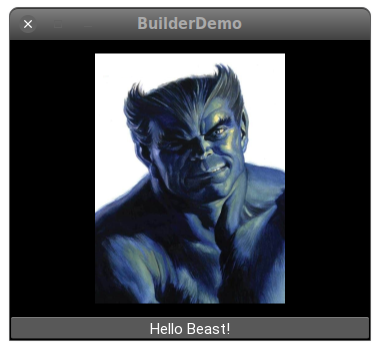

## El lenguaje kvlang

A medida que las aplicaciones crecen en complejidad, se hace más y más
complicado definir la construcción de árboles de controles, disposición de
layouts y vinculaciones con las funciones o métodos necesarias. El lenguaje KV
es un intento de simplificar y ayudar en este proceso.

El lenguaje KV, también llamado `kvlang` o «El lenguaje de Kivy», nos permite
crear el arbol de _widgets_ (Controles y _layouts_) de forma declarativa, y
nospermite vincular propiedades entre si o con llamadas a métodos/funciones de
forma más natural. Permite la creación de prototipos rápidos y permite cambiar
de forma ágil las interfaces de usuario sin afectar la funcionalidad, al
imponer una separación clara entre la lógica de la aplicación y la interfaz de
usuario


## Uso del lenguaje Kivy (kvlang)

El lenguaje **kvlang** no es estrictamente necesario, pero es verdad que
en muchos casos se simplifica mucho trabajo usándolo.

Como ya sabemos, podemos organizar la disposión o _layout_ de nuestras ventanas usando Python directamente. No hay nada que podamos hacer en el lenguaje de Kivy que
no podamos hacer con Python, y sin embargo, no es así al reves:
algunas cosas que podremos hacer en Python no podremos hacerlas en kvlang, por
ejemplo, la creación dinámioca de controles.

¿Por qué molestarse en aprender KvLang, entonces? Es conveniente, porque si que
es verdad que algunas cosas son más fáciles de hacer en kvlang que en Python.
Además, al tener la disposición de las ventanas descritas en un fichero y
lenguaje separado ayuda cuando la estructura es compleja.

Vamos a empezar modificando un programa muy sencillo. Vamos a dividirlo en dos,
el programa en si y un fichero con extensión `.kv` que define la disposición o
_layout_ de la interfaz:

Este sería el código Python inicial:

```python
from kivy.app import App
from kivy.uix.button import Button

class SimpleApp(App):

    def build(self):
        return Button(
           text="Hello World",
           size_hint=(0.4,0.05),
           pos_hint={'x': 0.3, 'y': 0.5}
           )

if __name__ == '__main__':
    app = SimpleApp() 
    app.run()
```

Vamos a definir el árbol de controles, en este caso un simple botón, en un
fichero kivy, que tiene una extensión por defecto `.kv`, y que llamaremos
`simple.kv`. Pero el nombre que le hemos dado no es casual, tiene una razón de
ser que requiere antes una explicacion

## Los fichero .kv

Lo primero que necesitamos saber es que Kivy tiene una regla por defecto para
vincular el programa Python con el fichero `.kv` a utilizar para la disposición o
*layout*. Tampoco es estrictamente necesario seguir esta regla, solo es una
ayuda, pero la mayoría de los programas lo hacen así, porque resulta muy
cómodo.

La regla es la siguiente: Dentro de nuestro programa, habrá un único elemento,
que representa la aplicación, y que será o bien una instancia de la clase `App`
directamente o, mas frecuentemente, una instancia de una clase derivada de
`App` (En el ejemplo, es la clase `SimpleApp`).  En ese caso, Kivy tomara el
nombre de la clase, le quitara en sufijo `App` si lo tuviera, pasará el resto a
minúsculas (En nuestro caso, `simple`), y buscará un fichero con ese mismo nombre
y la extensión `".kv"`.

En nuestro ejemplo, todos estos pasos lo llevarán a intentar buscará un fichero
llamado `simple.kv`. Así que creado el fichero con ese nombre ya se ha vincula
implícitamente con la clase `App` de nuestro programa.

Vamos entonces a guardar el fichero de ejemplo como `main.py`. Ahora vamos a
especificar la disposición de nuestros controles en un fichero,

En primer lugar el fichero `simple.kv`:

```kvlang
--8<--
docs/simple.kv
--8<--
```

y por otro, `simple.py`:

```python
--8<--
docs/simple.py
--8<--
```

**Ejercicio**: Para ver que el `simple.py` está realmente usando el fichero
`simple.kv`, haz una modificación en el fichero `simple.kv`, por ejemplo
ampliar el tamaño y color del texto incluyendo estas líneas:

```
    font_size: '24sp'
    color: [.8, .5, .2, 1]
```

Indentadas bajo la definición del botón.

Algunas cosas a tener en cuenta:

1) Ya no hace falta que importemos `Button` en `simple.py`, pues será
instanciado a partir del fichero `.kv`.

2) El método `builder` tampoco hace falta. Normalmente es el encargado de
construir el _layout_ de la aplicación en el inicio, pero en este caso se
generará también de forma automática a partir del contenido del fichero
`main.kv`.


## Estructura de los ficheros kivy

Un fichero `.kv` está formado por **reglas**, que sirven para describir el
contenido y propiedades de los _widgets_.

### Regla raíz

Una norma importante de estos ficheros es que **solo puede haber una regla**
que indique el contenido principal o _raíz_ del árbol de controles. Esta se la
**regla raíz**.

La regla raíz se declara usando el nombre de la clase del _widget_ que queremos
que sea la raíz, normalmente algún tipo de _layout_, **sin ninguna
indentación**, seguida del caracter `:`

```
Widget:
```

### reglas de clase

Una **regla de clase** se declara con el nombre de una clase de _widget_
rodeada por los caracteres `<` y `>`:

```
<Widget>:
```

Una regla de clase define la aparencia y comportamiento de **todas** las
instancias de esa clase, ya sean directas o dervidas.

Las reglas usan la indentación para definir sus contenidos, de forma similar a
como lo hace el propio Python. La indentación debería ser siempre con cuatro espacios, sin usar tabuladores.

Hay tres palabras claves específicas del lenguaje kivy:

- `app`: Es una referencia siempre disponible de la instancia de la aplicacion.

- `root`: Se refiere al _widget_ base o plantilla en la regla correspondiente.

- `self`: Se refiere siempre al _widget_ actual

### Sintáxis especial

Hay una sintáxis especial que nos permite definir valores para todo el
contextode un fichero `.kv.`

Podemos acceder a módulos y clases de python usando la forma `#:import`:

```
#:import name x.y.z
#:import isdir os.path.isdir
#:import np numpy
```

Que serían equivalentes al siguiente código Python:

```
from x.y import z as name
from os.path import isdir
import numpy as np
```

También podemos crear una variable global con `#:set`:

```
#:set name value
```

Sería equivalente a:

```
name = value
```

### Crear instancias

Para declarar un _widget_ como instancia contenido en otra, solo hay que
declarar el _widget_ indentado dentro del padre, En el siguiente ejemplo:

```
MyRootWidget:
    BoxLayout:
        Button:
        Button:
```

Se define la raíz como una instancia de la clase `myRootWidget`. Esta tiene un
hijo directo que sería una instancia de la clase `BoxLayout`, la cual a su vez
contiene dos instancias de la clase `Button`.

El código equivalente a crear algo así a amno en Python sería:

```
root = MyRootWidget()
box = BoxLayout()
box.add_widget(Button())
box.add_widget(Button())
root.add_widget(box)
```

En python, podemos pasar argumentos por nombre a la hora de crear una
instancia. Por ejempo, podemos crear una instancia de `GridLayout` con tres
columnas con `GridLayout(cols=3)`. Para hacer esto mismo en KV, creamos reglas 
indentadas bajo la regla principal:

```
GridLayout:
    cols: 3
```

Los valores a la derecha del caracter `:` son evaluadas como expresiones Python.
Eso significa que si tenemos algo como esto en Python (supongamos que self es
un _widget_ que ha declarado una propiedad de tipo `ListProperty` con el nombre
`data`):

```python
grid = GridLayout(cols=len(self.data))
self.bind(data=grid.setter('cols'))
```

Podemos hacer esto en kv, que es más sencillo, y que realizará la vinculación
de forma automática:

```kivy
GridLayout:
    cols: len(root.data)
```

Los nombres de los _Widgets_/clases deben siempre empezar con mayúsculas, minetras que
los nombres de las propiedades deben siempre empezar con minúsculas. Si
seguimos las recomendaciones del PEP8 no tendremos problemas.

### Vinculación de eventos

Podemos vincular eventos con funciones/métodos usando la parte derecha detras
del caracter `:`, por ejemplo:

```kivy
Widget:
    on_size: my_callback()
```

Se pueden pasar los argumentos incluidos en la señal usando la palabra clave
`args`, como en el siguiente ejmeplo:

```kivy
TextInput:
    on_text: app.search(args[1])
```

También podemos usar expresiones más complicadas:

```kivy
pos: self.center_x - self.texture_size[0] / 2., self.center_y - self.texture_size[1] / 2.
```

estas expresión qeudará ligada a los valores de `center_x`, `center_y` y
`texture_size`, de forma que si cualquier de ellos cambia, la expresion es
evaluada de nuevo y el campo `pos` es actualizado con el nuevo valor.

También se puede gestionar eventos de tipo `on_*` dentro del fichero `.kv`.
Por ejemplo, el control `TextInput` tiene una propiedad `focus`, cuyo evento
aauto-generado `on_focus` puede ser utilizado dentro del fichero kivy de la
siguiente manera:

```kivy
TextInput:
    on_focus: print(args)
```

### Uso extendido del cavas

Desde kv también podemos definir las instruccions canvas de un control, como en 
el siguiente ejmplo:

```
MyWidget:
    canvas:
        Color:
            rgba: 1, .3, .8, .5
        Line:
            points: zip(self.data.x, self.data.y)
```

Si `self.data` cambia, la representación gráfica del control también cambiara.
Por supuesto, tambien podemos usar `canvas.before` y `canvas.after`.

### Referencias entre controles

A menudo necesitamos hacer referencia a un control desde otro, situado en otra
posición del árbol. Podemos hacerlo facilmente asignado al control refreciado
una propiedad `id`. Podemos pensar en esto como en variables globales que solo
pueden ser accedidas dentro del fichero kv:

```kivy
<MyFirstWidget>:
    Button:
        id: f_but
    TextInput:
        text: f_but.state

<MySecondWidget>:
    Button:
        id: s_but
    TextInput:
        text: s_but.state
```

Pero un `id` solo puede ser referenciado por controles que estén por debajo de
él. Técnicam,ente, el _scope_ está limitado a la regla donde está declarado. En
el ejemplo anterior, `s_but` no puede ser referenciado fuera de la regla
`<MySeconfWidget>`.

!!! note "Un id no es una string"

    Al asignar valores a un `id`, recueada que ese valor no es una cadena de
    texto de python. Eso significa que **no** hay que ponerla entre comillas.

!!! note "Nota para pythonistas"

    Un `id` es una referencia débil (_weak reference_) al control, no el control en
    sí. Por tanto no es un impedimento para poder borrar el control y que el
    espacio que ocupe lo libere el recolector de basura.

### Acceder a los controles definoos en KV desde el código Python

La forma más sencilla es simplemente aceder a la propiedad `ids`, a la que
podemos acceder com si fuera un diccionario, o directamente usando como
atributos los valores de `id` usados para identificar cada elemento.  El
resultado, se acceda de la manera que sea, es el control buscado:

```
<Marvel>
  Label:
    id: loki
    text: 'loki: I AM YOUR GOD!'
  Button:
    id: hulk
    text: "press to smash loki"
    on_release: root.hulk_smash()
```

En Python:

```python
class Marvel(BoxLayout):

    def hulk_smash(self):
        self.ids.hulk.text = "hulk: puny god!"
        self.ids["loki"].text = "loki: >_<!!!"  # alternative syntax
```


### Clases dinámicas

Consideremos el siguiente ejemplo:

```kivy
<MyWidget>:
    Button:
        text: "Hello world, watch this text wrap inside the button"
        text_size: self.size
        font_size: '25sp'
        markup: True
    Button:
        text: "Even absolute is relative to itself"
        text_size: self.size
        font_size: '25sp'
        markup: True
    Button:
        text: "Repeating the same thing over and over in a comp = fail"
        text_size: self.size
        font_size: '25sp'
        markup: True
```

En vez de tener que repetir los mismo valores para cada boton, podemos crear
nuestro propia clase derivada del boton con la sintaxis
`<NuevaClase@ClasePadre>`, simplificando el caso anterior a:

```kivy
<MyBigButton@Button>:
    text_size: self.size
    font_size: '25sp'
    markup: True

<MyWidget>:
    MyBigButton:
        text: "Hello world, watch this text wrap inside the button"
    MyBigButton:
        text: "Even absolute is relative to itself"
    MyBigButton:
        text: "repeating the same thing over and over in a comp = fail"
```

La clase `MyBigButton` se crea mediante esta regla, derivada de la clase `Button`
y nos permite cambiar los valores por defecto y vincular código para todas las
instancias sin tener que crearla en la parte Python.


## Otras formas de cargar KV

Además de usar la regla _mágica_ de los nombres (`algoApp` -> `algo.kv`) para
asignar automáticamente un fichero `.kv` a un fichero `.py` (Más propiamente
hablando, a una clase derivada de `kivy.app.App`), existen otras dos formas de
hacerlo, máß explicitas:

### Cargando el contenido desde un fichero .kv arbitrario

Podemos usar el objeto predefinido `Builder` (definido en `kivy.core.builder`
para llamar al método `load_file()`, al cual le pasaremos la ruta de un fichero
`.kv` cualquiera. Esta función devuelve el arbol de controles formado a patir
del fichero, así que solo hay que llamar a esta función en el método `build` y
devolver su resultado:

```python
--8<--
docs/builder-load-from-file.py
--8<--
```

En este ejemplo, la estructura se crea a partir del fichero `builder.kv`:

```python
--8<--
docs/builder.kv
--8<--
```

Que debería resultar el algo como:




### Cargando el contenido desde una variable de texto

Usando igualmente `Builder` podemos llamar a su método `load_string()` con el contenido 
del fichero `.kv` (quizá obtenido pr medio de algun otro ptroceso, desde una
bse de datos, etc.) y de forma similar nos devuelve el árbol de controles.

```python
--8<--
docs/builder-load-from-string.py
--8<--
```
