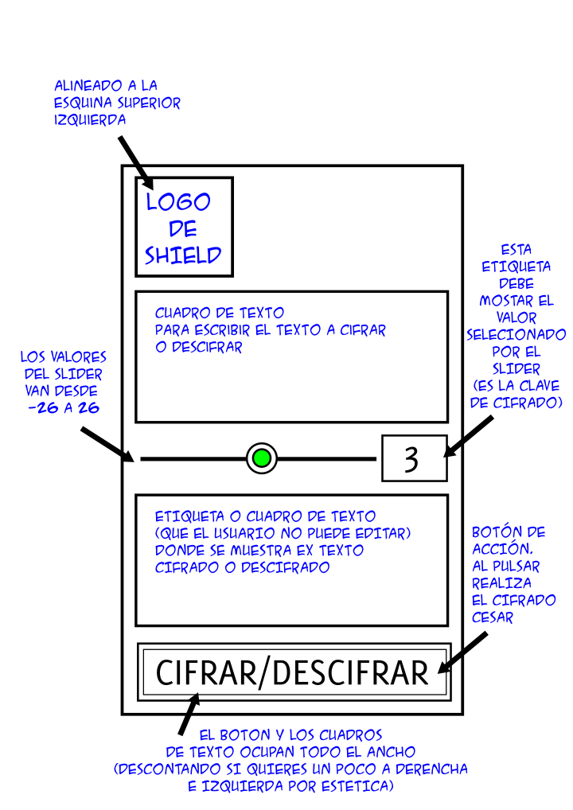

## 09-Miniproyecto

En este miniproyecto haremos una aplicación de escritorio, usando [kivy](https://kivy.org/), para codificar y decodificar textos usando el [cifrado
Cesar](https://es.wikipedia.org/wiki/Cifrado_C%C3%A9sar)

Debemos realizar una aplicación de escritorio, que debería funcionar
igual tanto en Linux como en Mac o Windows (Pero no hace falta que lo
pruebes en las tres plataformas, basta con que la pruebes y funcione
en la que uses tú).

Al arrancar la aplicación, debería mostrarnos una ventana (La aplicación
solo tiene una ventana), con disposición gráfica que se muestra en la
última página.


El funcionamiento de la aplicación es el siguiente: El usuario
puede escribir texto en el cuadro de texto superior. Con
el control _slider_ puede elegir un valor entre -26 y 26 que va a ser
la clave de cifrado. Si elige 0, el cifrado no hace nada.

La función para el cifrado del cesar no la tienen que implementar ustedes, se
las paso a continuación:

```python
def cifra(s, clave=3):
    buff = []
    for c in s:
        num = ord(c)
        if 65 <= num < 91:
            new_num = ((num - 65 + clave) % 26) + 65
            buff.append(str(chr(new_num)))
        elif 97 <= num < 123:
            new_num = ((num - 97 + clave) % 26) + 97
            buff.append(str(chr(new_num)))
        else:
            buff.append(c)
    return ''.join(buff)
```

Puedes probar esta función en Python. Tiene dos parámetros de entrada, el
primero es el texto a cifrar/descifrar, el segundo es la clave de cifrado. La
salida es el texto cifrado. Aunque hablemos de cifrar y descifrar, hay que
tener claro que **no** son dos operaciones diferentes, es la misma, lo que pasa es
que si ciframos con una clave de valor $x$, se descifra con la misma función,
pero pasando $-x$. Es decir:

```python
original = 'Hola, mundo'
cifrado = cifra(original, 3)
assert cifrado == 'Krod, pxqgr'
descifrado = cifra(cifrado, -3)
assert original == descifrado
```

### Rúbrica de evaluación

- Al ejecutar la aplicación no da error y crea una ventana gráfica: 20%

- La imagen con el logo de SHIELD esta alineada a la derecha
  y en la parte superior de la ventana: 20%

- El _layout_ de la ventana es similar al esperado, y tiene todos
  los controles: 10%

- Al mover el _slider_, el valor de la clave de cifrado se muestra en 
  la etiqueta a la izquierda del _slider_: 10%

- Al pulsar el botón inferior, se cifra/descifra el texto del
  cuadro de texto superior y se muestra en el inferior. Prueba a
  descifrar el mensaje:

```
Iholflgdghv, qrydwr, ho ghfrglilfdgru gh VKLHOG ixqflrqd
```
  Usando como clave el valor $-3$: 30%

- Cualquier mejora sobre el proyecto: 10%

Posibles ideas para mejoras:

- Usar otro algoritmo de cifrado

- Incluir algún indicador de
  que se ha seleccionado la clave 0, que no
  hace nada

- Un botón para asignar la clave a un valor
  aleatorio.

- Un botón para intercambiar los textos.

- Cualquier otra que se te ocurra. Consúltame antes si quieres estar 100% de que cuenta como mejora.


