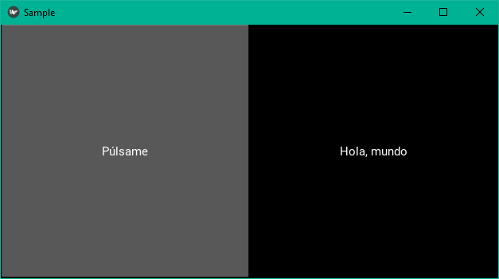
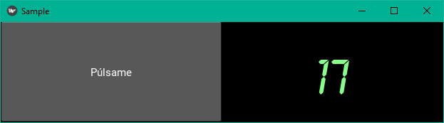

## Widgets

Vamos a empezar viendo los controles más básicos: el botón y la etiqueta.
Vamos a hacer primero un simple programa que muestre estos dos controles pero
que no haga nada más. Empezaremos con un fichero `.kv` para definir nuestro _layout_. En
este caso usaremos una clase derivada de

```kivy
WidgetExample:

<WidgetExample@BoxLayout>:
    cols: 3
    Button:
        text: "Pulsame"
    Label:
        text: "Hola, mundo"
```

En kivy las reglas pueden ser referidas a objetos (instancias) o a clases. Si son objetos
se usa el nombre de la clase, sin más, seguido de dos puntos. Para las clases, se usa
la forma `<NombreDeLaClase>` o incluso `<NombreDeLaClase@ClasePadre>` si queremos indicar
de que clase deriva. Es decir, que lo que en kivy seria:

```kivy
<WidgetExample@BoxLayout>:
```

Es equivalente al siguiente codigo de Python:

```python
class WidgetExample(BoxLayout)
```

Así que podemos definir las clases o bien en el fichero kivy
o en el de Python, lo que más cómodo nos resulte, pero no en los dos.

Para este ejemplo, necesitaremoos los siguientes ficheros, `sample.kv`:

```kivy
WidgetExample:

<WidgetExample@BoxLayout>:
    cols: 3
    Button:
        text: "Pulsame"
    Label:
        text: "Hola, mundo"
```

Y `sampleApp.py`:

```python
import kivy

from kivy.app import App

class SampleApp(App):
    pass


def main():
    app = SampleApp()
    app.run()

if __name__ == "__main__":
    main()
```

En el código Python no necesitamos definir la clase `WidgetExample`, ya que 
se define en el fichero `.kv`. La clase de la App se llama `SampleApp`, asi
que si dejamos a kivy que se encarge él mismo de cargar el fichero .kv, lo que hace es eliminar el sufijo App de la clase (si lo hubiera), pasar el resto a minusculas y cargar el fichero con la extensión .kv, que en este caso seria `sample.kv`. En ese fichero, la raiz es la primera
regla definida a con nivel 0 de identacion, en este caso `WidgetExamle`. De donde sale el código
de la clase `WidgetExample`? Lo genera automaticamente kivy desde el fichero
`sample.kv`, con la información contenida en la líneas tres y siguientes.

Si ejecutamos ahora el programa `sampleApp.py`, deberiamos obtener una ventana
con dos componentes, el primero es un boton, que podemos pulsar (aunque qhora no haga nada)
y una etiqueta que tampovo hace nada.



Vamos a hecer que el boton haga algo. Pero lo primero que vamos a hacer es sacar
la defincion de la clase del fichero kivy y nos lo vamos a a traer al fichero python.
Hecho este cambio, todo deberia funcioan igual, pero los ficheros quedarian:

`sample.kv`
```kivy
WidgetExample:

<WidgetExample>:
    cols: 3
    Button:
        text: "Pulsame"
    Label:
        text: "Hola, mundo"
```

El fichero `sample.py`:

```python
import kivy
 
from kivy.app import App

class WidgetExample(BoxLayout):
    pass


class SampleApp(App):
    pass


def main():
    app = SampleApp()
    app.run()

if __name__ == "__main__":
    main()
```

Ahora, con la clase definida en Python, podemos implmentar
en primer lugar el método que queramos para realizar la accion
que queremos que haga el boton, y en el fichero kivy realizamos
el vínculo entre el botón y el método. fijate que el método
se va a definir en la clase `WidgetExample`, no en el boton. Esto será
importante después, a la hora de vincularlos.

Podemos llamar a este método como queramos, vamos a usar el
nombre `do_click`.

El fichero `sample.kv`:

```kivy`
WidgetExample:

<WidgetExample>:
    cols: 3
    Button:
        text: "Púlsame"
        on_press: root.do_click()
    Label:
        text: "Hola, mundo"
```

Y el fichero `samplaApp.py`:

```python
import kivy

from kivy.app import App
from kivy.uix.boxlayout import BoxLayout

class WidgetExample(BoxLayout):
    
    def do_click(self):
        print("Botón pulsado")


class SampleApp(App):
    pass


def main():
    app = SampleApp()
    app.run()

if __name__ == "__main__":
    main()
```

si todo ha hido bien, veremos que al pulsar el botón, se imprime el mensaje.

Conviene resaltar dos cosas: La primera es que hemos escrito la
llamada `do_click()` usando los paréntesis, como si fuera
directamente código Python. La segunda es que no hemos usado
`self` para realizar la llamada (de hacerlo así, estariamos
llamando al método `on_click` del boton, que no es lo que queremos) sino a una 
variable predefinica `root`, que siempre esta referenciando al *Widget* padre
de toda esta jerarquia, en este caso `WidgetExample`.


Vamos a hacer ahora que al pulsar el boton se modifique el
texto de la etiqueta. Para eso vamos a usar unas lo que kivy 
llama **Propiedades** o **Properties**. Las propiedades
son clases definidas en kivy que tiene la particularidad de que
emiten eventos cuando cambia de valor.

Vamos a crear una propiedad para guardar el texto de la
etiqueta. Para propiedades de tipo textos usamos la clase
`kivy.properties.StringProperty`. La definiremos en la
propia clase, como si fuera una variable de clase (solo se incluye la
parte cambiada del fichero python, la importacion y la declaracion
de `label_text` como `StringProperty`):

```python
...
from kivy.properties import StringProperty

class WidgetExample(BoxLayout):
    label_text = StringProperty("Hola, mundo")

    def do_click(self):
        print("Botón pulsado")
...
```

Y ahora en el fichero kivy, cambiamos la propiedad `text` de la
etiqueta para que use la propeiedad 'label_text`:

```kivy
WidgetExample:

<WidgetExample>:
    cols: 3
    Button:
        text: "Púlsame"
        on_press: root.do_click()
    Label:
        text: root.label_text
```

Con esto e estamos diciendo a kivy que el texto de la etiqueta
debe ser el contendo de la propiedad `label_test`, **incluso si
este cambia**. Esto es la ventaja (y el propósito) de que las propiedades emitan
eventos cuando sus valores cambian; permitir a kivy enterarse
de esos cambios y reflejarlo en el texto de la etiqueta
de forma automática para nosotros.

Vamos a cambiar ahora el código del método `on_click`:

```python
    def do_click(self):
        self.label_text = "Alguien ha pulsado el botón!" 
```

La característica de que estos dos valores esten relacionados de forma
que cuando se cambia el valor en la propiedad, el cambio se prpaga o se refleja
en la otra, se llama *binding* o *vínculo*. Los dos valores están ahora **vinculados**.

**Ejercicio:** Cambiar el programa para que se muestre en el texto de la
etiqueta el número de veces que se ha pulsado el botón.

Podemos cambiar varios aspectos visuales de los controles, y el sitio
más cómodo es el fichero `.kv`. Vamos a cambiar la tipografía, el color y el tamaño
de la fuente de la etiqueta. Descarga un fichero `.ttf` y guardalo en una carpeta que llamaremos `fonts`. en mi caso voy a usar la fuente LCD.ttf.

Ahora, editamos el fichero kivy (solo se muestran las lineas cambiadas):

```kivy
    Label:
        text: root.label_text
        font_name: "fonts/LCD.ttf"
        font_size: "72dp"
        color: "#88FF88"
```

Y sin hacer ningun cambio en el codigo Python, vemos que tenemos
nuestro contador con los cambios estéticos que hemos indicado:



El código por el momento esta asi:

Fichero `sampleApp.py`:

```python
import kivy
from kivy.app import App
from kivy.uix.boxlayout import BoxLayout
from kivy.properties import StringProperty
G
class WidgetExample(BoxLayout):

    counter = 0
    label_text = StringProperty(str(counter))
    
    def do_click(self):
        self.counter += 1
        self.label_text = str(self.counter)
    

class SampleApp(App):
    pass


def main():
    app = SampleApp()
    app.run()

if __name__ == "__main__":
    main()
```

Y el fichero `sample.kv`:

```kivy
WidgetExample:

<WidgetExample>:
    cols: 3
    Button:
        text: "Púlsame"
        on_press: root.do_click()
    Label:
        text: root.label_text
        font_name: "fonts/LCD.ttf"
        font_size: "72dp"
        color: "#88FF88"
```

