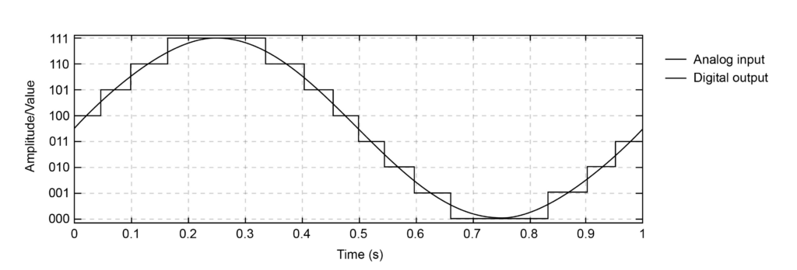
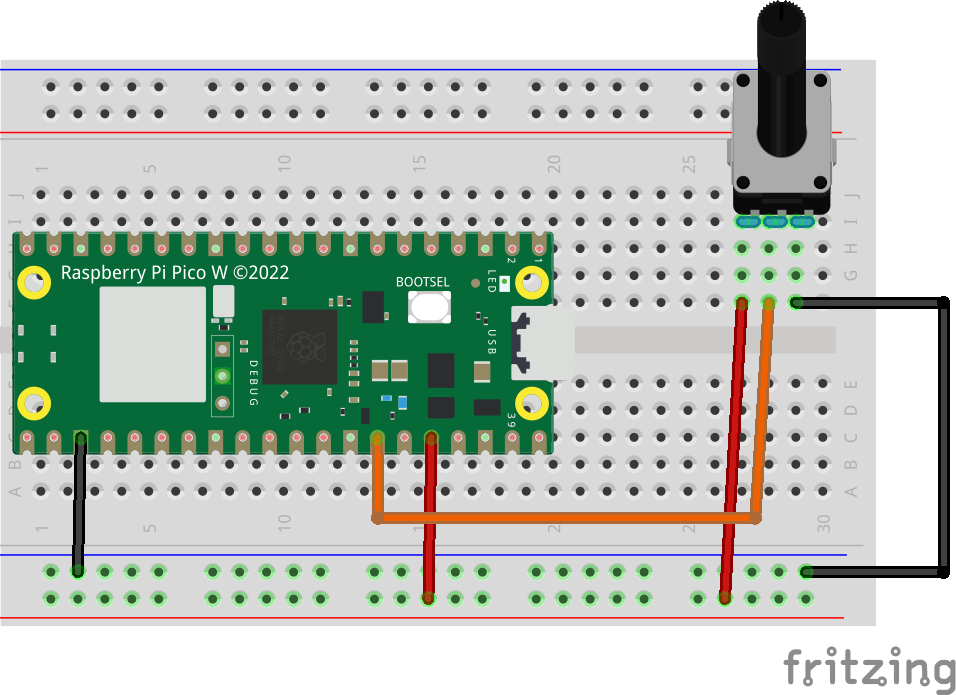
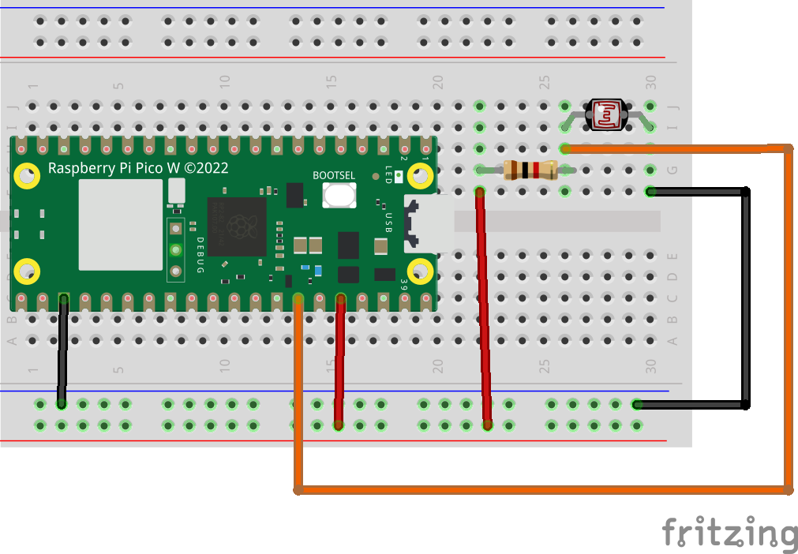
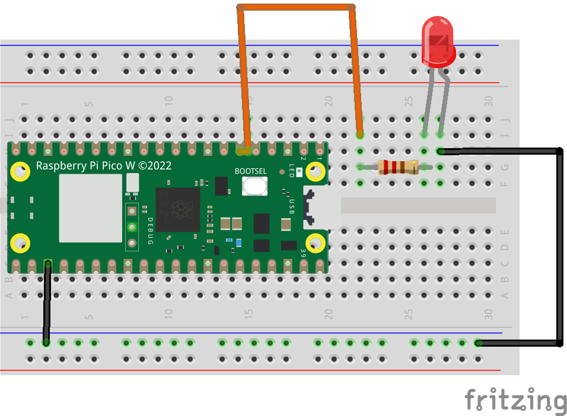
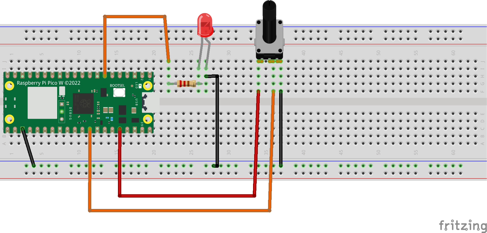

# Entrada/salida Analógica

Hasta ahora, hemos estado trabajando con señales digitales. Que trabajaban con dos niveles 0 o 1.

Pero normalmente, el mundo es analógico y se pueden trabajar con más niveles. En este apartado, vamos a ver como trabajar con señales analógicas tanto de entrada como de salida.

## Entrada analógica

Como hemos comentado, a la hora de trabajar con un microcontrolador, normalmente trabaja con valores digitales (0 o 1); sin embargo, en el mundo real, normalmente se trabajan con muchos niveles; estos niveles son los llamados valores analógicos.

Como el microcontrolador (al tener un microprocesador); solo trabaja con valores binarios, necesitaremos un componente que transforme dichos valores analógicos a digital. Para ello, se utilizan los ADC (Analog DIgital Converter). Los microcontroladores que utilizaremos en el curso incluyen estos componentes; por lo que podremos utilizarlos para leer valores analógicos.

El ADC; transforma los valores de voltaje analógicos; en valores discretos de voltaje. Los valores establecidos por el ADC, dependerán de la precisión de este. Normalmente, se mide por bits. Ya que un ADC transforma desde 0 hasta 2^n valores; donde n es el nº de bits.

Por ejemplo para el ESP32 y Raspberry Pi pico, incorpora un ADC de 12 bits por lo que los valores que puede representar son:

0-2^11 -> 0- 2048 valores

Es importante, saber, que no podemos leer una entrada analógica desde cualquier Pin GPIO de la placa. Sino que hay algunos especificos para ello.

Por ejemplo para la ESP32, Son los siguientes Pines:

* GPIO36
* GPIO39
* GPIO34
* GPIO35
* GPIO32
* GPIO33
* GPIO25
* GPIO26
* GPIO27
* GPIO14
* GPIO12
* GPIO13
* GPIO04
* GPIO02
* GPIO15

Por otro lado, los pines que podemos utilizar en la Raspberry Pi Pico, son:

* GPIO28
* GPIO27
* GPIO26

Para la Tom Lite, los pines son:

* GPIO33
* GPIO32

Puedes consultar el Pinout de tu placa para más información.

Seguidamente, vamos a hacer un pequeño montaje para comprobar con una resistencia variable, el valor que se puede leer cambiando esta.

Necesitaremos los siguientes componentes:

* 1 Microcontrolador Raspberry Pi Pico/ ESP32 o Atom Lite
* 1 Resistencia variable de 10KOhm
* 1 BreadBoard
* Cables Dupont

Una vez realizado el montaje, vamos a ver el código fuente en el siguiente [enlace](A03_entradas_analogicas/main.py).

### Uso de FotoResistencia

Otro de los componentes que podemos utilizar para comprobar las entradas analógicas son las fotoresistencia. Son resistencia que cambian de valor en función de la luminosidad recibida.

Este tipo de componentes son muy utilizados por ejemplo para regular la luminosidad de tu teléfono.

Vamos a realizar un ejemplo para poder medir los valores de luminosidad y mostrarlos por pantalla.

Para este ejemplo, necesitaremos los siguientes componentes:

* 1 Microcontrolador ESP32, Raspberry Pi Pico o Atom Lite
* 1 BreadBoard
* 1 fotoresistencia
* 1 resistencia 1Kohm
* Cables Dupont

Realizaremos el siguiente montaje:

El código, podemos usar el mismo ejemplo anterior ya que solo cambia el componente; pero la forma de leerlo es la misma.

## Salida analógica (PWM)

Hemos estado trabajando con las entradas analógicas; pero también es necesario poder trabajar con las salidas de igual forma, para poder interactuar con el entorno.

De igual forma que el anterior caso, se necesita un componente que transforme las señales digitales, en analógicas; por ello se utilizan los DAC que transforman los pulsos digitales en analógicos.

Entre otro usos, es uno de los componentes que transforman las señales digitales en el sonido de tus altavoces conectados a tu computador (antiguamente conocida como tarjeta de sonido).

Al igual que ADC, el DAC (Digital Analog Converter) tiene una precisión; también basada en Bits.

Para el caso de ESP32 tiene una resolución de 8 bits; es decir que nos devolverá un valor entre 0 y 256 niveles.

La forma en la que un DAC obtiene desde los valores digitales los analógicos, se llama PWM (Pulse Width Modulation).

Igual que para las entradas, no todos los GPIO son compatibles como salida analógica.

Para el ESP32, se pueden usar los pines GPIO excepto los pines (GPIO36, GPIO39,GPIO34,GPIO35).

Para Raspberry Pi Pico, podemos usar cualquiera de los que hay disponibles; para ello, consultar el pinout de la placa.

Vamos a ver el siguiente montaje; donde veremos como cambiar la intensidad de un Led. Necesitaremos los siguientes componentes:

* 1 Microcontrolador ESP32, Raspberry Pi Pico o Atom Lite
* 1 BreadBoard
* 1 Led
* 1 resistencia 220 Ohmios.
* Cables Dupont.

Para el código fuente, vamos a ver el siguiente [enlace](A04_salidas_PWM/main.py).

## Entrada y Salida analógica

Para este caso, vamos a tratar de unir los dos ejemplos anteriores en uno. Por lo que necesitaremos los siguiente componentes.

* 1 Microcontrolador ESP32, Raspberry Pi Pico o Atom Lite
* 1 BreadBoard
* 1 Resistencia Variable 10KOhm.
* 1 Led
* 1 resistencia 220 Ohmios.
* Cables Dupont.

Para el código fuente, puedes ver el siguiente enlace.