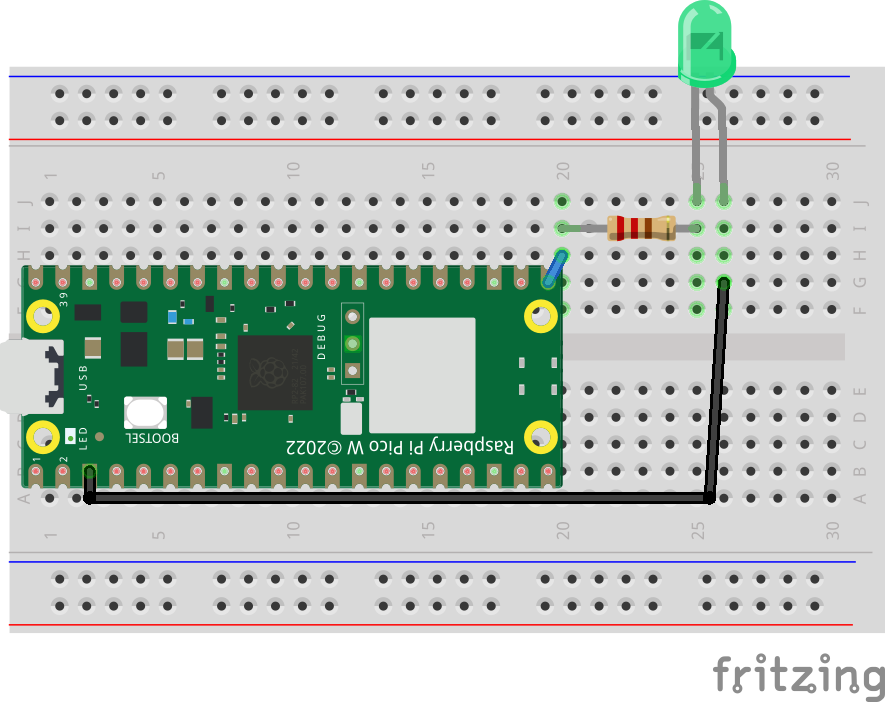
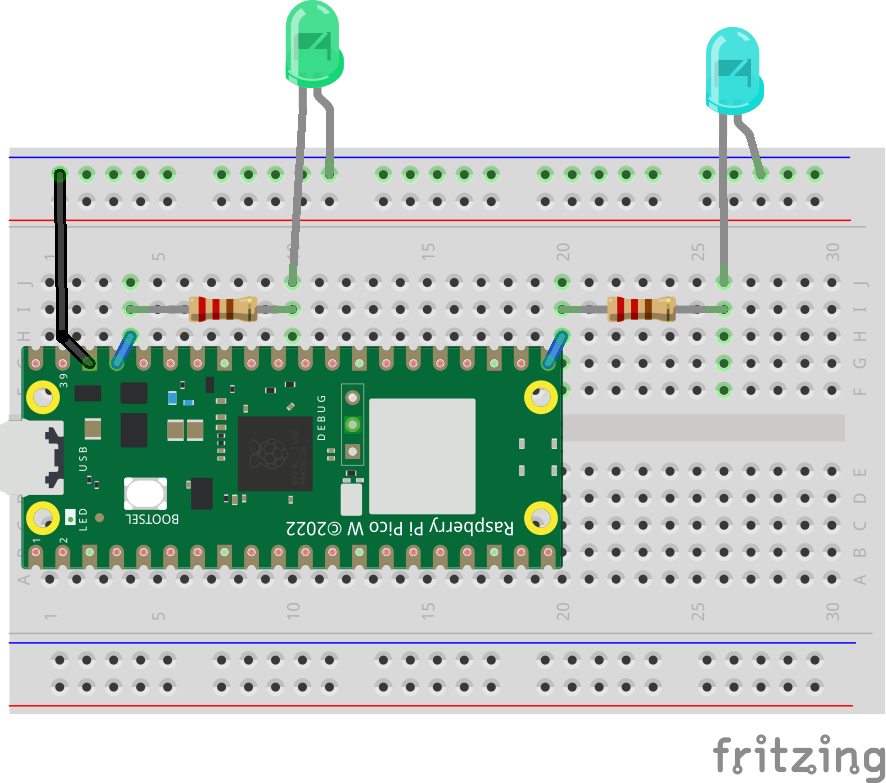
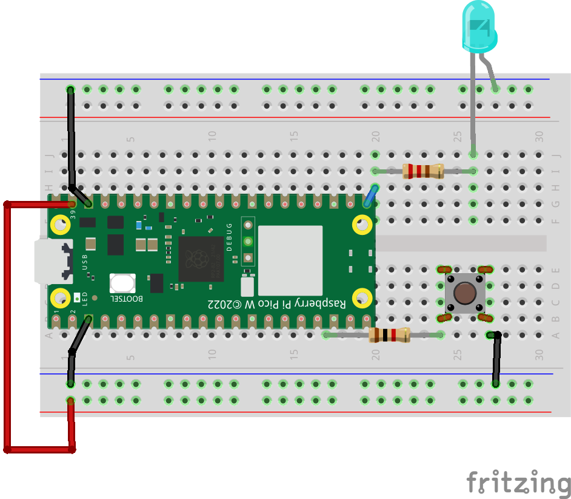
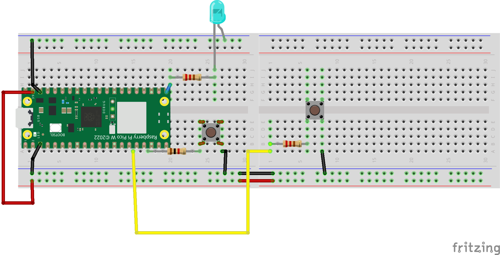

# Entradas/Salidas digitales

Lo primero que vamos a ver, es como tratar con las Entradas o salidas digitales de nuestro microcontrolador.

Una entrada o Salida digital, es una de las patillas disponibles, de tal forma que podemos trabajar con dos valores (0 o 1); basándonos en niveles de voltaje.

Los microcontroladores con los que trabajamos, trabajan con poco voltaje (5 o 3,3V).

Por otro lado, trabajaremos con distintos materiales; con los que vamos a mostrar distintos montajes, y posteriormente el fichero con el que trabajaremos.

Para poder subir un fichero, primero; lo escribiremos en el editor Thonny.

Y posteriormente, guardaremos el fichero, y nos preguntará por donde lo queremos guardar. Seleccionaremos el dispositivo.


Una vez hecho esto, ya podemos trabajar con dicho código y ver como funciona.

## Blink

Para comenzar, vamos a ver como hacer parpadear el led montado en la placa.

En este caso, no hará falta montar nada ya que esta directamente en la placa.

```python
from machine import Pin
from time import sleep

# para Raspberry Pi Pico usar el 25; para Raspberry Pi Pico W usar el 0.
ledpin = 2
pin = Pin(ledpin,Pin.OUT)

while True:
    pin.on()
    sleep(1)
    pin.off()
    sleep(1)
```

## Blink con montaje

Por otro lado, podemos comenzar a montar nuestro primer esquema. Para ello, vamos a tratar de mostrar en cada ejercicio, una ilustración de cada montaje; además de una lista de componentes necesarios.

Para este caso, vamos a mostrar el Primer montaje.

Para este montaje necesitaremos:

* Microcontrolador ESP32, Raspberry Pi Pico o Atom Lite.
* 1 BreadBoard
* 1 Resistencia de 220Ohmios.
* 1 LED.
* Cables Dupont Macho-Macho.

Realizando el siguiente montaje:



Puedes consultar el fichero de código en el siguiente [enlace](A01_GPIO_salida/main.py).

Es importante que pongas una resistencia del valor correcto. Recuerda que puedes consultar los valores de una resistencia, a partir de sus colores.

Para más información, consulta el siguiente enlace:

[https://www.digikey.es/es/resources/conversion-calculators/conversion-calculator-resistor-color-code](https://www.digikey.es/es/resources/conversion-calculators/conversion-calculator-resistor-color-code).

## Blink con dos Leds

Vamos a poner que tenemos que poner dos leds; para practicar. Poniendo cada uno con una frecuencia. Necesitaremos los siguientes componentes.

* Microcontrolador ESP32, Raspberry Pi Pico o Atom Lite.
* 1 BreadBoard
* 2 Resistencia de 220Ohmios.
* 1 LED.
* Cables Dupont Macho-Macho.



## Entrada Digital

Por otro lado, podemos utilizar botones u interruptores, o usar salidas externas para dar señales para poder decidir que hacer o activar algún otro valor.

Vamos a realizar el montaje más sencillo. Para ello, necesitaremos los siguientes componentes:

* Microcontrolador ESP32, Raspberry Pi Pico o Atom Lite.
* 1 BreadBoard
* 1 Resistencia de 220Ohmios.
* 1 Resistencia de 1KOhmio.
* 1 Led
* 1 Botón.
* Cables Dupont Macho-Macho.



Tras montarlo, vamos a tratar de crear el código necesario, para encender el led cuando se pulsa el botón. Puedes ver el código en el siguiente [enlace](A02_GPIO_entrada/main.py).

Por otro lado, como ejercicio, podemos tener 2 botones para activar un led.

Los componentes necesarios son:

* Microcontrolador ESP32, Raspberry Pi Pico o Atom Lite.
* 1 BreadBoard
* 1 Resistencia de 220Ohmios.
* 2 Resistencia de 1KOhmio.
* 1 Led
* 2 Botón.
* Cables Dupont Macho-Macho.



**Ejercicio 2**

A partir del montaje anterior, hacer que el led parpadee si se ha pulsado el botón.
