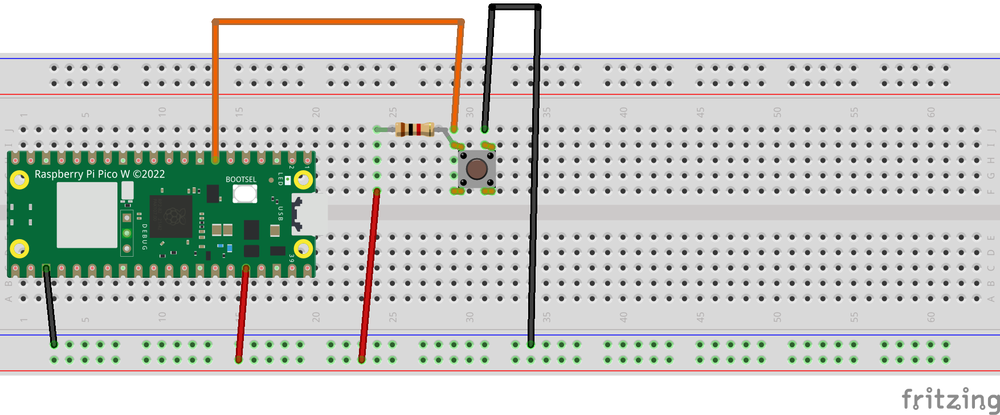

# Interrupciones

Hasta ahora, hemos estado trabajando con el microcontrolador que realizaba todas las acciones con un bucle. Esto en muchas ocasiones no es lo más eficiente.

Ya que por ejemplo si necesitamos esperar una señal para realizar una acción, siempre se va a comprobar este o no pulsado (lo cual puede ser cientos de veces or segundo); por ello, se pueden utilizar interrupciones por Hardware; de tal forma que podemos solamente realizar una acción, cuando se reciba una señal por una de las patillas.

Esto es lo que se conoce como _interrupción_; de tal forma que el microprocesador del microcontrolador es capaz de parar lo que este realizando, ejecutar una acción, y volver a la ejecución anterior.

Al realizarlo a nivel de hardware, este cambio es mucho más eficiente.

Para ejecutar una interrupción, necesitaremos primero; la patilla que sea de entrada, y además, una función de interrupción que se va a ejecutar.

Veamos un ejemplo en MicroPython:

```python
import machine
# Inicializacion Pines
pin = machine.Pin(2,Pin.IN)
# Variables Globales
count=0
push=False
#Función manejadora Interrupción
def handle_interrupt():
    global count,push
    # No realizar operaciones complejas
    count+=1
    push=True

# Inicializacion interrupcion
pin.irq(handle_interrupt,Pin.IRQ_FALLING)

while True:
    #Si se ha pulsado
    if push:
        print(f"Valor Contador:{count}")
        push=False
```

Como vemos en el ejemplo, se debe de inicializar una interrupción, tanto cuando se pulsa o se deja de pulsar.

Esto se establece con los valores:

* Cuando se pulsa el botón o se pasa de 0 a 1.
```Pin.IRQ_FALLING```.

* Cuando se pulsa el botón o se pasa de 1 a 0.
```Ping.IRQ_RELEASE```.

Veamos un ejemplo con un montaje sencillo; necesitaremos los siguientes componentes:

* 1 Microcontrolador ESP32, Raspberry Pi Pico o Atom Lite
* 1 BreadBoard
* 1 botón
* 1 resistencia 1K Ohmios.
* Cables Dupont.



Para el código fuente, vamos a tratar de utilizar El siguiente [enlace](A05_IRQ/main.py).

Por otro lado, vamos a ver que podamos ejecutar tanto una interrupción, como otra. Para ello, podemos establecer una interrupción al pulsar y preparar una tarea al finalizar

Por ejemplo:

```python
#Configurar pin
  self.boton = Pin(self.pin_n, Pin.IN)
  self.boton.irq(self.cb_pulsado, Pin.IRQ_FALLING)

#manejador Interrupción

 def cb_pulsado(self, inst):
    # Se crea una tarea para ejecutar cuando se termine la interrupción   
    micropython.schedule(self.post_cb_pulsado, 0)
```

Esto nos permitirá poder establecer tareas a ejecutar gracias a los dos núcleos que posee tanto el ESP32, como Raspberry Pi Pico.

Para ver como funciona, podemos utilizar el montaje anterior, junto al código fuente que encontrarás en el siguiente [enlace](A07_IRQ/main.py).

## Timers

Otro aspecto a tener en cuenta, es que podemos establecer Timers; que ejecutarán una operación o una única vez, o periódicamente.

Un Timer; nos permitirá, que pasado un tiempo se ejecute una función; por ejemplo:

```python
tim1 = Timer(-1)  # -1 para timer virtual (basado en RTOS)
tim1.init(period=2500, mode=Timer.ONE_SHOT, callback=lambda x:print("#### esto solo se ejecuta una vez"))
```

En este caso, se utiliza solo una vez al pasar 2500ms (2,5segs). Pero podemos establecer que sea periódicamente.

```python
tim2 = Timer(-1)
tim2.init(period=1000, mode=Timer.PERIODIC, callback=lambda x:print("esto se ejecutara periodicamente"))
```

**Ejercicio adicional**

Usar una interrupción, para poder encender un led si se ha pulsado 3 o más veces un botón.
