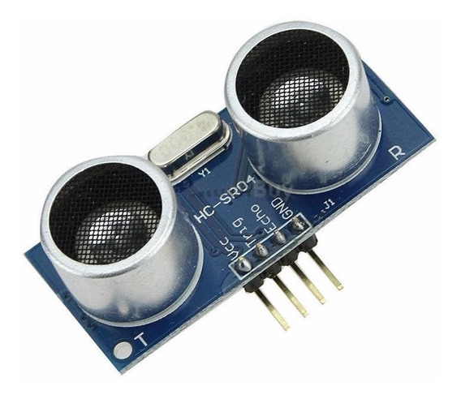
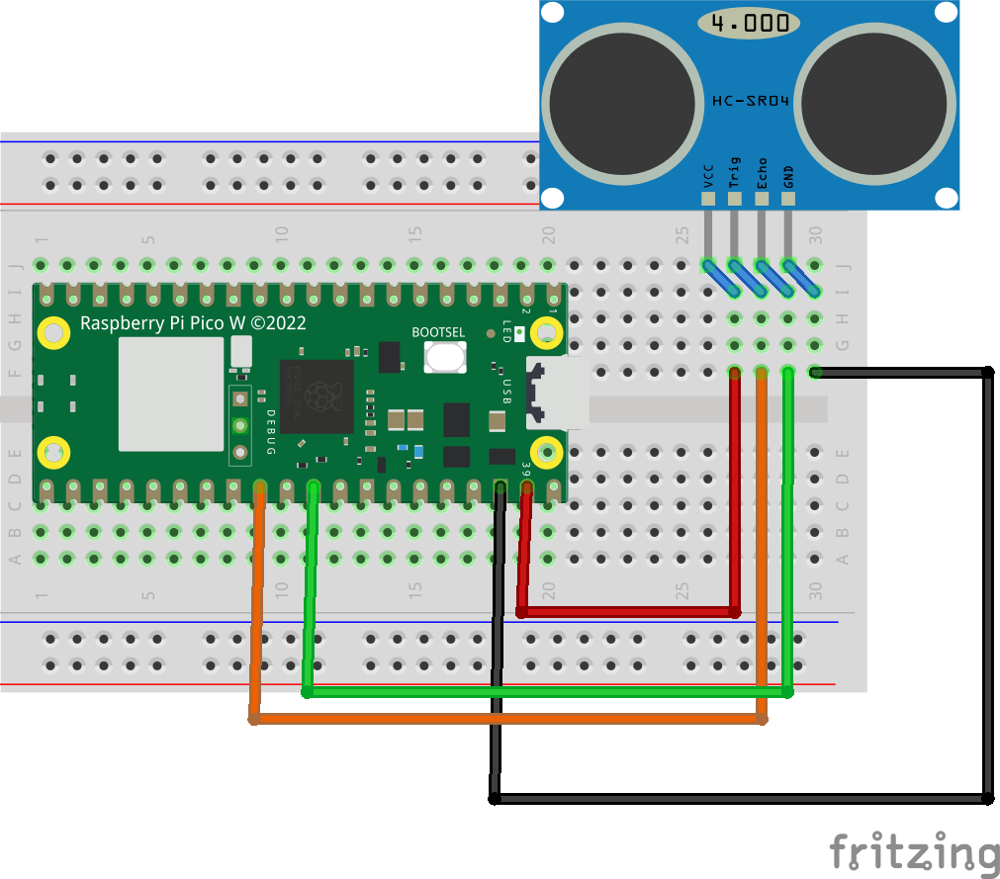
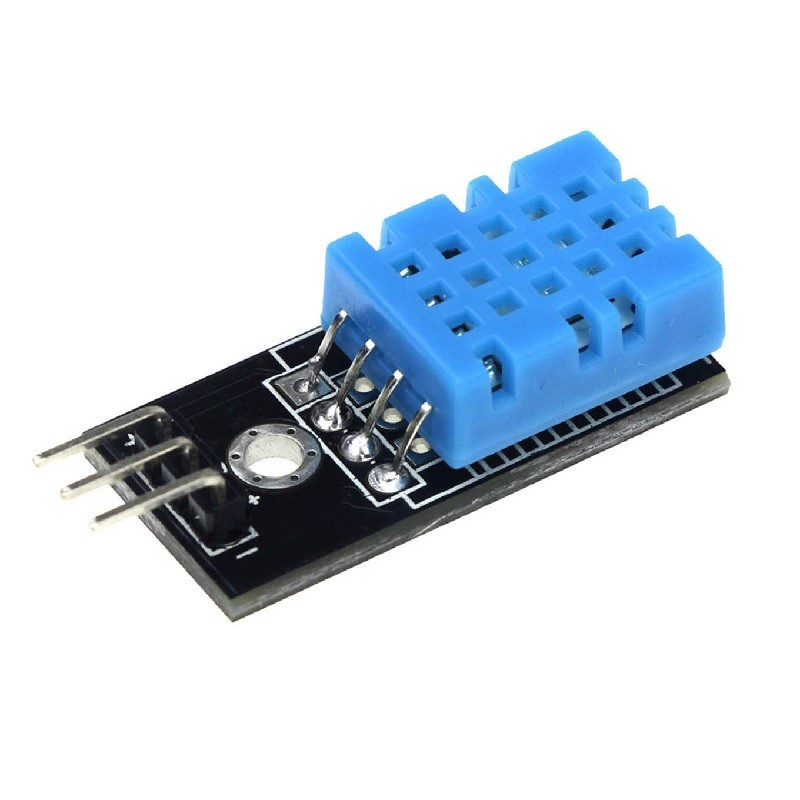
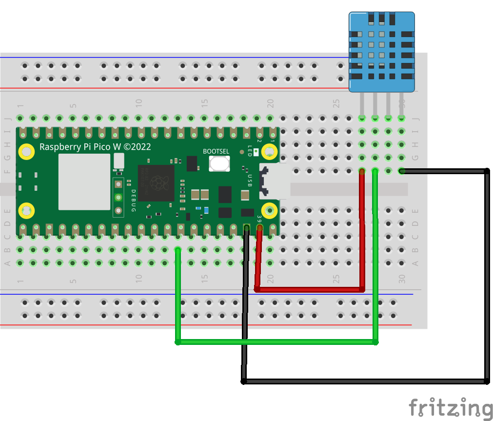

# Sensores I

En este apartado, vamos a ver como utilizar algunos sensores para poder leer estos valores usando MicroPython.

Nos centraremos en dos sensores; el sensor de ultrasonidos HC-SR04.

Este sensor, se basa en emitir un pulso con una frecuencia de ultrasonido, y recibirla en el receptor. Esto se basa en que el sonido, rebotará y volverá al receptor; midiendo el tiempo entre que se envía el pulso y se recibe (sabiendo que la velocidad del sonido son 340m/s), podemos saber la distancia recorrida.

Por lo tanto, vamos a tratar de realizar un montaje sencillo; solo conectando el sensor a nuestro microcontrolador.

Como puedes ver, en este caso conectamos 5v(vsys), tierra, y dos cables más que serán trigg(trigger) y echo que son los que activarán el ultrasonido, y recibirán la respuesta.

Para hacerlo más simple, descargaremos una librería externa para poder utilizar este sensor. Puedes descargarla desde:

[https://github.com/rsc1975/micropython-hcsr04](https://github.com/rsc1975/micropython-hcsr04)

Una vez descargada, podemos subirla a nuestra placa usando el propio Ide THonny; guardando la información en la propia placa para que este disponible.

**NOTA**: Recuerda no subir muchos ficheros ya que el espacio es limitado.

Para acabar vamos a crear el código fuente que tenéis disponible en el siguiente [enlace](A08b_hcsr04/).

**Ejercicio adicional**

Usando el sensor HC-SR04, conectar también un led, y cambiar la frecuencia de parpadeo de este. Contra más cerca este, más parpadeará.

## Sensor de Temperatura y Humedad

Otro sensor que vamos a utilizar es el DHT11; es un sensor  que nos va a permitir leer la temperatura y humedad del ambiente.

Para este caso, Micropython ya incluye una clase para usar este sensor; por lo que no es necesario instalar o utilizar ninguna librería externa.

Este sensor, también puede encontrarse con 4 pines; no te preocupes solo tienes que usar los dos pones de la izquierda (vcc y datos) y el último de la derecha (GND).

Vamos a ver un montaje:

Una vez realizado el montaje, podemos comenzar a escribir el código utilizando el que hay en el siguiente [enlace](A08c_DHT11/main.py).

**Ejercicio Adicional**

A partir del ejemplo anterior, conectar un led y que se active si la temperatura es superior a 25ºC.

**Ejercicio Adicional 2**
Conectar 3 leds; y se activen 1, 2 o 3 en función de la temperatura; si esta entre 15 y 20, solo encender uno; si esta por encima de 20 y menos de 25 encender dos; si esta por encima de 25, encender los tres.
