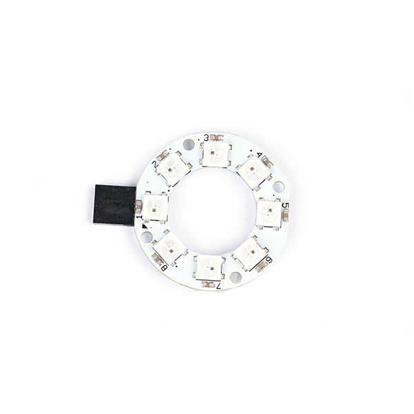
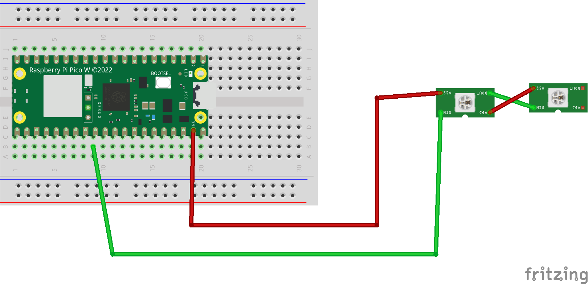
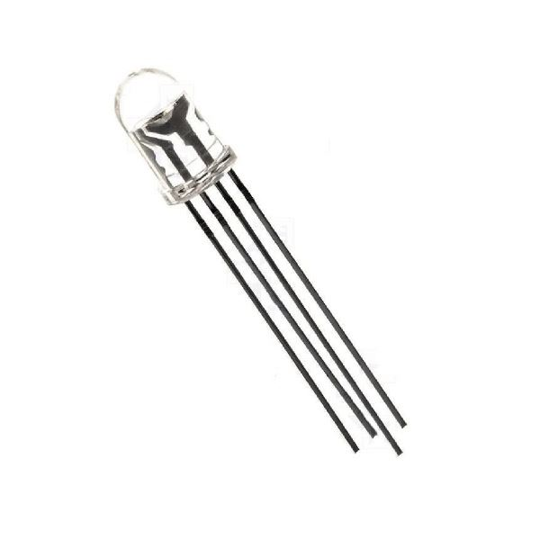
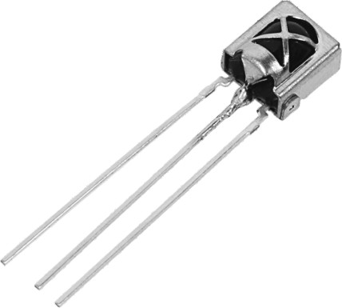
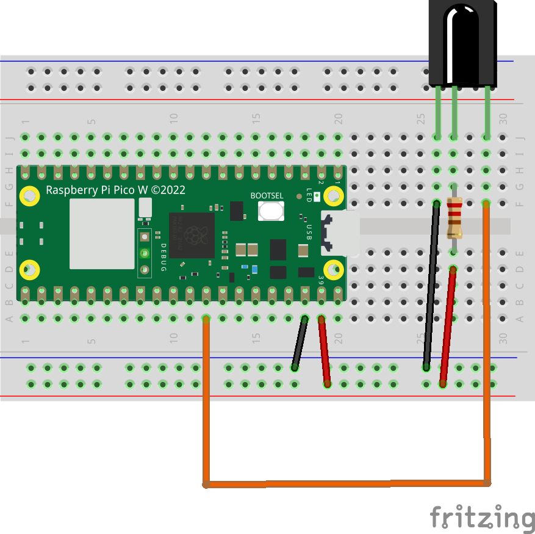

# Sensores II

Para esta segunda parte de sensores, vamos a trabajar con distintos sensores; como puede ser los Leds RGB, o un diodo receptor de infrarojos.

## leds RGB

En muchos de los packs que hemos estado viendo para este curso, hemos podido ver que vienen algunos leds RGB o incluso, varios conectados a través de tiras o en un pequeño array.

Normalmente estos leds basados en el microcontrolador WS2812, permiten modificar los colores de varios leds.

Micropython, tiene soporte para este microcontrolador y nos permite usar su librería Neopixel.



Normalmente estos leds se conectan con 3 pines; VCC, datos y GND. De tal forma que es muy sencillo enviar la información a este.

Veamos un ejemplo; que necesitaremos los siguientes materiales:

* 1 microcontrolador ESP32, Raspberry Pi pico o Atom Lite.
* 1 BreadBoard
* 1 Array de Leds RGB basado en WS2812
* cables Dupont



**NOTA:** consulta la especificación del microcontrolador en este ejemplo se ha obviado la tierra por simplicidad.

Una vez hecho esto, vamos a ver como utilizar la librería de neopixel.

```python
import machine, neopixel

pin = machine.Pin(22) #pin de datos
n=8 #Numero de leds

np = neopixel.Neopixel(pin,n) #inicializacion de neopixel

np[0] = (255,0,0) #El primer led será Rojo (R,G,B) siempre con valores de 0 a 255.

np[3]= (125,204,33)

np[6]= (255,0,153)

np.write()#enviar para que se muestren los leds

```

Como podemos ver, podemos controlar cada uno de los leds mandando la información y se pueden crear distintos efectos.

Veamos un ejemplo:

```python
import machine, neopixel
import time

pin = machine.Pin(22) #pin de datos
n=8 #Numero de leds

np = neopixel.Neopixel(pin,n) #inicializacion de neopixel

while True:
    #lipiar leds
    for i in range(0,8):
        np[i]=(0,0,0)
        np.write()
    for i in range(0,8):
        #rellena un led por segundo
        np[i]=(255,0,0)
        np.write()
        time.sleep(1)
```

**Ejercicio adicional**
Escribir un programa que vaya cambiando la escala de color cada segundo.

## Led RGB sencillo

En caso de no tener disponible un array de leds RGB, puede usarse un simple led RGB.



En este caso, tendremos que realizar a mano el cambio de color; estos leds tienen 4 patillas que son de izquierda a derecha

* Rojo
* GND (patilla mas larga)
* Azul
* verde

Enviando un 1 en cada patilla, se pueden cambiar los colores; obviamente también puede usarse PWM (salida analógica) para enviar la información.

Veamos un ejemplo; que necesitaremos los siguientes materiales:

* 1 microcontrolador; esp32, raspberry pi pico o Atom Lite.
* 1 BreadBoard
* 1 led RGB
* cables Dupont


```python
import time
from machine import Pin,PWM 
 
# RGB
RED = 0
GREEN = 1
BLUE = 2

# Pines usados (comprueba tu placa)
pwm_pins = [13,14,15]
# Inicializacion de pines
pwms = [PWM(Pin(pwm_pins[RED])),PWM(Pin(pwm_pins[GREEN])),
                PWM(Pin(pwm_pins[BLUE]))]
for pwm in pwms:
    pwm.freq(1000)

while True:
    #ROJO
    pwms[RED].duty_u16(65535)
    pwms[GREEN].duty_u16(0)
    pwms[BLUE].duty_u16(0)
    time.sleep(1)
    #AZUL
    pwms[RED].duty_u16(0)
    pwms[GREEN].duty_u16(0)
    pwms[BLUE].duty_u16(65535)
    time.sleep(1)
    #VERDE
    pwms[RED].duty_u16(0)
    pwms[GREEN].duty_u16(65535)
    pwms[BLUE].duty_u16(0)
    time.sleep(1)
```

**Ejercicio adicional**

Usando un solo led, trata de ir cambiando la escala de color cambiando los valores enviados por PWM.

## Led Infrarojo

En muchas ocasiones, puede ser útil recibir o enviar información por infrarrojos. Por ello, vamos a tratar de realizar un pequeño ejemplo para recibir información a través de infrarrojos.

En algunos packs de electrónica, viene un led receptor de infrarrojos que nos puede servir para recibir la información.



Como puedes ver, tiene 3 patillas:

* VCC
* Datos
* GND

El led, recibe las señales infrarrojas y envía los datos por el pint; obviamente esto tiene en cuenta un protocolo que se envía usando unos códigos. Pero para nuestro ejemplo solo necesitaremos recibir "algo".

Veamos un pequeño montaje, que necesitaremos los siguientes materiales:

* 1 microcontrolador ESP32, Raspberry Pi Pico o Atom Lite.



Una vez visto el montaje, vamos a ver el código en el siguiente [enlace](A09binfrared/main.py).

**Ejercicio Adicional**

Cuando se reciba una señal infrarroja, encender un led un segundo; en caso contrario apagarlo.
