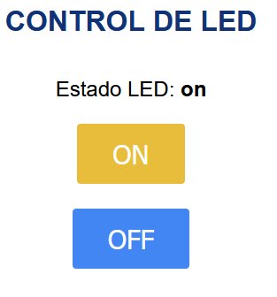
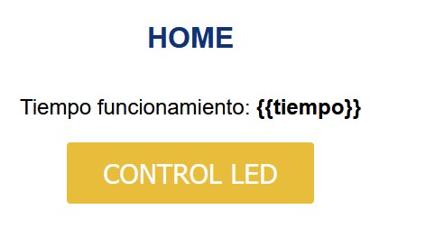
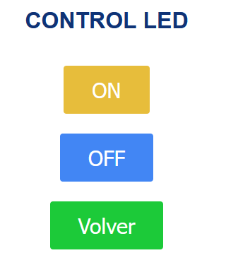

# Web

Una vez hemos visto como mandar información a internet, también puede ser interesante; tener un servidor en la propia placa para recibir peticiones y realizar acciones.

En este caso veremos dos aproximaciones; la primera, crear el socket de red y mandando la información.

## Crear un Servidor Web

Veamos la primera aproximación para crear un servidor web, que acepte peticiones HTTP:

```python
# creamos y configuramos el socket
s = socket.socket(socket.AF_INET, socket.SOCK_STREAM)  # address family (ip4), socket type (TCP)
s.bind(('0.0.0.0', 80))  # tupla ip puerto, dejar ip vacia para localhost
s.listen(5)
# Estará a la espera de una conexion
while True: #bucle infinito
    conn, addr = s.accept()  # esta llamada bloquea hasta que haya alguna conexion entrante
    request = conn.recv(1024)  # bytes maximos que se pueden recibir de cada vez
    request_str = request.decode()
    print(request_str) #Mostramos respuesta
     conn.send('HTTP/1.1 200 OK\n')  # cabecera
    conn.send('Content-Type: text/html\n')#COntent Type
    conn.send('Connection: close\n\n')#Cierre de conexion
    conn.sendall(contenido_respuesta)#Enviamos la respuesta
    conn.close()#Cerramos conexion
```

Esto nos debería de devolver una web en HTML.



**NOTA:** Obviamente se necesita que la placa tenga conexión y sepamos su dirección IP.

## Crear un Servidor usando una librería

En este caso, vamos a ver otro ejemplo en el que añadimos una clase auxiliar, que nos va a permitir generar distintas vistas y usar plantillas.

Puedes ver este ejemplo en el siguiente [enlace](B02_libreria_web/).

Al entrar a la web, una vez instalado el sistema, podemos algo parecido a esto:





**Ejercicio adicional 1**

Utilizar un sensor de temperatura DHT11, para leer la temperatura y la humedad relativa, y mostrarla en una web.

**Ejercicio adicional 2**

Utilizando el ejemplo anterior, mostrar en la página de inicio la temperatura local usando la API open Meteo.

**Ejercicio adicional 3**

Crear una web, para controlar un Led RGb pudiendo enviar, R,g y b (valor entre 0 y 255).
