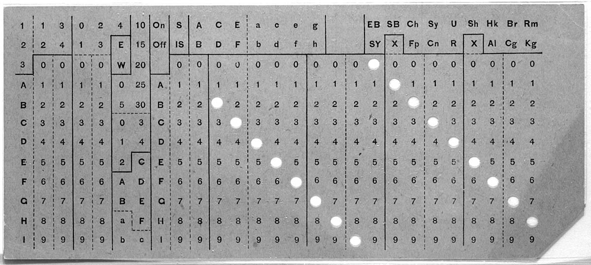

Introducción a las bases de datos
=======================================================================

Qué son las bases de datos
-----------------------------------------------------------------------

El término **base de datos** ha sido utilizado para referirse a muchas
cosas (En algunos casos, incluso, para cosas que claramente no son bases
de datos, cómo por ejemplo un simple fichero de nombres y teléfonos),
por lo que hay múltiples definiciones del término.

Además, los distintos proveedores de :term:`DBMS` (*Data Base Management
System*) han desarrollado diferentes arquitecturas, por lo que no todas
las bases de datos están diseñadas de la misma manera.

A falta de una definición absoluta y consensuada, vamos a utilizar la
siguiente: Una base de datos es **una colección de datos estructurados,
que se organiza y almacena de forma que se facilita la recuperación,
manejo y gestión de los mismos**.

Antecedentes históricos
------------------------------------------------------------------------

Los datos han sido almacenados de forma digital desde haca ya mucho
tiempo. `Herman Hollerith`_ inventó el sistema de tarjetas perforadas
para procesar el censo de los Estados Unidos de América en 1890. Las
tarjetas perforadas fueron usadas durante los siguientes 65 años como
sistema de almacenamiento de datos, hasta que fueron reemplazados 
durante la década de los 50 por las cintas magnéticas y, un poco más
tarde,por los primeros discos duros.

Hasta ese momento, los datos eran almacenados secuencialmente en una
cinta, y estaban dedicados en exclusiva para una sola aplicación. Un
sistema de control de inventario de la época podía funcionar, por
ejemplo, leyendo periódicamente los datos, quizá una vez por semana, se
realizaban los cambio oportunos y luego se grababan los datos
actualizados nuevamente en la cinta.

La llegada de los discos duros, con el IBM RAMAC en 1956, provocó un
impacto enorme en la forma en que los datos se almacenaban y procesaban.
Ya no era necesario procesar los datos secuencialmente, ya que los
discos duros permiten el acceso a los datos en cualquier orden (Las
iniciales RAMAC son las iniciales en inglés de Sistema de Contabilidad
con Memoria de Acceso Aleatorio (*Random Access Memory ACcounting
System*). Esto llevo a nuevos esfuerzos de innovación en lo referido
a la organización de los datos en el disco.

Durante la década siguiente, en los años 60 del pasado siglo, un equipo
de ingenieros que trabajan para la NASA desarrollaron un sistema,
pensado inicialmente para ser usado en el `programa Apolo`_, que
almacenada y recuperaba la información desde un disco duro. El sistema,
llamado *Information Management System* (`IMS`_), pronto demostró ser
útil también fuera del programa espacial, y fue puesto a disposición de
los usuarios de los sistemas IBM en 1969. Este programa organizaba la
información en el disco en forma de un **sistema jerárquico de
registros** "padres" e "hijos".

Más o menos al mismo tiempo, en la empresa *General Electric*, uno de
sus empleados, `Charles Bachman`_, estaba trabajando en un sistema
llamado `Integrated Data Store` (IDS) con el mismo objetivo de recuperar
y almacenar información. Como el sistema IMS, IDS almacenaba los datos
en disco en forma de registros y conexiones entre los mismos. Los
usuarios podían recuperar la información usando estas conexiones,
siguiendo las rutas que llevaban de un registro a otro. Pero a
diferencia de IMS, este sistema no exigía que los registros estuvieran
organizadas en forma jerárquica, sino que permitía organizaciones en
forma de red, de mayor complejidad.

Mientras trabaja en su sistema, Bachman tuvo una revelación muy
importante. Si los datos almacenados en el disco se podían acceder en
cualquier orden, no había en realidad necesidad de que el sistema
estuviera dedicado en exclusiva a una única aplicación. Se podía crear
un nuevo nivel de abstracción, situado sobre el nivel del sistema
operativo, que gestionara y manejara los datos para diferentes
aplicaciones. Llamó a esta nueva capa de abstracción "*Database
management system*". 

Este nuevo *sistema de gestión de bases de datos* podía a la vez
eliminar redundancias y hacer los datos más consistentes entre las
aplicaciones. Ofrecía además otras ventajas: podría proporcionar control
de acceso a los datos a diferentes tipos de usuarios. Aprovechando la
centralidad de este sistema, se facilitaban también las copias de
seguridad, la seguridad de las transacciones y la seguridad de que las
actividades de múltiples usuarios no interfirieran entre si.

Estos dos sistemas definieron los primeros sistemas de bases de datos,
IMS a las bases de datos jerárquicas e IDS a las sistemas de bases de
datos en red. (Charlie Bachman recibió el premio ACM A.M. Turing por
este y otros trabajos en 1973).

El lenguaje de programación COBOL, orientado a aplicaciones de negocios,
había sido diseñado por una organización conocida como *Conference on
Data System Languages* (CODASYL). A finales de los 60, se creo un grupo
de trabajo, llamado *Data Base Task Group* (DBTG), con el objetivo de
definir un lenguaje estándar para las aplicaciones de bases de datos,
que pudiera ser embebido en COBOL. Bachman formaba parte de este grupo,
por lo que sus ideas influyeron decisivamente en el mismo.

Por otro lado, `Edgar Frank «Ted» Codd`_, un científico informático
inglés, había estado trabajando en su modelo *relacional* de base de
datos en IBM. En una publicación de 1970, "Un modelo relacional de datos
para grandes bancos de datos compartidos" (*A Relational Model of Data
for Large Shared Data Banks*) definía un modelo fuertemente matemático,
en el que se introdujeron conceptos fundamentales como independencia de
datos, normalización, el propio concepto de *relacion* se definía como
un subconjunto del producto cartesiano de un conjunto de dominios.
También introdujo la idea de que era posible usar el cálculo de
predicados de primer orden como una forma ideal de estimar la potencia
de futuros lenguajes de consulta, y definió un conjunto de operadores,
mas tarde conocidos como "Álgebra relacional".

Muchos investigadores y empresas del momento no prestaron mucha atención
a este enfoque, considerándolo como un documento de interés teórico,
alejado de los requerimientos prácticos de la industria. La idea
consistía en construir un compilador que tradujera de forma óptima desde
las descripciones de alto nivel de las consultas, a un plan de ejecución
que produjera los resultados buscados. Algunos expertos se mostraron
escépticos de que se consiguiera un nivel de traducción lo
suficientemente bueno como para competir con el que podría producir un
programador humano. Las ventajas del sistema relacional eran evidentes,
pero había dudas acerca de si sería posible conseguir un rendimiento
aceptable para bases de datos masivas y con múltiples usuarios.

En 1973, la división de investigación de IBM decidió a crear un
nuevo proyecto en sus oficinas de San Jose, en California, donde estaba
trabajando Ted Codd. El proyecto, más tarde bautizado "System R",
consistía en crear un prototipo de gestor de base de datos relacional.

Más o menos al mismo tiempo, en la Universidad de Berkeley, bajo el
liderazgo de los profesores `Michael Stonebraker`_ y `Gene
Wong`_

.. _Michael Stonebraker: 

At about the same time, a research project was taking shape at UC
Berkeley under the leadership of Professors Michael Stonebraker and Gene
Wong. This project was called INGRES, an acronym for Interactive
Graphics and Retrieval System (also the name of an 18th century French
artist, Jean Auguste Dominique Ingres). Like System R, INGRES intended
to explore relational database technology and demonstrate its
feasibility for use in a production environment. Funding for INGRES was
provided by several federal agencies, including the National Science
Foundation. Over its active life from 1973 to 1979, INGRES provided
research opportunities and practical experience for about two dozen UC
students, many of whom went on to take leading positions at various
companies in the rapidly growing database industry.

Modelo Relacional

------------------------------------------------------------------------

The essence of a relational system is that all information is
represented by data values, never by explicit connections between
records. Queries are framed in a high-level descriptive language based
only on data values. An optimizing compiler then translates each query
into an efficient plan, using access aids that underlie the data values
(B-tree indexes, hash tables, sort-merge join algorithms, and so on).
Users do not need to see the access aids—in fact, they can be changed
and new ones can be added, without affecting existing applications
(except possibly by improving performance). This is basically the same
idea found in high-level programming languages, in which mathematical
formulas are compiled into procedures for loading registers and
performing arithmetic.

Both the System R group and the INGRES group had ambitious agendas.
They had to develop software techniques for implementing relational data
on top of an operating system (VM/CMS in the case of System R; Unix in
the case of INGRES). They also had to design a user interface, including
a relational query language, and build an optimizing compiler to
translate that query language into efficient execution plans. Both
System R and INGRES existed in environments that encouraged their
members to attend conferences, share experiences with colleagues
(including each other), and publish papers in the open technical
literature. This open collaborative environment would prove to be
crucial to the impact that both projects would have on the software
industry. Over the course of their existence, System R and INGRES each
published more than 40 technical papers.6,22 In 1988, System R and
INGRES jointly received the ACM Software System Award for their
contributions to relational database technology.

Two more facts about SIGFIDET 1974 may be worth mentioning. The first is
that, after this meeting, the participants in the Special Interest Group
realized that what they were doing was managing data, and changed the
name of the group to SIGMOD, the Special Interest Group on Management of
Data. SIGMOD continues to hold annual meetings, which are among the most
widely respected conferences in the field of data management. The second
fact is that, hidden on page 249 of the Proceedings of SIGFIDET 1974 was
a short paper by Don Chamberlin and Ray Boyce, titled “SEQUEL: A
Structured English Query Language”.

Our specific goals were to design a query language with the following
 properties:

    The language should be declarative (non-procedural) and based on Codd’s relational concepts.

    The language should be framed in familiar English keywords, with no jargon or special symbols, and easy to type on a keyboard.

    In addition to the usual relational operations of selection, projection, and join, the language should provide a way to partition a table into groups and apply aggregating functions such as SUM or AVERAGE to the groups.

    Queries should resemble natural language to the extent that a user with no specialized training could, in simple cases, understand the meaning of a query simply by reading it. We called this the “walk-up-and-read” property.

We called this language SEQUEL, an acronym for “Structured English Query Language.” 

As the System R project matured, the SEQUEL language continued to evolve. A 1976 paper titled SEQUEL 27 extended the query syntax to cover insert, delete, and update operations; view definitions; integrity assertions; and triggered actions. The language defined in that paper would be immediately recognized by database developers working today. In 1977, the SEQUEL name was shortened to SQL, an acronym for “Structured Query Language.”

In 1977, the founders of a small company named Software Development Laboratories (SDL) took an interest in some of the System R papers, including the SQL specifications published in 1974 and 1976. The SDL founders saw an opportunity here. Assuming correctly that IBM would eventually release an SQL product on its mainframe computers, they decided to build a compatible product on a less expensive platform, to be named Oracle, which was developed on a DEC PDP-11. Its source code was written in C, which made it easily portable to other platforms. Oracle Database, the first commercial implementation of the SQL language, was released in 1979. Available on the popular DEC VAX minicomputer, Oracle was an immediate commercial success. In 1983, the SDL company changed its name to Oracle.

The INGRES project at UC Berkeley also produced an experimental prototype and distributed it freely to other universities and research labs. By 1978, INGRES had about 300 installations and had become the de facto standard for use in university classes on database management. In 1980, the leaders of the INGRES project spun off a commercial company, funded by venture capital and initially named Relational Technology Inc. (RTI), which had its own management and technical staff that was independent of the university. This enabled the INGRES project at the university to continue its focus on research issues of academic interest. The first task for RTI was to port the INGRES code from Unix to run on the DEC VAX platform. The resulting commercial product was released in 1981, supporting a query language called QUEL. RDI changed its name to Ingres Corporation in 1989.

IBM was not in a hurry to release a relational database system on its strategic mainframes to compete with its successful IMS database product. But IBM’s mid-range platform, a competitor to DEC VAX, needed a database system to compete with Oracle and INGRES. It took IBM about two years to turn the System R prototype into a commercial product running on the VSE and VM operating systems. This product, called SQL/DS, was released in 1981, at about the same time as INGRES but two years behind Oracle.

IBM eventually released a relational database product on MVS, its strategic mainframe platform. This product, named DB2, was released on a limited basis in 1983, followed by general availability the following year.15 By this time, Oracle had established a commanding lead in the relational database industry.

Another significant development came from the National Institute of Standards and Technology (NIST). Unlike ANSI, which is a voluntary association of private companies, NIST is a branch of the federal government. In 1992, NIST published a Federal Information Processing Standard, called FIPS-127,19 which specified the requirements for relational database systems to be purchased by the U.S. government. FIPS-127 was essentially identical to the ANSI SQL standard that was current at the time (SQL:1992 Entry Level). Most importantly, NIST created a test suite of several hundred test cases, and offered a service of testing systems for conformance to FIPS-127. About a dozen companies had their SQL products certified under FIPS-127 and became eligible to sell them to the federal government. Naturally, this was a big help in marketing these products.

The H2 committee’s strategy of tying standards closely to commercial products proved to be successful. Over several decades, H2 provided a mechanism for the controlled evolution of SQL to meet changing requirements. Under the guidance of H2, the SQL standard has grown to include referential integrity, outer joins, date and time datatypes, OLAP features, window functions, recursive queries, stored procedures, constraints and triggers, and many more features.

Relational database systems were attracting so much attention during the 1980s that Codd published a list of Twelve Rules11 (actually 13 rules, numbered 0 to 12) which served as his definition of a genuine relational system. The most important of these rules, called the Information Rule, stated that “all information in a relational database must be represented explicitly at the logical level and in exactly one way: by values in rows and columns of tables.”

Open source.

The mid-1990s saw some game-changing developments in the database industry. Three open-source SQL implementations became available for free: MySQL, PostgreSQL, and SQLite. For companies developing new Web applications, these systems offered a compelling business model.

MySQL
~~~~~~~~~~~~~~~~~~~~~~~~~~~~~~~~~~~~~~~~~~~~~~~~~~~~~~~~~~~~~~~~~~~~~~~~

MySQL (https://mysql.com), developed by Michael Widenius and David
Axmark, was first released in 1995 by the Swedish company MySQL AB.
MySQL soon became popular as part of the LAMP stack (Linux, Apache,
MySQL, and PHP) for developing Web applications. It now has an active
installed base of 5 million users. In 2008, MySQL was acquired by Sun
Microsystems, which in turn was acquired by Oracle in 2010.

At the time of the Oracle acquisition, a copy of MySQL was separated
from the Oracle version and is being maintained independently by Michael
Widenius and some of the other original MySQL developers under the name
MariaDB (https://mariadb.org). MariaDB is promised to be open-source
forever and is now evolving separately from MySQL. MySQL and MariaDB are
named after Widenius’ two daughters, My and Maria.

PostgreSQL
~~~~~~~~~~~~~~~~~~~~~~~~~~~~~~~~~~~~~~~~~~~~~~~~~~~~~~~~~~~~~~~~~~~~~~~~

PostgreSQL (https://postgresql.org) is derived from POSTGRES, the
successor to the INGRES project at U.C. Berkeley. As a research project,
POSTGRES focused on an extensible type system. When the research project
ended, the POSTGRES code continued to be maintained by a volunteer
organization called the PostgreSQL Global Development Group. Its first
SQL-based version was released in 1997. PostgreSQL is the most fully
featured and most complex of the open-source SQL implementations. For
their work on POSTGRES, Michael Stonebraker and Larry Rowe received the
SIGMOD Systems Award in 2015.

SQLite
~~~~~~~~~~~~~~~~~~~~~~~~~~~~~~~~~~~~~~~~~~~~~~~~~~~~~~~~~~~~~~~~~~~~~~~~

SQLite (https://sqlite.org), designed by Richard Hipp, was first
released in 2000. Unlike MySQL and PostgreSQL, SQLite is not a
client-server system in which the server runs as a separate process.
Instead, SQLite is a library of C-language functions that can be called
directly from application code and run in the application process.
SQLite claims to be the most widely deployed database system in the
world. It is embedded (invisibly) in every Apple or Android smartphone;
every Mac or Windows computer; every Firefox, Chrome, or Safari browser;
and countless well-known applications. For designing SQLite, Richard
Hipp received the SIGMOD Systems Award in 2017.

Falta

* Cálculo relacional

  In his early papers, Codd had described two relational query languages; a “relational algebra” consisting of operators like “projection” and “join”; and a “Relational Calculus,” based on first-order logic. Codd’s papers proved that these two languages were equivalent in their expressive power.

* Álgebra Relacional
* Normalización de  base de datos
  * 1 FM

  Primera forma normal
  ~~~~~~~~~~~~~~~~~~~~~~~~~~~~~~~~~~~~~~~~~~~~~~~~~~~~~~~~~~~~~~~~~~~~~~~~

  Una relación (tabla) está en primera forma si:

  * Todos los atributos **son atómicos**. Un atributo es atómico si los
    elementos del dominio son simples e indivisibles.

  * No debe existir variación en el número de columnas.

  * Los campos no clave deben identificarse por la clave (dependencia
    funcional).

  * Debe existir una independencia del orden tanto de las filas como de
    las columnas; es decir, si los datos cambian de orden no deben
    cambiar sus significados.

  Esta forma normal elimina los valores repetidos dentro de una base de
  datos. 

  Segunda Forma Normal (2FN)
  ~~~~~~~~~~~~~~~~~~~~~~~~~~~~~~~~~~~~~~~~~~~~~~~~~~~~~~~~~~~~~~~~~~~~~~~~

  Para entender la segunda forma normal, tnos ayudará definir un
  concepto conocido como **Dependencia Funcional**. 

  Una relación está en 2FN si:

  * Está en primera forma normal

  * los atributos que **no** forman parte de ninguna clave, dependen de
    forma completa de la clave principal. Es decir, que no existen
    dependencias parciales. Todos los atributos que no son clave
    principal deben depender únicamente de la clave principal.

  En otras palabras, podríamos decir que la segunda forma normal está
  basada en el concepto de dependencia completamente funcional. Una
  dependencia funcional x → y {\displaystyle x\rightarrow y} es
  completamente funcional si al eliminar los atributos A de X significa
  que la dependencia no es mantenida, esto es que A ∈ X , X − { A } ↛ Y
  {\displaystyle A\in X,X-\{A\}\nrightarrow Y}. Una dependencia
  funcional x → y {\displaystyle x\rightarrow y} es una dependencia
  parcial si hay algunos atributos A ∈ X {\displaystyle A\in X} que
  pueden ser eliminados de X y la dependencia todavía se mantiene, esto
  es A ∈ X , X − { A } → Y {\displaystyle A\in X,X-\{A\}\rightarrow Y}.

  Por ejemplo {DNI, ID_PROYECTO} → {\displaystyle \rightarrow }
  HORAS_TRABAJO (con el DNI de un empleado y el ID de un proyecto
  sabemos cuántas horas de trabajo por semana trabaja un empleado en
  dicho proyecto) es completamente funcional dado que ni DNI →
  {\displaystyle \rightarrow } HORAS_TRABAJO ni ID_PROYECTO →
  {\displaystyle \rightarrow } HORAS_TRABAJO mantienen la dependencia.
  Sin embargo {DNI, ID_PROYECTO} → {\displaystyle \rightarrow }
  NOMBRE_EMPLEADO es parcialmente dependiente dado que DNI →
  {\displaystyle \rightarrow } NOMBRE_EMPLEADO mantiene la dependencia.
  * 3 Fn *   

Forma Normal de Boyce-Codd (FNBC)
~~~~~~~~~~~~~~~~~~~~~~~~~~~~~~~~~~~~~~~~~~~~~~~~~~~~~~~~~~~~~~~~~~~~~~~~

La **Forma Normal de Boyce-Codd** (FNBC) es una forma normal utilizada
en la normalización de bases de datos. Es una versión ligeramente más
fuerte de la Tercera forma normal (3FN). La forma normal de Boyce-Codd
requiere que no existan dependencias funcionales no triviales de los
atributos que no sean un conjunto de la clave candidata.

En una tabla en 3FN, todos los atributos dependen de una clave, de la
clave completa y de ninguna otra cosa excepto de la clave (excluyendo
dependencias triviales, como A → A. Se dice que una tabla está en FNBC
si y solo si está en 3FN y cada dependencia funcional no trivial tiene
una clave candidata como determinante. En términos menos formales, una
tabla está en FNBC si está en 3FN y los únicos determinantes son
claves candidatas.

Una forma sencilla de comprobar si una relación se encuentra en FNBC
consiste en comprobar, además de que esté en 3FN, lo siguiente:

(1) Si no existen claves candidatas compuestas (con varios atributos),
está en FNBC.

(2) Si existen varias claves candidatas compuestas y éstas tienen un
elemento común, puede no estar en FNBC. Solo si, para cada dependencia
funcional en la relación, el determinante es una clave candidata, estará
en FNBC.

Transacciones
~~~~~~~~~~~~~~~~~~~~~~~~~~~~~~~~~~~~~~~~~~~~~~~~~~~~~~~~~~~~~~~~~~~~~~~~

ACID
~~~~~~~~~~~~~~~~~~~~~~~~~~~~~~~~~~~~~~~~~~~~~~~~~~~~~~~~~~~~~~~~~~~~~~~~

NoSQL
-----------------------------------------------------------------------

NoSQL

Currently, many interesting developments in database management are part
of a movement broadly known as “NoSQL.” As described in a 2010 paper by
Rick Cattell, NoSQL systems are characterized by the ability to
horizontally scale a high volume of simple transactions across many
servers. These abilities are motivated by Web applications, in which
thousands or millions of users are performing relatively simple reads
and updates on shared data.

NoSQL systems usually achieve their goals of low latency, massive
throughput, and high availability by relaxing one or more of the
constraints of ordinary relational systems. For example:

* Relational databases have rigid schemas that define their database
  structure. NoSQL systems may have relaxed or partial schemas or may
  have no schemas at all.

* Relational systems usually have transactions that make certain
  guarantees, including the well-known ACID properties. NoSQL systems
  might make some compromises in transaction semantics. For example, an
  update to some piece of information that is replicated on many nodes
  might take a little while to propagate to all the nodes. Some
  applications can afford to be patient about this.

* Relational systems usually implement the full SQL language. NoSQL
  systems might support simpler user interfaces that omit some of the
  more complex and expensive operations, such as joins and grouping. The
  user interface might look more like an API than like a query language.

* The relational data model consists of homogeneous, flat tables. NoSQL
  systems are sometimes based on other data models. If they store
  tables, they might allow these tables to be nested. Or they might use
  some document-oriented format, like XML or JSON, to store documents.
  Or they might even be something very simple, like a key-value store.

A NoSQL system will probably not include all of these features. More
likely, it will include one or two. As a result, the term NoSQL
encompasses a variety of different systems and represents an active area
of research and development.

It is worth noting that not all the NoSQL characteristics listed above
are related to query languages. A system that has a relaxed schema and
eventual consistency, for example, might still have a high-level query
language. That is why NoSQL is sometimes interpreted as **No Solo SQL**.

.. _Herman Hollerith: https://es.wikipedia.org/wiki/Herman_Hollerith
.. _Charles Bachman: https://es.wikipedia.org/wiki/Charles_Bachman
.. _IMS: https://es.wikipedia.org/wiki/IMS_(IBM)
.. _programa Apolo: https://es.wikipedia.org/wiki/Programa_Apolo
.. _Edgar Frank «Ted» Codd: https://es.wikipedia.org/wiki/Edgar_Frank_Codd
